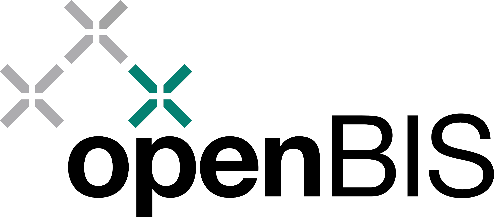
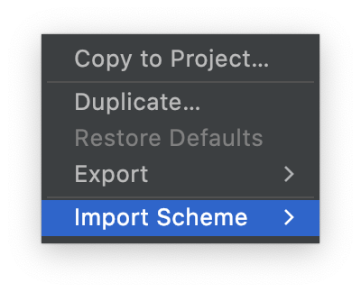
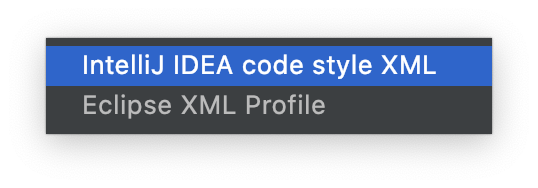
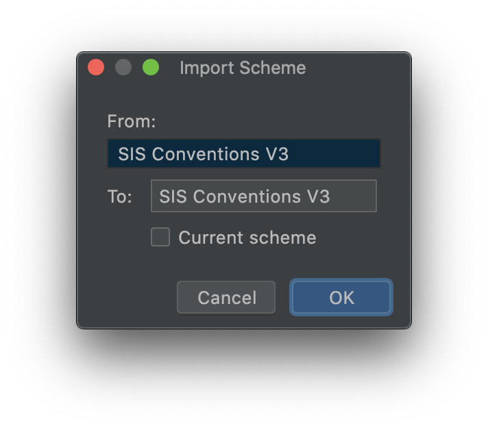
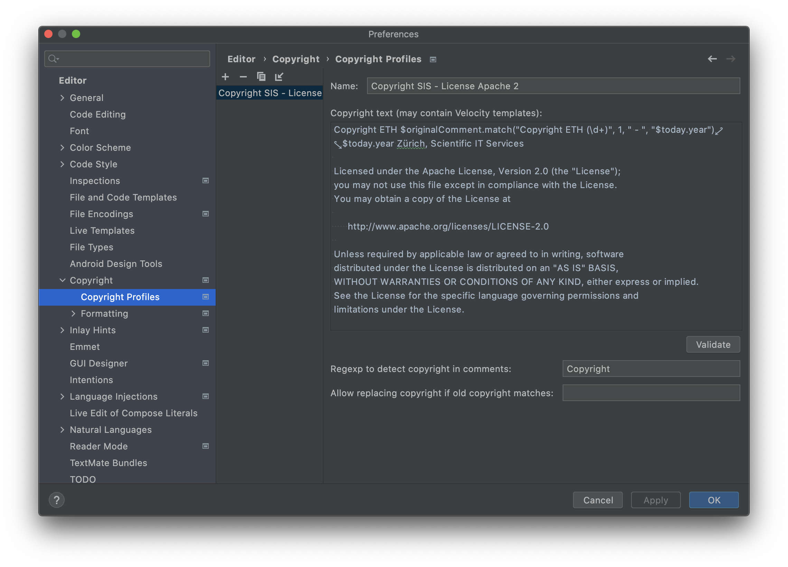
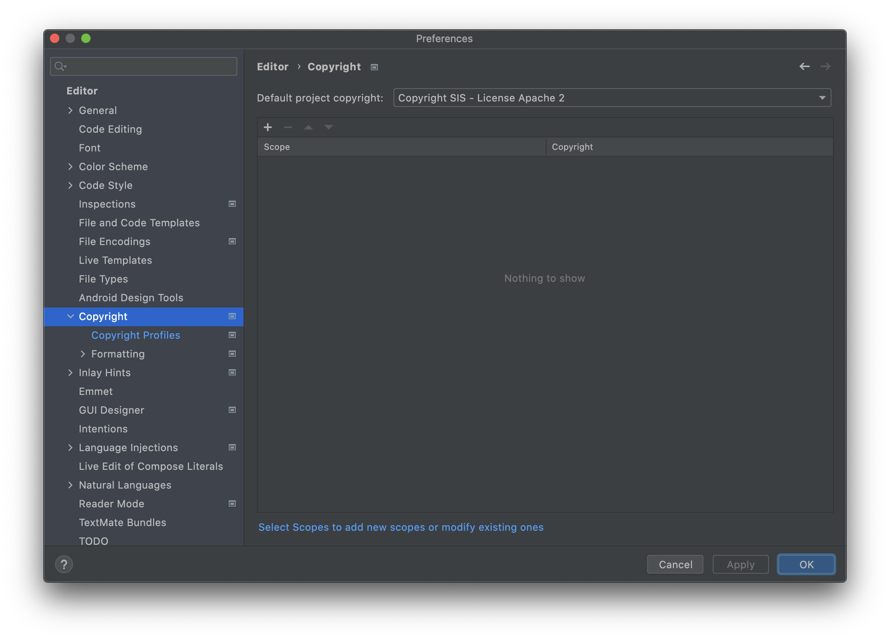
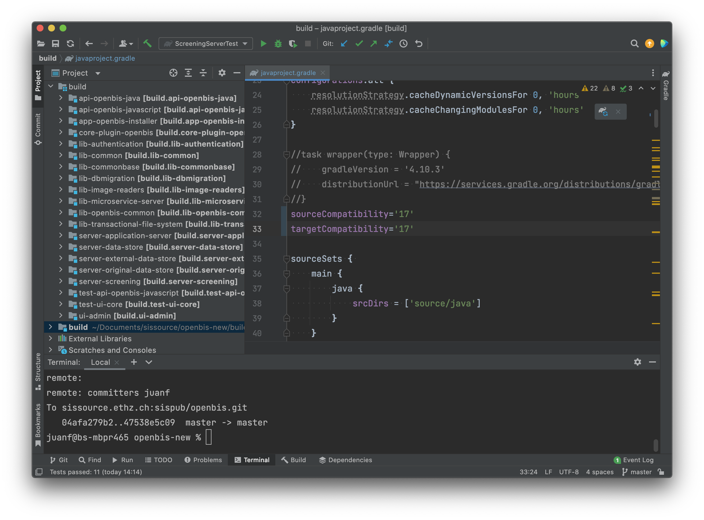
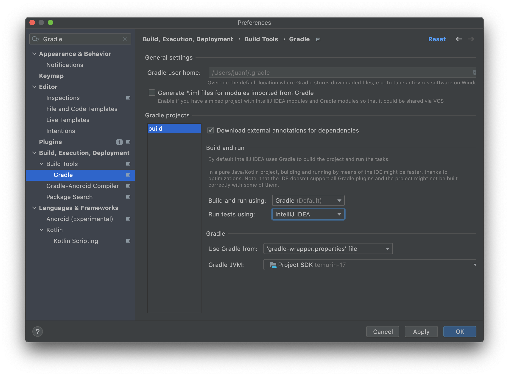
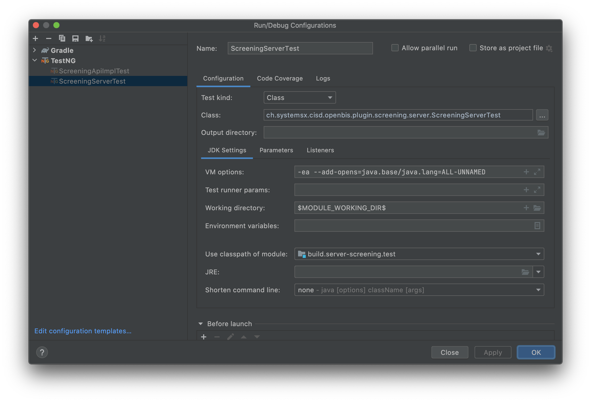

# Repository organization

The repository contains these kind of modules used to build the openBIS distributable:
- api-*: API Facades
- app-*: Applications
- build: Build scripts
- core-plugins-*: Core plugins distributed with openBIS
- lib-*: Internally maintained libraries used to build openBIS
- server-*: Server components
- test-*: Integration tests
- ui-*: User interfaces

# Software Requirements

- JDK 17
- Postgres 15

# Building openBIS

## Step By Step:

```
git clone https://sissource.ethz.ch/sispub/openbis.git
cd app-openbis-installer/
./gradlew clean
./gradlew build -x test "-Dorg.gradle.jvmargs=--add-opens=java.base/java.text=ALL-UNNAMED --add-opens=java.desktop/java.awt.font=ALL-UNNAMED"
```

## Where the build is found?

```
./app-openbis-installer/targets/gradle/distributions/openBIS-installation-standard-technologies-SNAPSHOT-rXXXXXXXXXX.tar.gz
```

## Why we disable tests to make the build?

They increase the time to obtain a build plus some tests could have additional environment
requirements.

## Why the core UI made using GWT is not build anymore?

The core UI is deprecated for removal on next mayor release and requires JDK8.

For now it can be build following the next commands and only with JDK8:

```
git clone https://sissource.ethz.ch/sispub/openbis.git
cd core-plugin-openbis/
./gradlew clean
./gradlew buildCoreUIPackageUsingJDK8 -x test
```

## How to compile the V3 JS bundle used by the new Admin UI in production?

```
git clone https://sissource.ethz.ch/sispub/openbis.git
cd core-plugin-openbis/
./gradlew clean
./gradlew bundleOpenbisStaticResources -x test
```

The output can be found at:
server-application-server/source/java/ch/systemsx/cisd/openbis/public/resources/api/v3

config.bundle.js
config.bundle.min.js
openbis.bundle.js
openbis.bundle.min.js

# Development of openBIS

## Requirements

- Software Requirements
- IntelliJ IDEA CE

## Step By Step

```
File -> New -> Project From Existing Sources
Select the build folder to load the gradle model
After the model is loaded execute the tasks:

openBISDevelopementEnvironmentASPrepare
openBISDevelopementEnvironmentASStart
openBISDevelopementEnvironmentDSSStart
```

## Source Code Auto Formatting

OpenBIS source code uses a particular style preset that guarantees all code is formatted uniformly.

To make use of the preset go to File/Settings or IntelliJIDEA/Preferences depending on your OS.

Then import the XML file under 'docs/codestyle/SIS_Conventions_IntelliJ_V3.xml'. See images below:






## Commit Messages Formatting

OpenBIS source code commit messages use a particular formatting.

This formatting guarantees that there is a User Story behind it.

To ensure commits follow the formatting 'Git Hooks' are provided.

Just copy them from the root folder of this repo run the next command:
````
%/> cp ./docs/hooks/* ./.git/hooks/   
%/> git add README.md
%/> git commit -m "Test incorrectly formatted message"
Aborting commit. Your commit message is missing an issue number ('SSDM-XXXXX:')
````

## Source Code Copyright Header

OpenBIS source code is licensed under SIS copyright and licensed under 'Apache 2 License':
````
http://www.apache.org/licenses/LICENSE-2.0
````
To guarantee all new source files contain the appropriate license a preset is provided.

To make use of the preset go to File/Settings or IntelliJIDEA/Preferences depending on your OS.

Then import the XML file under 'docs/copyright/Copyright_IntelliJ.xml' under the copyright section as the image below indicate.

Last, set the Copyright Profile under the Copyright section as the image below indicate:


## Typical Errors

# IntelliJ can't find package com.sun.*, but I can compile the project using the command line!

Turn off "File | Settings | Build, Execution, Deployment | Compiler | Java Compiler | Use --release
option for cross-compilation".

# IntelliJ can't find a particular method

Code compatiblity 1.8 is set by default to work well with our javadoc tools but it can be set to 17 on IntelliJ. See image below.


# Test seem to run through Gradle and fail

They need to be set to run using IntelliJ.


# Test seem to run through intelliJ but throw a package not open error

The project does not uses modules yet. Add '--add-opens' statements manually when launching the tests as shown below.


## Development of NG UI

1. Generate openBIS JS bundle by running in command line
    1. cd /<OPENBIS_PROJECT_ROOT>/core-plugin-openbis
    2. ./gradlew :bundleOpenbisStaticResources
2. Start openBIS in your chosen IDE (NG UI assumes it will run
   at: http://localhost:8888/openbis-test/):
    1. run openBISDevelopementEnvironmentASPrepare gradle task
    2. run openBISDevelopementEnvironmentASStart gradle task
3. In command line do:
    1. cd /<OPENBIS_PROJECT_ROOT>/ui-admin
    2. npm install
    3. npm run dev
4. Open in your chosen browser a url, by default: http://localhost:8124/ng-ui-path

## Setting up IntelliJ Idea

1. Under "IntelliJ IDEA" -> "Preferences" -> "Languages and Frameworks" -> Javascript, set the
   language version to ECMAScript 6.