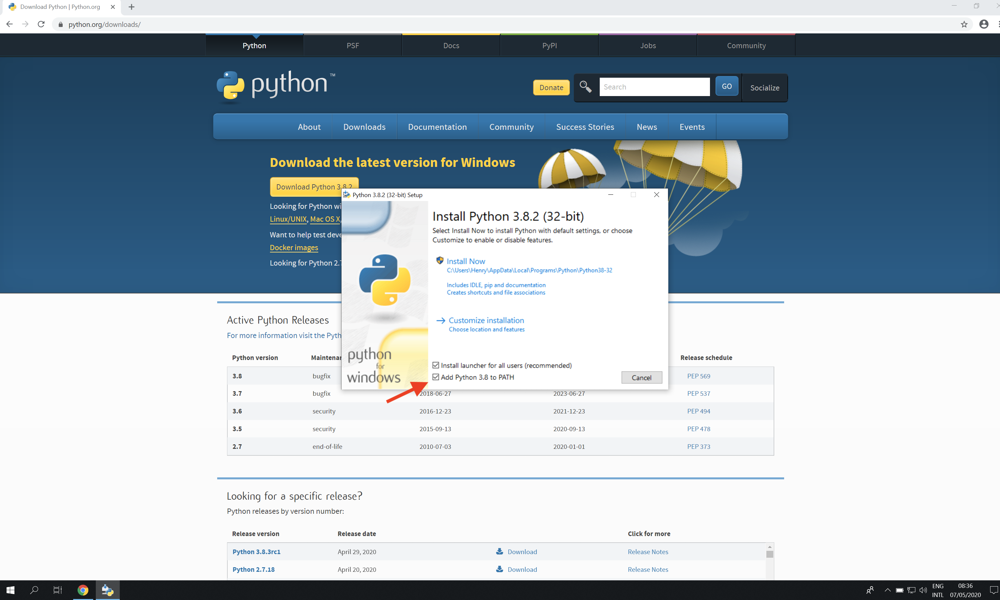

# How to access openBIS from MATLAB

## Preamble
[openBIS](https://wiki-bsse.ethz.ch/display/bis/Home) is a research data management system developed by [ETH SIS](https://sis.id.ethz.ch/). Data stored in openBIS can be accessed directly via the web UI or programmatically using APIs. For example, [pyBIS](https://sissource.ethz.ch/sispub/openbis/tree/master/pybis) is a project that provides a Python 3 module for interacting with openBIS. 
[MATLAB](https://ch.mathworks.com/products/matlab.html) is a high-level numerical computing environment that is popular in many areas of science. This repository provides a toolbox to access data in openBIS directly from MATLAB.

## Setup
The toolbox interacts with openBIS by calling pyBIS functions directly from MATLAB. Therefore, both Python and MATLAB have to be installed and configured properly. Please consult the [MATLAB - Python compatibility table](https://www.mathworks.com/content/dam/mathworks/mathworks-dot-com/support/sysreq/files/python-compatibility.pdf) to choose the correct versions. Also note that Python 2.7 is no longer supported!
 
#### macOS
On macOS, the setup has been tested with a Miniconda Python distribution. 
1. Download and install [Miniconda3](https://conda.io/miniconda.html) (use a Python version according to the [MATLAB - Python compatibility table](https://www.mathworks.com/content/dam/mathworks/mathworks-dot-com/support/sysreq/files/python-compatibility.pdf))
2. Open the terminal and install pyBIS with pip: `pip install pybis`
3. Find the path to your Python executable: `which python`
4. Open MATLAB and set the Python executable. On Matlab R2019b or later, use the command: `pyenv('Version', 'Path/to/python')`. Replace with the path found in previous step. On earlier versions of Matlab, the `pyenv` command is called `pyversion`.

#### Windows 10
On Windows using the Anaconda or Miniconda approach did not work (for some reason, MATLAB could not find the Python modules). On the other hand, using the standard Python installation seems to work.
1. Download and install Python [here](https://www.python.org/downloads/windows/) (use a Python version according to the [MATLAB - Python compatibility table](https://www.mathworks.com/content/dam/mathworks/mathworks-dot-com/support/sysreq/files/python-compatibility.pdf)). Make sure to choose the **64-bit version**. 
2. During the installation, make sure Python is added to the Path and registered as default Python interpreter. To do this, select the little tick box `Add Python 3.x to PATH` in the installation window:

3. Open Windows PowerShell and install pyBIS with pip: `pip install pybis`
4. Find the path to your Python executable by typing: `Get-Command python`. The path is listed in the Source column, i.e. `C:\Users\user\AppData\Local\Programs\Python\Python38\python.exe`. Copy the path by selecting it and pressing `Ctrl-C` 
5. Open MATLAB and set the Python executable. On Matlab R2019b or later, use the command: `pyenv('Version', 'C:\Path\to\Programs\python.exe')`. Replace with the path found in step 4. On earlier versions of Matlab, the `pyenv` command is called `pyversion`. 

## Usage
Download [this repository](https://sissource.ethz.ch/sispub/openbis/-/tree/master/api-openbis-matlab) and add it to your Matlab Path. If you are running the toolbox for the first time, make sure to carry out the steps described under **Setup** above. An [example script](https://sissource.ethz.ch/hluetcke/matlab-openbis/blob/master/openbis_example.mlx) demonstrating some common usage patterns is provided in the repository. The script can be run interactively in the MATLAB Live Editor. Type `doc OpenBis` in the Matlab Command Window to access the built-in documentation.

## Notes
I do not have time to test these instructions and the toolbox with all combinations of Python & Matlab versions on different operating systems. In general, a combination of recent Python and Matlab versions should work on macOS and Windows. If you run into any issues, please feel free to contact the [SIS Helpdesk](mailto:sis.helpdesk@ethz.ch).
