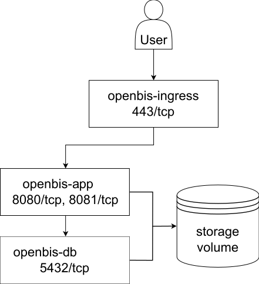

# Architecture

We recommend to run **openBIS** as a lightweight Docker container, fostering portability across environments and platforms.

## Requirements

Refer to the official documentation pages on Docker Engine (aka Docker CE) to learn more about requirements and [installation instructions](https://docs.docker.com/engine/install/) of the packages needed for running docker containers. 
We recommend to run the openBIS Docker container on top of an Ubuntu server for running the application in production - [System Requirements](../standalone/system-requirements.md).
Read more on [Docker Architecture](https://docs.docker.com/get-started/overview/#docker-architecture) to familiarize with its core concepts.

## Application Layout

openBIS can be split into distinct sub-units, which are virtualized either all-in-one or within multiple Docker containers. 
Independently of the scenario, we recommend clients to communicate with the application via a reverse proxy.

