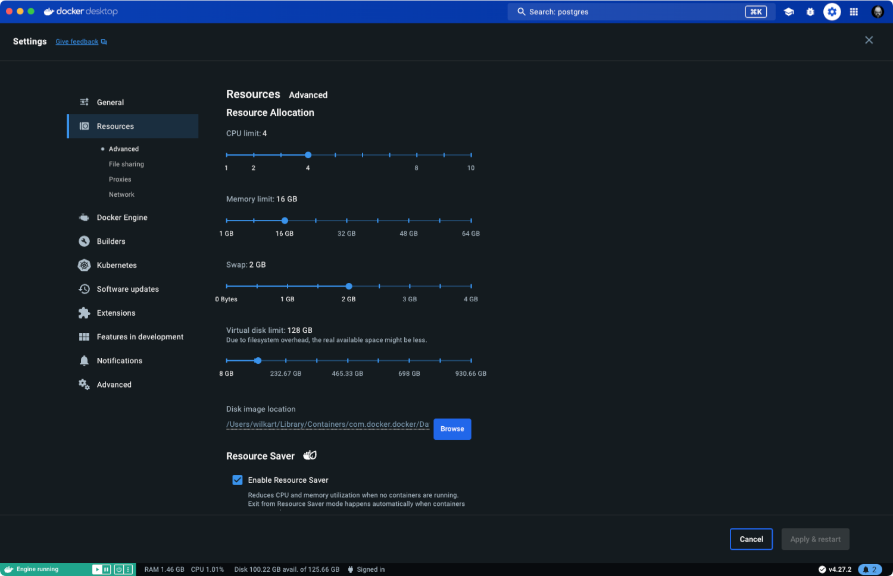
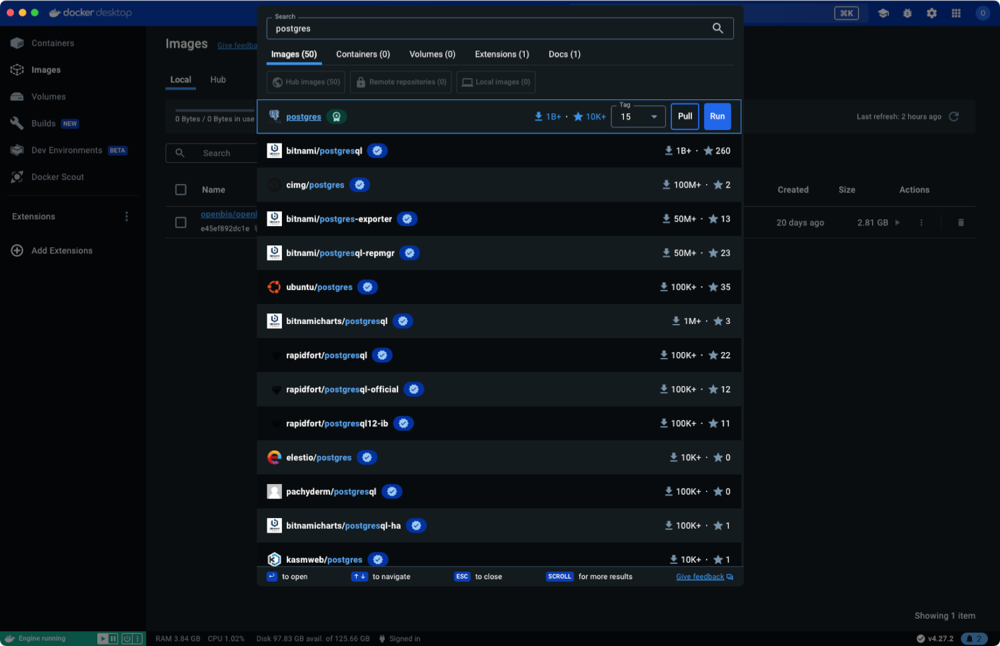
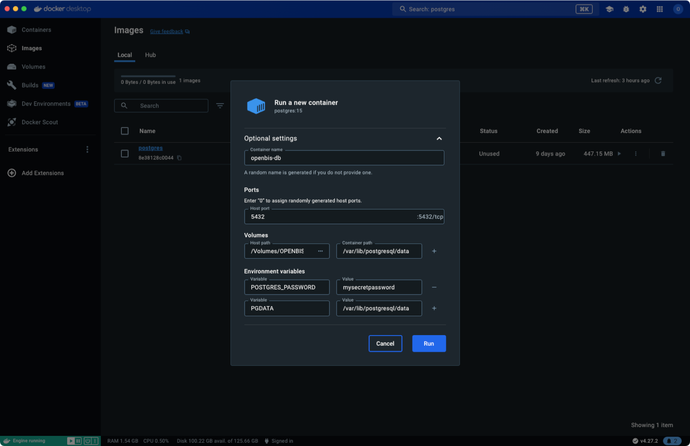
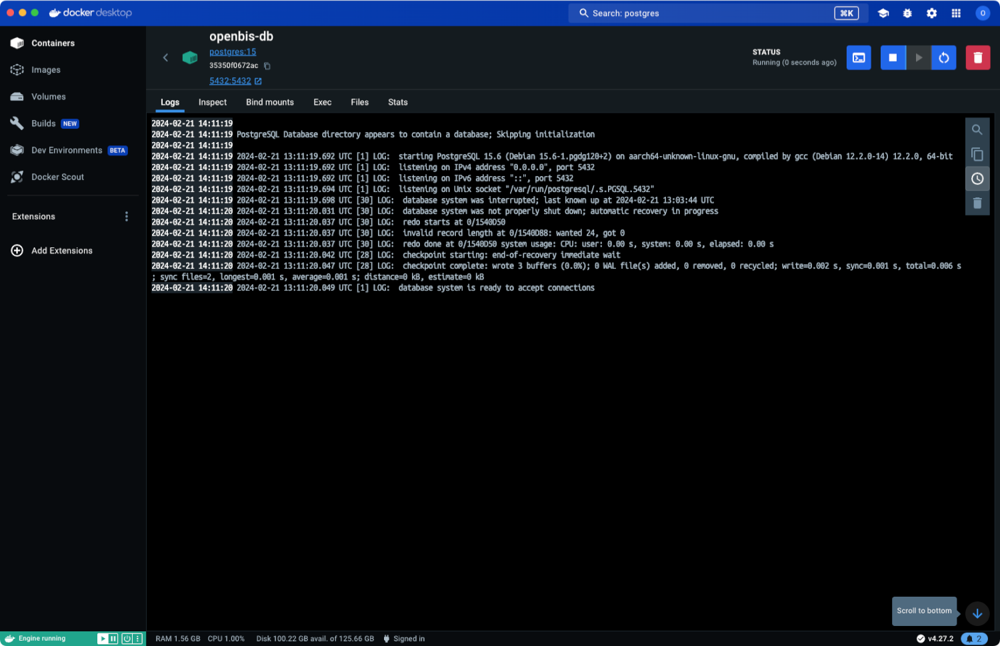
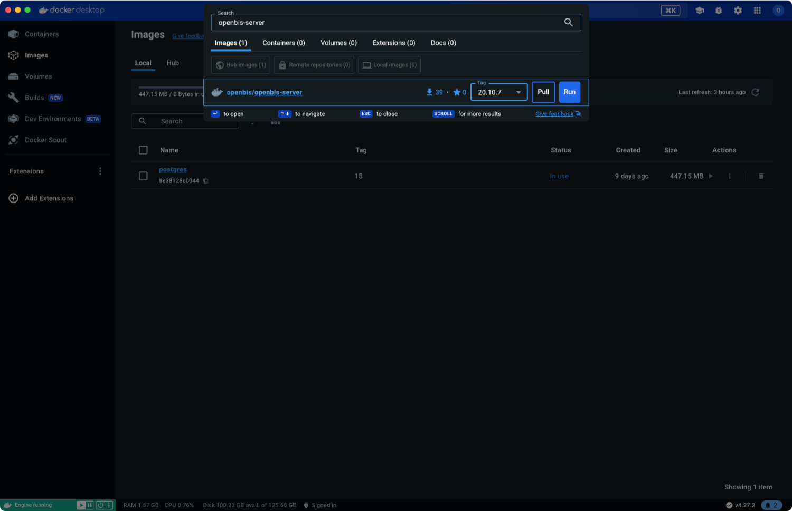
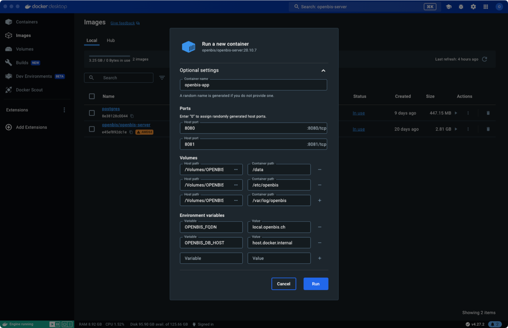
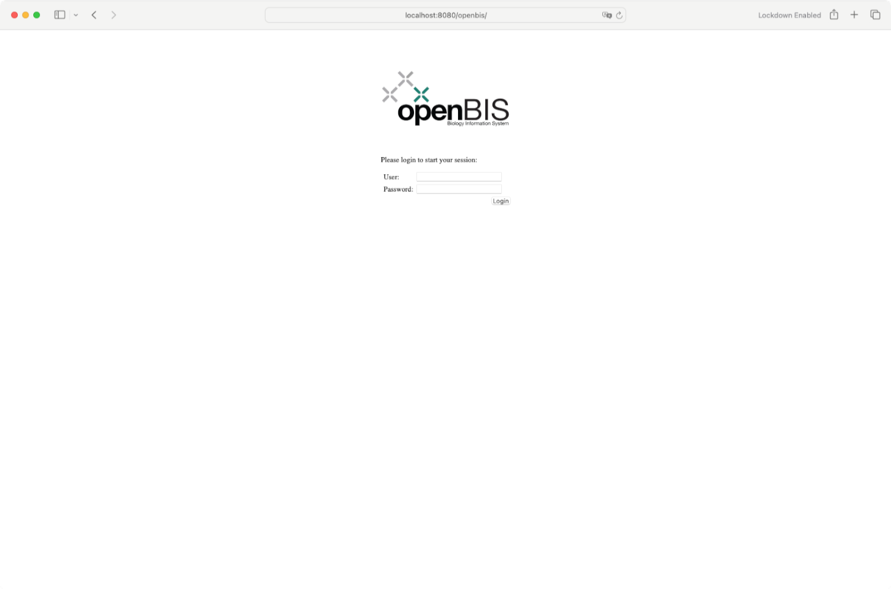
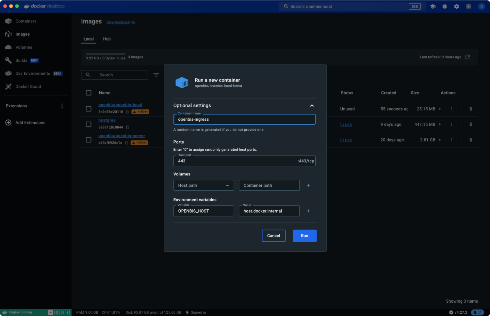
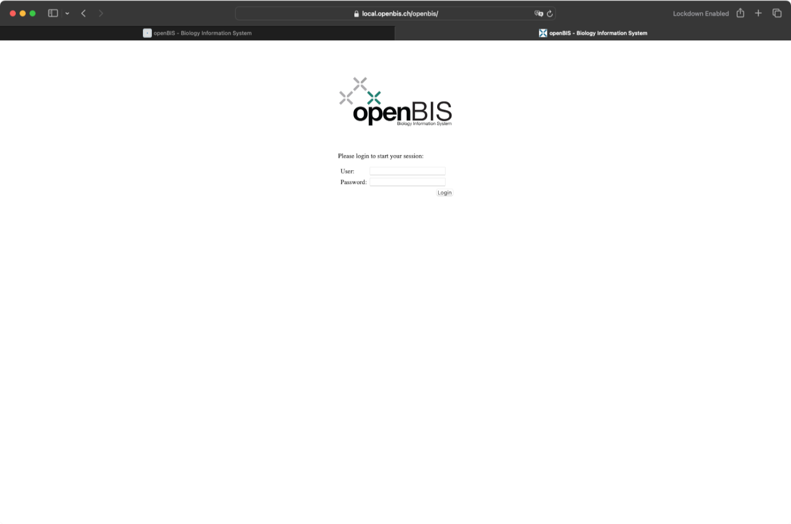
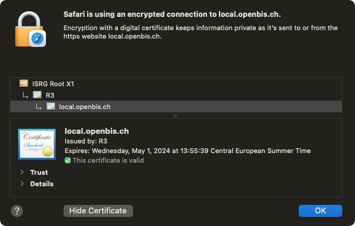

# Docker Desktop

Docker Desktop is a one-click-install application for your Mac, Linux, or Windows environment that lets you build, share, and run containerized applications and microservices. 
It provides a straightforward GUI (Graphical User Interface) that lets you manage your containers, applications, and images directly from your machine. 
Deploying openBIS within Docker Desktop containerization provides a streamlined interface and convenient local access, facilitating a straightforward evaluation and demonstration of both the service stack and the application itself. 
Follow our [usage pages](../docker/usage.md) for more details and official Docker Desktop [documentation pages](https://docs.docker.com/desktop/).

## Docker Desktop Settings

Change settings for optimal performance. openBIS is a complex Java application with PostgreSQL database running in backend. Assign [system resources](../standalone/system-requirements.md) accordingly.

Use a virtualization framework (like Rosetta for x86_64/amd64 emulation on Apple Silicon) if neccessary and consider enhanced security and container isolation.

## Docker Desktop Runtime

### Database

The search feature within the dashboard offers a seamless overview of images available on Docker Hub.

Ports, volumes and environment variables should be defined following our [usage pages](../docker/usage.md).

Graphical user inteface provides easy access to running container logs, files and statistics. It allows deep inspection and execution terminal inside container too. 

### Application

The "openbis/openbis-server" is an [official container](https://hub.docker.com/r/openbis/openbis-server) image of openBIS releases.

Apply desired configuration as described on [basic configuration](../docker/configuration.md). 
Please note "local.openbis.ch" as a OPENBIS_FQDN, and "host.docker.internal" as a OPENBIS_DB_HOST for the simplest possible setup intended for individual use case.

The openBIS user interface will be accessible through a browser at "http://localhost:8080/openbis".

### Ingress

Use "openbis/openbis-local" as a local only [example of reverse proxy](https://sissource.ethz.ch/sispub/openbis-continuous-integration/-/tree/master/hub/openbis-local) with TLS certificate. 
It is intended to use as a "https://local.openbis.ch" local service.
This is provided as a functional example only for references, local development or demonstration purposes.

