# Register Master Data via the Admin Interface

-   Created by [Fuentes Serna Juan Mariano
    (ID)](%20%20%20%20/display/~juanf%0A), last modified by [Barillari
    Caterina (ID)](%20%20%20%20/display/~barillac%0A) on [Oct 22,
    2021](/pages/diffpagesbyversion.action?pageId=53745926&selectedPageVersions=1&selectedPageVersions=2 "Show changes")
  

This documentation describes how to register master data via the core
UI. The documentation for the new admin UI can be found here:
<https://openbis.ch/index.php/docs/admin-documentation/new-entity-type-registration/> 

  

openBIS master data are:

1.  Spaces
2.  Experiment/Collection types
3.  Object types
4.  Dataset types
5.  Property types

  

## How to register a Space

1.  Go to *Admin → Spaces*  
      
     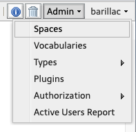
2.  Go to *Add Space* at the bottom of the page  
      
    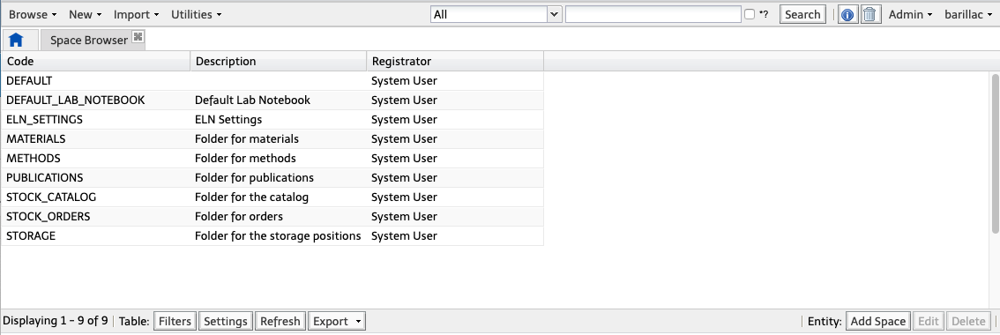  
      
3.  Enter a *Code* and, if you wish, a *Description* for the Space  
      
    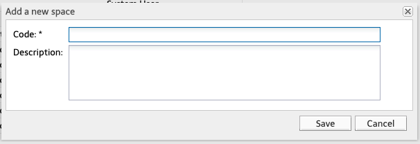  
      
4.  *Save*

  

## How to Register an Experiment/Collection type  

1.  Go to *Admin → Types → CollectionTypes*  
    *  
    *
2.  Select *Add* at the bottom of the page  
      
    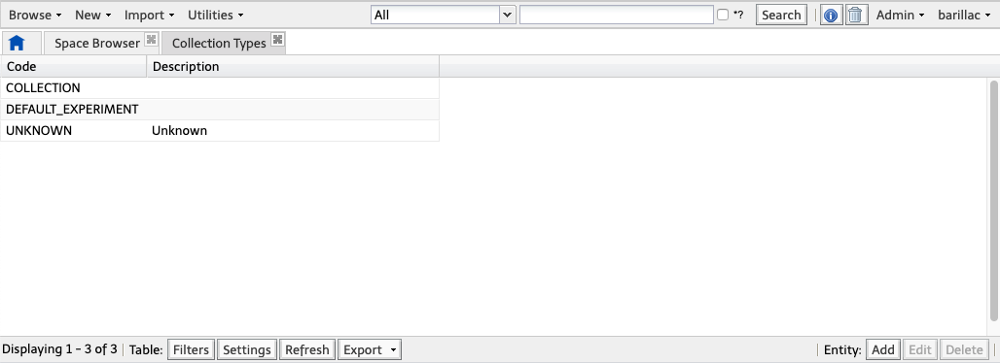  
      
3.  Now enter the *Code* for the Experiment/Collection type. E.g. for a
    microscopy experiment, the code could be EXPERIMENT\_MICROSCOPY.  
      
    
4.  *Description*: fill in this field if you want to provide some
    details about this Collection/Experiment type
5.  *Validation plugin*: If you want to have data validation, a script
    needs to be written (=validation plugin) and can be selected from
    here. An example of data validation would be if you have two
    properties, one called *Start date* and one called *End date*, the
    *End date* should never be earlier than the S*tart date*.  
      
6.  *Add properties.* These are the fields that you need for this
    Collection/Experiment. Select *Entity: Add* at the bottom of the
    page. You have two options:  
      
    1.  choose from a list of existing properties  
        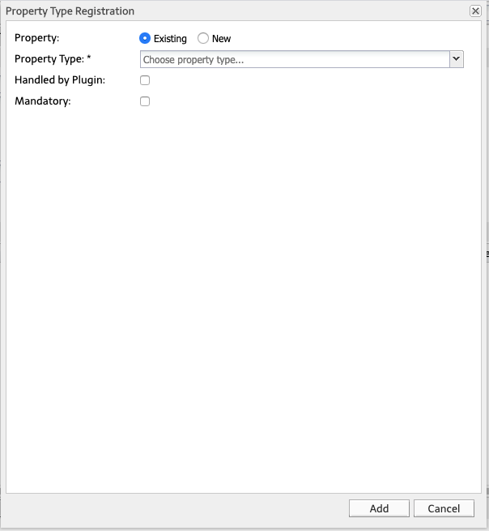  
        The dropdown Property type (see screenshot above) gives you the
        list of all registered properties in openBIS. The full list of
        registered properties is under *Admin → Types → Browse Property
        Types*  
        *  
        *
    2.  create a new property  
          
        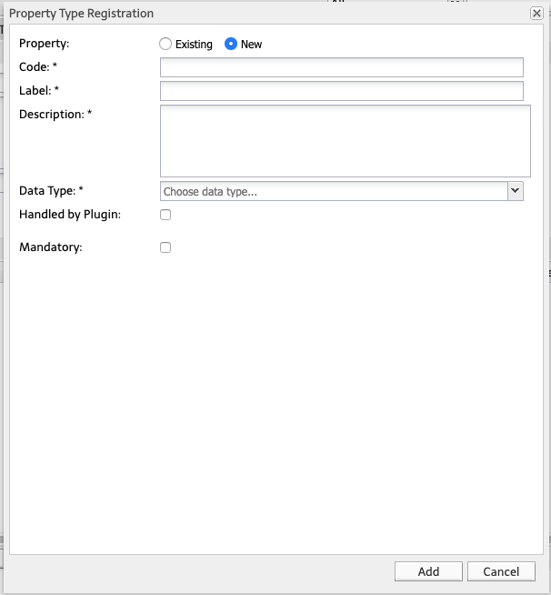  
        To register a new property you need to provide:  
          
        1.  *Code*: this is the unique identifier for this property.
            Codes only take alphanumeric characters and no spaces.
        2.  *Label*: This is what is shown in the user interface. Labels
            are not unique.
        3.  *Description*: this field provides a hint to what should be
            entered in the property field
        4.  *Data type*: what type of property this is (see below for
            list of available Data Types)
        5.  *Handled by plugin:* if this is a dynamic property or
            managed property, whose value is computed by a plugin, this
            needs to be specified here
        6.  *Mandatory*: It is possible to set mandatory properties   
              

        After choosing the data type, two new fields are added to the
        widget in the screenshot above:  
          
          
          
        1.  *Section*: sections are ways of grouping together some
            properties. For example properties such as *Storage
            Condition*, *Storage location*, *Box Name*, can all belong
            to a Section called *Storage information.* There are no
            pre-defined Sections in the system, they always need to be
            defined by an admin by entering the desired *Section Name*
            in the *Section field.*
        2.  *Position after:* this allows to specify the position of the
            Property in the user interface.

## Data Types available in openBIS

The following data types are available in openBIS:

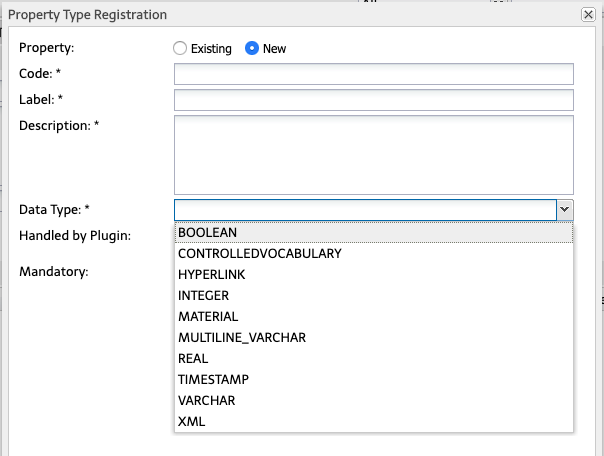

1.  *Boolean*: True or false
2.  *Controlled Vocabulary*: list of values to choose form. Only 1 value
    can be selected from a list
3.  *Hyperlink*: URL
4.  *Integer*: integer number
5.  *Material*: not to be used, it will be soon discontinued
6.  *Multiline varchar*: long text
7.  *Real*: decimal number 
8.  *Timestamp*: date (and timestamp)
9.  *Varchar*: one-line text
10. *XML*: to be used for Managed properties and for spreadsheet fields 

  

### Controlled Vocabularies

A Controlled Vocabulary is a pre-defined list of terms to choose from.
Only one term can be selected.

When you choose CONTROLLEDVOCABULARY as data type, you can then either
choose from existing vocabularies (drop down) or create a new vocabulary
(+ next to dropdown).

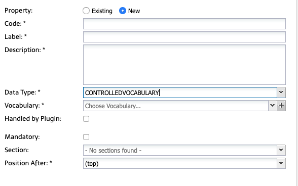

To create a new vocabulary, you need to enter the *Code* and the *list
of terms* belonging to the vocabulary. 

For example, we want to have a drop down list for different storage
conditions: -80°C, -20°C, 4°C, room temperature.

We can use STORAGE\_CONDITION as vocabulary code (this is the unique
identifier of this vocabulary). Then we can specify the list of terms,
either in the interface or we can load them from a file.

Vocabulary terms have codes and labels. The code is always the unique
identifier and should be written with alphanumeric characters and no
spaces; labels are shown in the user interface (if present) and they can
be written as normal text.

Taking as example the Storage conditions mentioned above, we could have
the following codes and labels:

|Code|Label|
|--- |--- |
|MINUS_80|-80°C|
|MINUS_20|-20°C|
|4|+4°C|
|RT|room temperature|

1.  **specify list of terms in the interface.** 

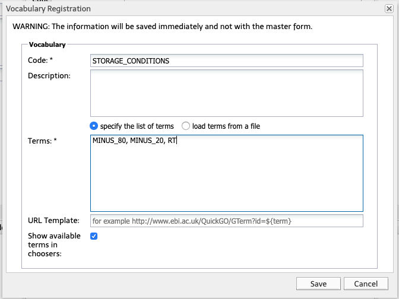
  

In this case, in the Terms field, we can only enter vocabulary codes
(not labels) separated by a comma, or alternatively 1 code per line. If
we use this approach, we need to add the label in a second step, by
editing the Controlled Vocabulary.

2**. load terms from a file**

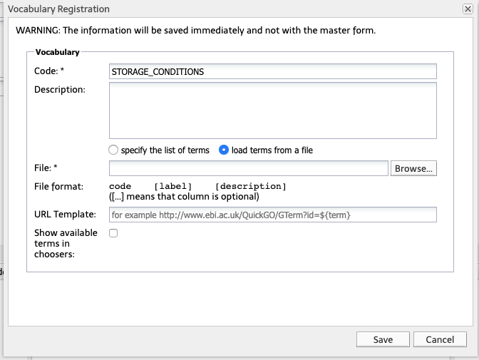

  

In this case a tab separated file that contains at least one column for
code and one column for label can be uploaded. Following this procedure,
codes and labels can be added in one single step.

  

### Editing Controlled Vocabularies

It is possible to edit existing vocabulary terms, for example to add a
label, and also to add new terms to an existing vocabulary.

1.  Go to *Admin→ Vocabularies*

 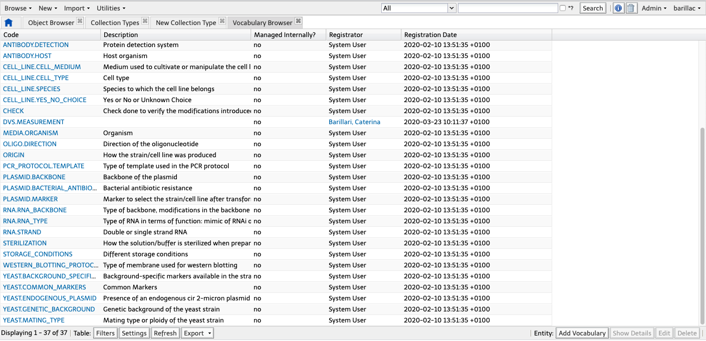

2\. Select the desired vocabulary in the table (click on the blue link)

3\. Add a new term by selecting *Entity: Add* at the bottom of the page

or

Edit an existing term by selecting it in the table and then going to
*Entity:Edit* at the bottom of the page.

 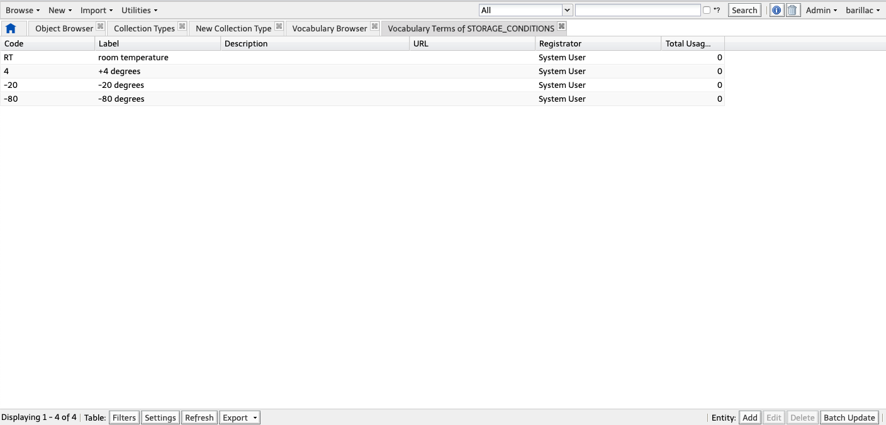

## How to Register an Object type  

1.  Go to *Admin → Types → Object Types*  
      
    
2.  To register a new type select *Entity:Add* at the bottom of the
    page. To edit an existing Object type, select the desired type from
    the table and go to *Entity:Edit* at the bottom of the page.  
      
    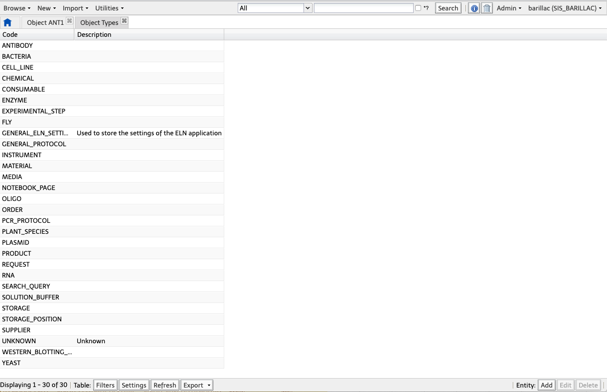  
      
3.  In the Object Type registration page a few fields need to be filled
    in (see screenshot below)
    1.  *Code*: the name of the object type. Codes can only have
        alpha-numeric characters.
    2.  *Description*: fill in this field if you want to provide some
        details about this Object type.
    3.  *Validation plugin*: If you want to have data validation, a
        script needs to be written (=validation plugin) and can be
        selected from here. An example of data validation would be if
        you have two properties, one called *Start date* and one
        called *End date*, the* End date* should never be earlier than
        the S*tart date*.
    4.  *Listable*: if checked, the object appears in the "Browse
        object" dropdown of the admin UI. Please note that this does not
        apply to the ELN UI.
    5.  *Show container*: if checked, container objects are shown.
        Please note that this does not apply to the ELN UI.
    6.  *Show parents*: if checked, parents of the object are shown 
    7.  *Unique subcodes*: this applies to contained samples, which can
        have unique subcodes if this property is checked. Please note
        that the concept of *container* and *contained samples* are not
        used in the ELN.
    8.  *Generate Codes automatically*: check this if you want to have
        Object codes automatically generated by openBIS
    9.  *Show parent metadata*: check this if you wnat to have parents
        metadata shown. If not, only parents' codes will be shown
    10. *Generated Code prefix*: this is the prefix of the code used for
        each new registered object. A good convention is to use the
        first 3 letters of the Object Type Code ad Code Prefix. E.g. If
        the Object Type Code is CHEMICAL, the Code prefix can be CHE.
        Each new chemical registered in openBIS will have CHE1, CHE2,
        CHE3... CHEn as codes.  
          
        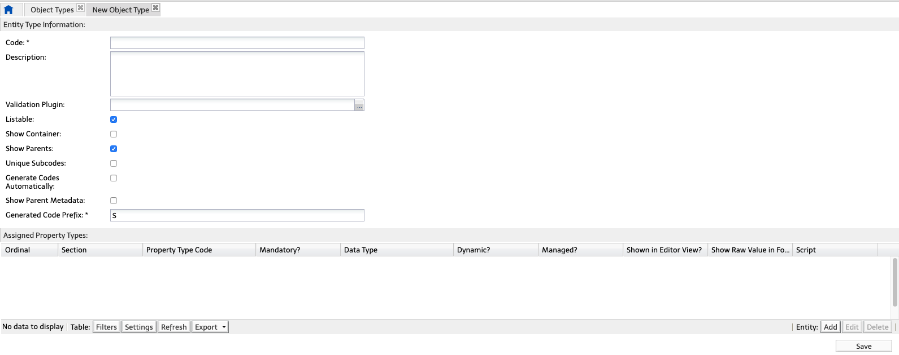
4.  Add properties: these are the fields that you need for this Object
    Type. Select *Entity: Add* at the bottom of the page.
    See [HowtoRegisteranExperiment/Collectiontype](#RegisterMasterDataviatheAdminInterface-HowtoRegisteranExperiment/Collectiontype).

  

## How to register a Data Set type

1.  Go to *Admin → Types → Data Set Types*  
      
    
2.  Select *Entity:Add* at the bottom of the page  
    
3.  The Data Set Type registration form has the following fields:
    1.  *Code*: name of the data set (e.g. RAW\_DATA). Code can only
        take alphanumeric characters and cannot contain spaces.
    2.  *Description*: you can provide a short description of the data
        set
    3.  *Validation plugin*:
    4.  *Disallow deletion*: if checked, all datasets belonging to this
        type cannot be deleted
    5.  *Main Data Set Pattern: *if there is just one data set matching
        the chosen 'main data set' pattern, it will be automatically
        displayed. A regular expression is expected. E.g.: '.\*.jpg'
    6.  *Main Data Set Path:* The path (relative to the top directory of
        a data set) that will be used as a starting point of 'main data
        set' lookup. E.g. 'original/images/'

    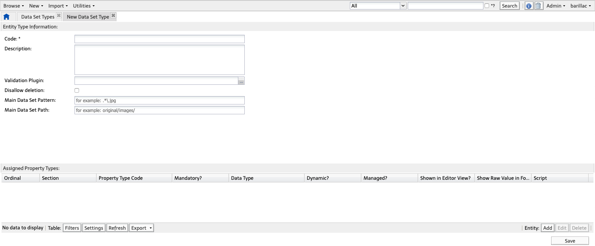
4.  Add properties: these are the fields that you need for this Object
    Type. Select *Entity: Add* at the bottom of the page.
    See [HowtoRegisteranExperiment/Collectiontype](#RegisterMasterDataviatheAdminInterface-HowtoRegisteranExperiment/Collectiontype).

  

## Property Types

The full list of properties registered in openBIS is accessible by
navigating to *Admin → Types → Browse Property Types* 

In the Property Browser page it is possible to:

1.  Add new properties → *Entity:Add Property Type. *
2.  Edit existing properties → *Entity:Edit.* It is possible to change
    the *Label* and *Description* of the property.
3.  Delete Existing properties → *Entity:Delete.* Deleting a property
    will delete also all associated values, if the property is in use. A
    warning is issued: please read carefully before deleting properties!

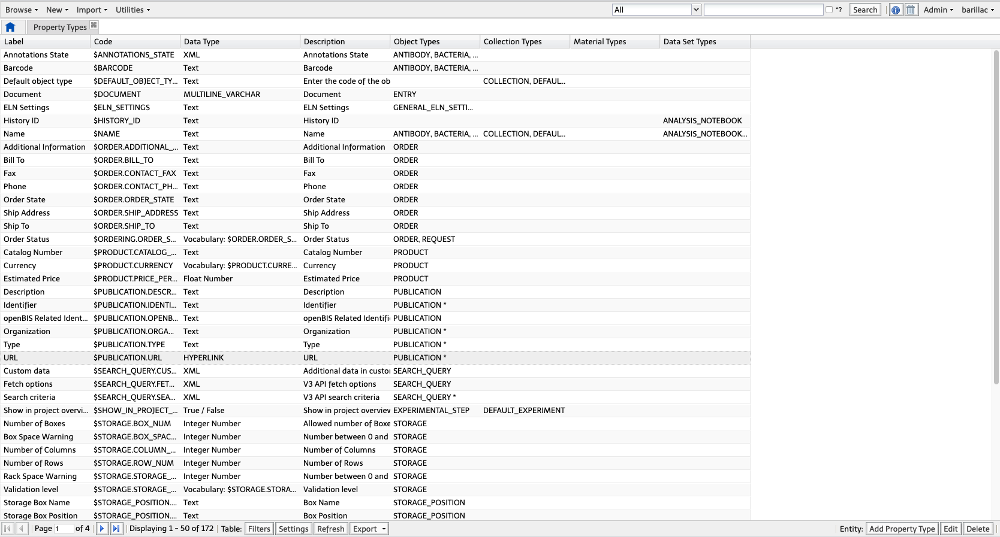
