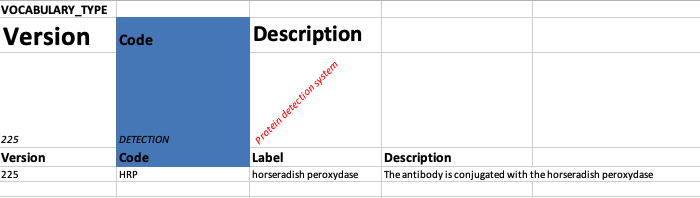
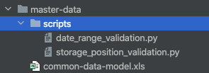
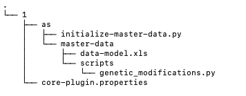

# Excel Import Service

## Introduction

The Excel import service reads xls definitions for both types and
entities and send them to openBIS. It is the replacement of the old
master data scripts adding support for the creation of openBIS entities.

**The goals are:**

For common users an import format with the following features to avoid
the shortcomings of the old format:  

-   Recognisable labels as column names.
-   Multi-type imports.
-   Parents/Children creation and linking on a single import.

For advanced users like consultants and plugin developers a tool that
allows to specify on an Excel sheet:

-   Metadata model.
-   Basic entity structures used for navigation.

## Modes

To support different use cases the import service supports the next
modes, specifying one of them is mandatory.

-   UPDATE IF EXISTS: This one should be the default mode to use to make
    incremental updates.
-   IGNORE EXISTING: This mode should be used when the intention is to
    ignore updates. Existing entities will be ignored. That way is
    possible to avoid unintentionally updating entities and at the same
    time adding new ones.
-   FAIL IF EXISTS: This mode should be used when the intention is to
    fail if anything is found. That way is possible to avoid making any
    unintentional changes.

## Organising Definition Files

All data can be arranged according to the needs of the user, in any
number of files and any number of worksheets. All files have to be in
one directory.

The names of the files and worksheets are ignored by the service, the
user is advised to use descriptive names that they can quickly
remember/refer to later.

```{warning}
If there are dependencies between files they should be submitted together or an error will be shown.
```

**Example:**

We want to define vocabularies and sample types with properties using
these vocabularies. We can arrange our files in several ways:

1.  put vocabulary and sample types in separate files named i.e
    vocabulary.xls and sample\_types.xlsx respectively
2.  put vocabulary and sample types in different worksheets in the same
    xls file
3.  put everything in one worksheet in the same file

## Organising Definitions

**Type definitions:**

The order of type definitions is not important for the Excel import
service, with exception of Vocabularies, those need to be placed before
the property types that use them.

**Entity definitions:**

Type definitions for the entities should already exist in the database
at the time when entities are registered. Generally Entity definitions
are placed at the end.

### Text cell formatting (colours, fonts, font style, text decorations)

All types of formatting are permitted, and users are encouraged to use
them to make their excel files more readable. Adding any non text
element (table, clipart) will cause the import to fail.



(A valid, but not easily readable, example)

### Definition, rows and sheet formatting

- A valid sheet has to start with definition on the first row.
- Each definition has to be separated by one empty row.
- Two or more consecutive empty rows mark the end of the definitions.
- Empty spaces at the beginning or end of headers are silently eliminated.
- Code fields that openBIS enforces to be uppercase are silently make uppercase if they are not.
- Any unintended header will result in an error. This is to avoid possible misspellings and avoid silently ignoring content.
  
```{warning}
If any content is placed after two consecutive empty rows it will result in an error. This is to alert the user and avoid silently ignoring content.
```

```{warning}
Header rows **NEED TO BE** a valid attribute of the entity or entity type, property label or property code.
```

## Entity Types Definitions

All entity types can be created. There are differences due to the nature of the defined elements themselves.

### Vocabulary and Vocabulary Term

Vocabulary

| Headers     | Mandatory | Uppercase |
|-------------|-----------|-----------|
| Code        | Yes       | Yes       |
| Description | Yes       | No        |
| Internal    | No        | No        |

Vocabulary Term

| Headers     | Mandatory | Uppercase |
|-------------|-----------|-----------|
| Code        | Yes       | Yes       |
| Label       | Yes       | No        |
| Description | Yes       | No        |
| Internal    | No        | No        |

**Example**

| VOCABULARY_TYPE                  |                         |             |          |
|----------------------------------|-------------------------|-------------|----------|
| Code                             | Description             | Internal    |          |
| STORAGE.STORAGE_VALIDATION_LEVEL | Validation Level        | TRUE        |          |
| Code                             | Label                   | Description | Internal |
| RACK                             | Rack Validation         |             | TRUE     |
| BOX                              | Box Validation          |             | TRUE     |
| BOX_POSITION                     | Box Position Validation |             | TRUE     |

Experiment Type
---------------

| Headers                | Mandatory | Uppercase |
|------------------------|-----------|-----------|
| Code                   | Yes       | Yes       |
| Description            | Yes       | No        |
| Validation script      | Yes       | No        |
| Ontology Id            | No        | No        |
| Ontology Version       | No        | No        |
| Ontology Annotation Id | No        | No        |
| Internal               | No        | No        |

**Example**

| EXPERIMENT_TYPE    |             |                          |          |
|--------------------|-------------|--------------------------|----------|
| Code               | Description | Validation script        | Internal |
| DEFAULT_EXPERIMENT |             | date_range_validation.py | TRUE     |

### Sample Type

| Headers                | Mandatory | Uppercase |
|------------------------|-----------|-----------|
| Code                   | Yes       | Yes       |
| Description            | Yes       | No        |
| Auto generate codes    | Yes       | No        |
| Validation script      | Yes       | No        |
| Generate code prefix   | Yes       | No        |
| Ontology Id            | No        | No        |
| Ontology Version       | No        | No        |
| Ontology Annotation Id | No        | No        |
| Internal               | No        | No        |

**Example**

| SAMPLE_TYPE      |             |                     |                                |                       |          |
|------------------|-------------|---------------------|--------------------------------|-----------------------|----------|
| Code             | Description | Auto generate codes | Validation script              | Generated code prefix | Internal |
| STORAGE_POSITION |             | TRUE                | storage_position_validation.py | STO                   | TRUE     |

### Dataset Type

| Headers                | Mandatory | Uppercase |
|------------------------|-----------|-----------|
| Code                   | Yes       | Yes       |
| Description            | Yes       | No        |
| Validation script      | Yes       | No        |
| Ontology Id            | No        | No        |
| Ontology Version       | No        | No        |
| Ontology Annotation Id | No        | No        |
| Internal               | No        | No        |

**Example**

| DATASET_TYPE |             |                   |          |
|--------------|-------------|-------------------|----------|
| Code         | Description | Validation script | Internal |
| RAW_DATA     |             |                   | TRUE     |

### Property Type

A property type can exist assigned to an entity type or unassigned to an entity type.
So there is two actual things being modeled in one line, one is the property type and another is the property type assignment.
Fields belonging to the assignment are silently ignored when they are not.

| Headers                | Mandatory Assigned (property type + property type assignment) | Mandatory Unassigned (property type) | Uppercase |
|------------------------|---------------------------------------------------------------|--------------------------------------|-----------|
| Code                   | Yes                                                           | Yes                                  | Yes       |
| Mandatory              | Yes                                                           | Ignored                              | No        |
| Show in edit views     | Yes                                                           | Ignored                              | No        |
| Section                | Yes                                                           | Ignored                              | No        |
| Property label         | Yes                                                           | Yes                                  | No        |
| Data type              | Yes                                                           | Yes                                  | Yes       |
| Vocabulary code        | Yes                                                           | Yes                                  | Yes       |
| Description            | Yes                                                           | Yes                                  | No        |
| Metadata               | No                                                            | No                                   | No        |
| Dynamic script         | No                                                            | No                                   | No        |
| Ontology Id            | No                                                            | No                                   | No        |
| Ontology Version       | No                                                            | No                                   | No        |
| Ontology Annotation Id | No                                                            | No                                   | No        |
| Unique                 | No                                                            | Ignored                              | No        |
| MultiValued            | No                                                            | No                                   | No        |
| Internal               | No                                                            | No                                   | No        |
| InternalAssignment     | No                                                            | Ignored                              | No        |

A property type requires a data type to be defined, valid data types are.

| Data type            | Description                                              |
|----------------------|----------------------------------------------------------|
| INTEGER              |                                                          |
| REAL                 |                                                          |
| VARCHAR              | Text of any length but displayed as a single line field. |
| MULTILINE_VARCHAR    | Text of any length but displayed as a multi line field.  |
| HYPERLINK            |                                                          |
| BOOLEAN              |                                                          |
| CONTROLLEDVOCABULARY |                                                          |
| XML                  |                                                          |
| TIMESTAMP            |                                                          |
| DATE                 |                                                          |
| SAMPLE               | Sample of any type.                                      |
| SAMPLE:<SAMPLE_TYPE> | Sample of the indicated type.                            |

**Example Unassigned Property**

In this case, the property is registered without being assigned to a
type, and  the block of property types uses the PROPERTY\_TYPE block.

| PROPERTY_TYPE                        |          |                   |                      |                                |                                  |                                        |
|--------------------------------------|----------|-------------------|:---------------------|--------------------------------|----------------------------------|----------------------------------------|
| Code                                 | Internal | Property label    | Data type            | Vocabulary code                | Description                      | Metadata                               |
| WELL.COLOR_ENCODED_ANNOTATION        | TRUE     | Color Annotation  | CONTROLLEDVOCABULARY | WELL.COLOR_ENCODED_ANNOTATIONS | Color Annotation for plate wells |                                        |
| ANNOTATION.SYSTEM.COMMENTS           |          | Comments          | VARCHAR              |                                | Comments                         |                                        |
| ANNOTATION.REQUEST.QUANTITY_OF_ITEMS |          | Quantity of Items | INTEGER              |                                | Quantity of Items                |                                        |
| BARCODE                              | TRUE     | Custom Barcode    | VARCHAR              |                                | Custom Barcode                   |                                        |
| DOCUMENT                             | TRUE     | Document          | MULTILINE_VARCHAR    |                                | Document                         | { "custom_widget" : "Word Processor" } |


**Example Assigned**

In this case the property types are assigned to a sample type and the
block of property types belong to the entity type block (SAMPLE\_TYPE in
this case).

| SAMPLE_TYPE              |          |                    |                     |                    |                       |                          |                   |                 |                               |                                        |                |
|--------------------------|----------|--------------------|---------------------|--------------------|-----------------------|--------------------------|-------------------|-----------------|-------------------------------|----------------------------------------|----------------|
| Code                     | Internal | Description        | Auto generate codes | Validation script  | Generated code prefix |                          |                   |                 |                               |                                        |                |
| ENTRY                    | TRUE     |                    | TRUE                |                    | ENTRY                 |                          |                   |                 |                               |                                        |                |
| Code                     | Internal | InternalAssignment | Mandatory           | Show in edit views | Section               | Property label           | Data type         | Vocabulary code | Description                   | Metadata                               | Dynamic script |
| NAME                     | TRUE     | TRUE               | FALSE               | TRUE               | General info          | Name                     | VARCHAR           |                 | Name                          |                                        |                |
| SHOW_IN_PROJECT_OVERVIEW | TRUE     | TRUE               | FALSE               | TRUE               | General info          | Show in project overview | BOOLEAN           |                 | Show in project overview page |                                        |                |
| DOCUMENT                 | TRUE     | TRUE               | FALSE               | TRUE               | General info          | Document                 | MULTILINE_VARCHAR |                 | Document                      | { "custom_widget" : "Word Processor" } |                |

### Entity Type Validation Script and Property Type Dynamic Script

Scripts have to reside in *.py* files in the *scripts* directory within
the folder that contains the Excel files.

Within *scripts,* files can be organised in any suitable setup:

In order to refer to a validation or dynamic script
(e.g. *storage\_position\_validation.py* below), the relative path (from
the *scripts* directory) to the file has to be provided in the relevant
column. See the example columns below.

**Example**



| SAMPLE_TYPE                           |          |                    |                     |                                |                       |                      |                      |                                   |                   |          |                |
|---------------------------------------|----------|--------------------|---------------------|--------------------------------|-----------------------|----------------------|----------------------|-----------------------------------|-------------------|----------|----------------|
| Code                                  | Internal | Description        | Auto generate codes | Validation script              | Generated code prefix |                      |                      |                                   |                   |          |                |
| STORAGE_POSITION                      | TRUE     |                    | TRUE                | storage_position_validation.py | STO                   |                      |                      |                                   |                   |          |                |
| Code                                  | Internal | InternalAssignment | Mandatory           | Show in edit views             | Section               | Property label       | Data type            | Vocabulary code                   | Description       | Metadata | Dynamic script |
| STORAGE_POSITION.STORAGE_CODE         | TRUE     | TRUE               | FALSE               | TRUE                           | Physical Storage      | Storage Code         | VARCHAR              |                                   | Storage Code      |          |                |
| STORAGE_POSITION.STORAGE_RACK_ROW     | TRUE     | TRUE               | FALSE               | TRUE                           | Physical Storage      | Storage Rack Row     | INTEGER              |                                   | Number of Rows    |          |                |
| STORAGE_POSITION.STORAGE_RACK_COLUMN  | TRUE     | TRUE               | FALSE               | TRUE                           | Physical Storage      | Storage Rack Column  | INTEGER              |                                   | Number of Columns |          |                |
| STORAGE_POSITION.STORAGE_BOX_NAME     | TRUE     | TRUE               | FALSE               | TRUE                           | Physical Storage      | Storage Box Name     | VARCHAR              |                                   | Box Name          |          |                |
| STORAGE_POSITION.STORAGE_BOX_SIZE     | TRUE     | TRUE               | FALSE               | TRUE                           | Physical Storage      | Storage Box Size     | CONTROLLEDVOCABULARY | STORAGE_POSITION.STORAGE_BOX_SIZE | Box Size          |          |                |
| STORAGE_POSITION.STORAGE_BOX_POSITION | TRUE     | TRUE               | FALSE               | TRUE                           | Physical Storage      | Storage Box Position | VARCHAR              |                                   | Box Position      |          |                |
| STORAGE_POSITION.STORAGE_USER         | TRUE     | TRUE               | FALSE               | TRUE                           | Physical Storage      | Storage User Id      | VARCHAR              |                                   | Storage User Id   |          |                |
| XMLCOMMENTS                           | TRUE     | TRUE               | FALSE               | FALSE                          |                       | Comments             | XML                  |                                   | Comments log      |          |                |

### Entity Types Update Algorithm

#### General Usage 

For every TYPE found in the Excel sheet the next algorithm is performed:

```py
    IF ITEM NOT EXISTS in openBIS:
        CREATE ITEM                             
    ELSE: // Doesn't exist branch
        IF FAIL_IF_EXISTS:
            THROW EXCEPTION
        IF UPDATE_IF_EXISTS:
            UPDATE ITEM
        ELSE IF IGNORE_EXISTING:
            PASS // Ignore as requested
ELSE:
    PASS // Ignore object that have not been updated
```


  

## Entity Definitions

Most entities can be created, excluding DataSets. There are differences due to the nature of the defined elements themselves.

General Rules:

-   Header order is arbitrary.
-   When referring to another entity only Identifiers are allowed.
    Sample Variables are the only exception.
-   Vocabulary values in property value rows can be referred to by
    either the vocabulary term code or the vocabulary term label.

  
```{warning}
If a mandatory header is missing it results in an error.
```

```{warning}
Repeated headers will result in an error, in case a Property shares Label with an Attribute is encouraged to use the property code instead.
```

### Space

| Headers     | Mandatory | Uppercase |
|-------------|-----------|-----------|
| Code        | Yes       | Yes       |
| Description | Yes       | No        |

**Example**

| SPACE                |                         |
|----------------------|-------------------------|
| Code                 | Description             |
| ELN_SETTINGS         | ELN Settings            |
| DEFAULT_LAB_NOTEBOOK | Default Lab Notebook    |
| METHODS              | Folder for methods      |
| MATERIALS            | Folder for th materials |
| STOCK_CATALOG        | Folder for the catalog  |
| STOCK_ORDERS         | Folder for orders       |
| PUBLICATIONS         | Folder for publications |

### Project

| Headers     | Mandatory                         | Uppercase |
|-------------|-----------------------------------|-----------|
| Identifier  | Yes on UPDATES, ignored on INSERT | Yes       |
| Code        | Yes                               | Yes       |
| Space       | Yes                               | Yes       |
| Description | Yes                               | No        |

**Example**

| PROJECT                               |                     |                     |                      |
|---------------------------------------|---------------------|---------------------|----------------------|
| Identifier                            | Code                | Description         | Space                |
| /DEFAULT_LAB_NOTEBOOK/DEFAULT_PROJECT | DEFAULT_PROJECT     | Default Project     | DEFAULT_LAB_NOTEBOOK |
| /METHODS/PROTOCOLS                    | PROTOCOLS           | Protocols           | METHODS              |
| /STOCK_CATALOG/PRODUCTS               | PRODUCTS            | Products            | STOCK_CATALOG        |
| /STOCK_CATALOG/SUPPLIERS              | SUPPLIERS           | Suppliers           | STOCK_CATALOG        |
| /STOCK_CATALOG/REQUESTS               | REQUESTS            | Requests            | STOCK_CATALOG        |
| /STOCK_ORDERS/ORDERS                  | ORDERS              | Orders              | STOCK_ORDERS         |
| /ELN_SETTINGS/TEMPLATES               | TEMPLATES           | Templates           | ELN_SETTINGS         |
| /PUBLICATIONS/PUBLIC_REPOSITORIES     | PUBLIC_REPOSITORIES | Public Repositories | PUBLICATIONS         |

### Experiment

| Headers        | Mandatory                         | Uppercase |
|----------------|-----------------------------------|-----------|
| Identifier     | Yes on UPDATES, ignored on INSERT | Yes       |
| Code           | Yes                               | Yes       |
| Project        | Yes                               | Yes       |
| Property Code  | No                                | Yes       |
| Property Label | No                                | No        |

**Example**

| EXPERIMENT                                                |                         |                                   |                         |                     |
|-----------------------------------------------------------|-------------------------|-----------------------------------|-------------------------|---------------------|
| Experiment type                                           |                         |                                   |                         |                     |
| COLLECTION                                                |                         |                                   |                         |                     |
| Identifier                                                | Code                    | Project                           | Name                    | Default object type |
| /METHODS/PROTOCOLS/GENERAL_PROTOCOLS                      | GENERAL_PROTOCOLS       | /METHODS/PROTOCOLS                | General Protocols       | GENERAL_PROTOCOL    |
| /STOCK_CATALOG/PRODUCTS/PRODUCT_COLLECTION                | PRODUCT_COLLECTION      | /STOCK_CATALOG/PRODUCTS           | Product Collection      | PRODUCT             |
| /STOCK_CATALOG/SUPPLIERS/SUPPLIER_COLLECTION              | SUPPLIER_COLLECTION     | /STOCK_CATALOG/SUPPLIERS          | Supplier Collection     | SUPPLIER            |
| /STOCK_CATALOG/REQUESTS/REQUEST_COLLECTION                | REQUEST_COLLECTION      | /STOCK_CATALOG/REQUESTS           | Request Collection      | REQUEST             |
| /STOCK_ORDERS/ORDERS/ORDER_COLLECTION                     | ORDER_COLLECTION        | /STOCK_ORDERS/ORDERS              | Order Collection        | ORDER               |
| /ELN_SETTINGS/TEMPLATES/TEMPLATES_COLLECTION              | TEMPLATES_COLLECTION    | /ELN_SETTINGS/TEMPLATES           | Template Collection     |                     |
| /PUBLICATIONS/PUBLIC_REPOSITORIES/PUBLICATIONS_COLLECTION | PUBLICATIONS_COLLECTION | /PUBLICATIONS/PUBLIC_REPOSITORIES | Publications Collection | PUBLICATION         |

### Sample

| Headers            | Mandatory                         | Uppercase |
|--------------------|-----------------------------------|-----------|
| $                  | No                                |           |
| Identifier         | Yes on UPDATES, ignored on INSERT | Yes       |
| Code               | No                                | Yes       |
| Project            | No                                | Yes       |
| Experiment         | No                                | Yes       |
| Auto generate code | No                                | No        |
| Parents            | No                                | Yes       |
| Children           | No                                | Yes       |
| Property Code      | No                                | No        |
| Property Label     | No                                | No        |

**Example**

| SAMPLE      |                                        |                |              |                         |                                              |                 |
|-------------|----------------------------------------|----------------|--------------|-------------------------|----------------------------------------------|-----------------|
| Sample type |                                        |                |              |                         |                                              |                 |
| ORDER       |                                        |                |              |                         |                                              |                 |
| $           | Identifier                             | Code           | Space        | Project                 | Experiment                                   | Order Status    |
|             | /ELN_SETTINGS/TEMPLATES/ORDER_TEMPLATE | ORDER_TEMPLATE | ELN_SETTINGS | /ELN_SETTINGS/TEMPLATES | /ELN_SETTINGS/TEMPLATES/TEMPLATES_COLLECTION | Not yet ordered |

#### Defining Parent and Children in Samples

Parent and child columns can be used to define relations between
samples. Samples can be addressed by:

1.  $ : Variables, only really useful during batch inserts for samples
    with autogenerated codes since Identifiers can't be known. Variables
    SHOULD start with $.
2.  Identifiers

  
```{warning}
Parents and children SHOULD be separated by an end of line, each sample should be in its own line.
```

| SAMPLE      |                                          |                                          |                                          |                |              |                         |                                              |                 |
|-------------|------------------------------------------|------------------------------------------|------------------------------------------|----------------|--------------|-------------------------|----------------------------------------------|-----------------|
| Sample type |                                          |                                          |                                          |                |              |                         |                                              |                 |
| ORDER       |                                          |                                          |                                          |                |              |                         |                                              |                 |
| $A          | Parents                                  | Children                                 | Identifier                               | Code           | Space        | Project                 | Experiment                                   | Order Status    |
|             |                                          |                                          | /ELN_SETTINGS/TEMPLATES/ORDER_TEMPLATE_A | ORDER_TEMPLATE | ELN_SETTINGS | /ELN_SETTINGS/TEMPLATES | /ELN_SETTINGS/TEMPLATES/TEMPLATES_COLLECTION | Not yet ordered |
| $B          |                                          |                                          | /ELN_SETTINGS/TEMPLATES/ORDER_TEMPLATE_B | ORDER_TEMPLATE | ELN_SETTINGS | /ELN_SETTINGS/TEMPLATES | /ELN_SETTINGS/TEMPLATES/TEMPLATES_COLLECTION | Not yet ordered |
| $C          | /ELN_SETTINGS/TEMPLATES/ORDER_TEMPLATE_A | /ELN_SETTINGS/TEMPLATES/ORDER_TEMPLATE_D | /ELN_SETTINGS/TEMPLATES/ORDER_TEMPLATE_C | ORDER_TEMPLATE | ELN_SETTINGS | /ELN_SETTINGS/TEMPLATES | /ELN_SETTINGS/TEMPLATES/TEMPLATES_COLLECTION | Not yet ordered |               
|             |                                          |                                          | /ELN_SETTINGS/TEMPLATES/ORDER_TEMPLATE_D | ORDER_TEMPLATE | ELN_SETTINGS | /ELN_SETTINGS/TEMPLATES | /ELN_SETTINGS/TEMPLATES/TEMPLATES_COLLECTION | Not yet ordered |     

### Properties and Sample Variables

As a general rule, properties would only accept data of the specified
type.

Sample properties would typically require an Identifier to be given but
a variable '$' could be used instead for a sample declared at any point
of the document, including cyclical dependencies. This is useful for
scenarios where Sample codes are autogenerated and can't be known in
advance.

## Master Data as a Core Plugin

The master data plugin is an AS core plugin.

Directory structure **(important)** :



Use standard initialize-master-data.py handle as it is ingested by
openbis on startup. **Excel files** should be organised **in
*master-data*** **directory** in the same plugin and **scripts** should
be contained in ***scripts* directory** under master-data.

Contents of initialize-master-data.py:

```python
from ch.ethz.sis.openbis.generic.server.asapi.v3 import ApplicationServerApi
from ch.systemsx.cisd.openbis.generic.server import CommonServiceProvider
from ch.ethz.sis.openbis.generic.asapi.v3.dto.service.id import CustomASServiceCode
from ch.ethz.sis.openbis.generic.asapi.v3.dto.service import CustomASServiceExecutionOptions
from ch.systemsx.cisd.openbis.generic.server.jython.api.v1.impl import MasterDataRegistrationHelper
import sys

helper = MasterDataRegistrationHelper(sys.path)
api = CommonServiceProvider.getApplicationContext().getBean(ApplicationServerApi.INTERNAL_SERVICE_NAME)
sessionToken = api.loginAsSystem()
props = CustomASServiceExecutionOptions().withParameter('xls', helper.listXlsByteArrays()) \
    .withParameter('xls_name', 'ELN-LIMS-LIFE-SCIENCES').withParameter('update_mode', 'UPDATE_IF_EXISTS') \
    .withParameter('scripts', helper.getAllScripts())
result = api.executeCustomASService(sessionToken, CustomASServiceCode("xls-import-api"), props)
```

There are following parameters to fill (Easiest is to use
MasterDataRegistrationHelper to evaluate parameter values):

-   'xls': Array of excel files. It can be easily acquired by calling
    helper.listXlsByteArrays or listCsvByteArrays.
-   'xls\_name' - Name for the batch, it is used by versioning system.
-   'update\_mode' - See "Modes" section.
-   'scripts' - if you have any scripts in your data, provide them here.
    It is easiest to get it with MasterDataRegistrationHelper
    getAllScripts function.

'results' object is a summary of what has been created.

**Example**

For an complete up to date example, please check the
eln-lims-life-sciences plugin that ships with the installer or on the
official Git repository:

<https://sissource.ethz.ch/sispub/openbis/-/tree/master/openbis_standard_technologies/dist/core-plugins/eln-lims-life-sciences/1/as>

Or download the complete plugin using the next link:

<https://sissource.ethz.ch/sispub/openbis/-/archive/master/openbis-master.zip?path=openbis_standard_technologies/dist/core-plugins/eln-lims-life-sciences>

## Known Limitations

-   Property type assignments to entity types cannot be updated since
    the current V3 API does not support this functionality. This means
    that a change in the order of assignments or group names during an
    update will be ignored.
