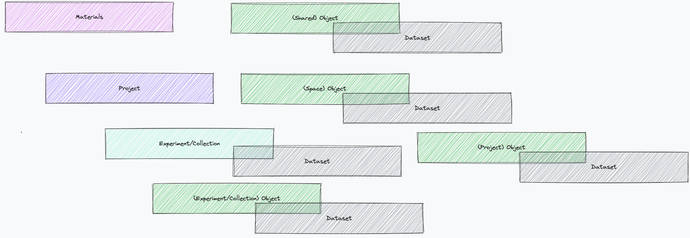
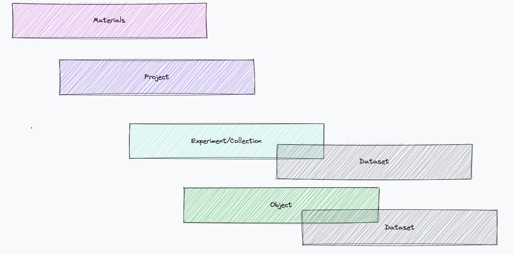
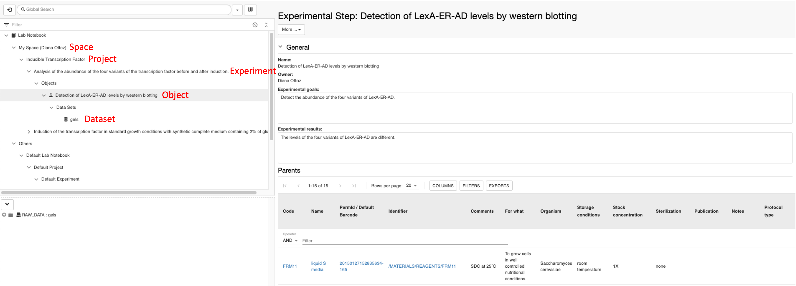
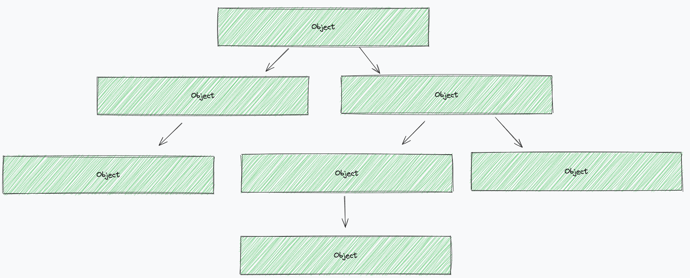
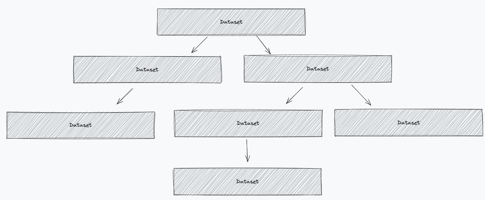
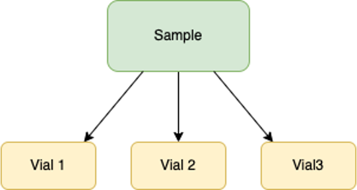
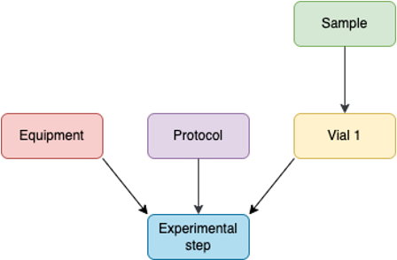
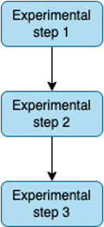

openBIS Data Modelling
======================

# Overview

openBIS has the following data structure:

1.  **Space**: entity with *Code and *Description**
2.  **Project**: entity with *Code* and *Description*
3.  **Experiment/Collection:** entity with *user-defined properties*
4.  **Object**: entity with *user-defined properties* 
5.  **Dataset**: folder where data files are stored. A dataset has *user-defined properties*      
      

*Space* is the top level. Below *Spaces* there are *Projects* and below *Projects* there are *Experiments/Collections*. 
In the general openBIS data model, *Objects* can:
- be shared across *Spaces* (i.e. they do not belong to any Space)
- belong to a *Space*
- belong to a *Project*
- belong to an *Experiment/Collection*
  
*Datasets* can be associated only to *Experiments/Collections* or to *Objects*.  

Access to openBIS is controlled either at the *Space* level or *Project* level (see [openBIS roles ](../general-admin-users/admins-documentation/user-registration.md#openbis-roles)).

  

## Data model in openBIS ELN-LIMS 
-------------------------------

In the openBIS ELN-LIMS a simplified data model is used, as shown below.  

. 

In this case, *Objects* can only belong to *Experiments/Collections*.

## Inventory

The inventory is usually conceived to be shared by all lab members. The
inventory is used to store all materials and protocols (i.e. standard
operating procedures) used in the lab. It is possible to create
additional inventories, for example of instruments and equipment.

The picture below shows an example of an Inventory with the different openBIS levels.  

## Lab Notebook

By default, the lab notebook is organised per user. Each user has a
personal folder (=*Space*), where to create *Projects*, *Experiments*
and Experimental Steps (=*Objects*). Data files can be uploaded to *Dataets*. Example structure:

  

  

Some labs prefer to organise their lab notebook using a classification
per project rather than per user. In this case an openBIS *Space* would
correspond to a lab Project and an openBIS *Project* could be a
sub-project. 
  

# openBIS parents and children
----------------------------

*Objects* can be linked to other *Objects*, *Datasets* to other *Datasets* with
N:N relationship. In openBIS these connections are known as *parents*
and *children*.

  

|

  

## Examples of parent-child relationships

1.  One or more samples are derived from one main sample. This is the
    parent of the other samples:  

      
2.  One Experimental step is performed following a protocol stored in the
    inventory, on a sample stored in the inventory, using a given equipment. The protocol, the sample and the equipment are the parents of the Experimental step

      
3.  One Experimental Step is done after another and we want to keep
    track of the links between the steps: 
    
     

      

