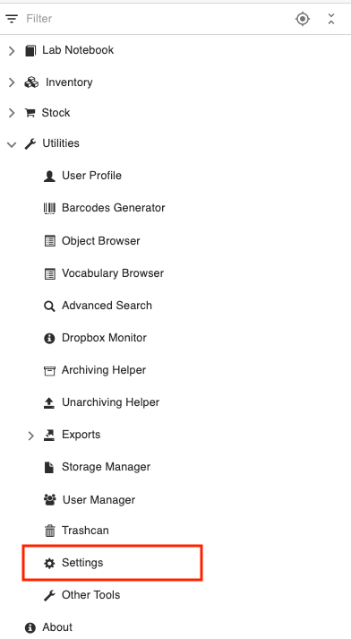
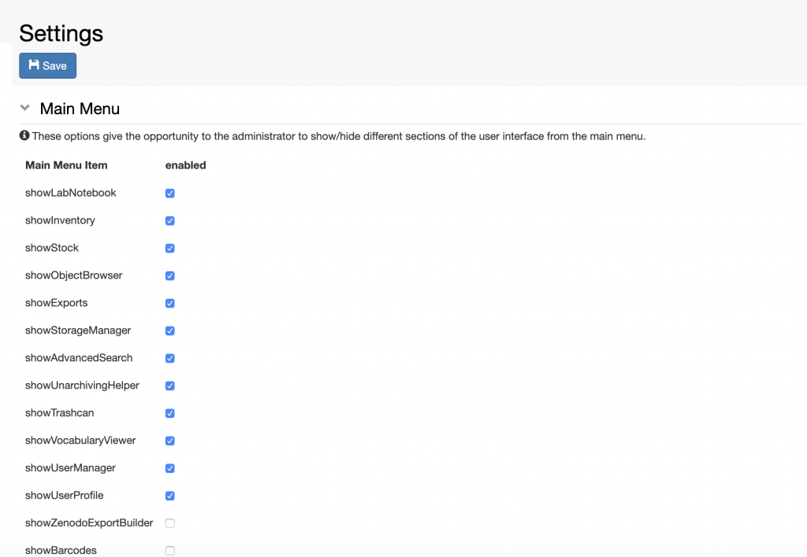
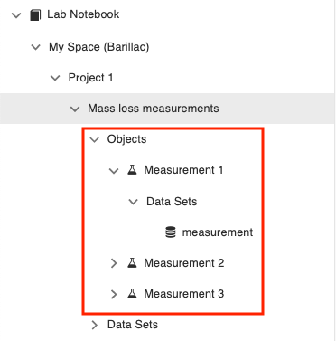
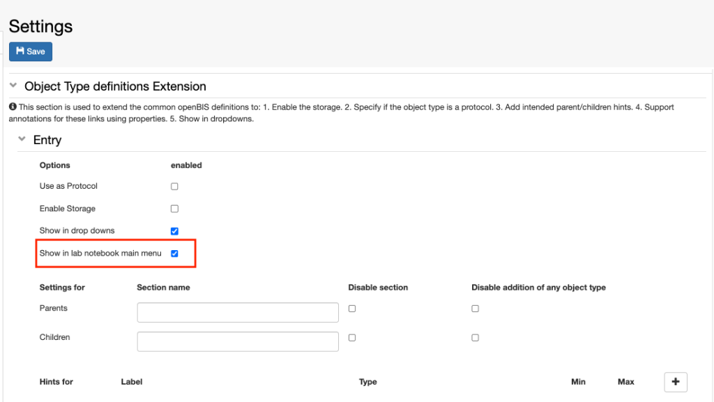

# Customise the Main Menu

 

## Main Menu Sections

  
The main menu can be customised from the **Settings**, under
**Utilities**, to hide sections that are not needed by the lab.

 

 

1.  Go to **Settings.**
2.  Click **Edit.**
3.  Go to the **Main Menu** section.
4.  Disable the parts of the menu which are not needed.
5.  **Save.**

 

 

1.  **showLabNotebook**: if unselected, the **Lab Notebook** section of
    the main menu ([Lab
    Notebook)](../../general-users/lab-notebook.md)
    will be hidden.
2.  **showInventory**: if unselected, the **Inventory** section of the
    main menu ([Inventory of Materials and
    Methods](../../general-users/inventory-of-materials-and-methods.md))
    will be hidden.
3.  **showStock**: if unselected, the **Stock** section of the main menu
    ([Managing Lab Stocks and
    Orders](../../general-users/managing-lab-stocks-and-orders-2.md))
    will be hidden.
4.  **showObjectBrowser**: if unselected, the **Object Browser** under
    **Utilities** in the main menu ([Object
    Browser)](../../general-users/additional-functionalities.md#browse-entries-by-type)
    will be hidden.
5.  **showStorageManager**: if unselected, the **Storage Manager** under
    **Utilities** in the main menu [(Storage
    manager](../../general-users/managing-lab-stocks-and-orders-2.md#))
    will be hidden.
6.  **showAdvancedSearch**: if unselected, the **Advanced Search** under
    **Utilities** in the main menu ([Advanced
    Search)](../../general-users/search.md)
    be hidden.
7.  **showUnarchivingHelper**: if unselected, the **Unarchiving Helper**
    and **Archiving Helper** under **Utilities** in the main menu ([Data
    archiving)](../../general-users/data-archiving.md)
    will be hidden.
8.  **showTrashcan**: if unselected, the **Traschcan** under
    **Utilities** in the main menu
    ([Trashcan](../../general-users/additional-functionalities.md#trashcan))
    will be hidden.
9.  **showVocabularyViewer:** if unselected, the **Vocabulary
    Browser** under **Utilities** in the main menu ([Vocabulary
    browser](../../general-users/additional-functionalities.md#vocabulary-browser))
    will be hidden.
10. **showUserManager**: if unselected, the **User Manager** under
    **Utilities** in the main menu ([User
    Registration](./user-registration.md))
    will be hidden.
11. **showUserProfile**: if unselected, the **User Profile** under
    **Utilities** in the main menu ([User
    Profile](./user-registration.md#user-profile))
    will be hidden.
12. **showZenodoExportBuilder**: if unselected, the **Zenodo
    Export** under **Utilities -> Exports** in the main menu 
    ([Export to
    Zenodo](../../general-users/data-export.md#export-to-zenodo))
    will be hidden.
13. **showBarcodes**: if unselected, the **Barcodes/QR codes Generator** under
    **Utilities** in the main menu
    ([Barcodes)](../../general-users/barcodes.md)
    will be hidden.

## Lab Notebook menu

It is also possible to customise which entities should be shown under
*Experiments/Collections* in the main menu under the **Lab Notebook**
section.

By default, only the *Object* types **Entry** and **Experimental Step**
are shown (see picture below).

 

 

 

If you want to show additional custom *Object* types in the lab notebook
main menu, they need to be enabled by editing the **Settings**. 

Go to the **Object Type definitions Extension** section in the
**Settings**. Open the relevant *Object* type, which you would like to
see in the Main menu of the Lab Notebook and select **Show in lab
notebook main menu**, as shown below.

By default, the Object Types **Entry** and **Experimental Step** have
this option already selected. 

 

 

Please note that this is only valid for the **Lab Notebook** section. In
the **Inventory** section, entries are never shown in the main menu,
because inventories can potentially have thousands of entries, which are
better visualised in tables, rather than in the main menu.

Updated on April 26, 2023
