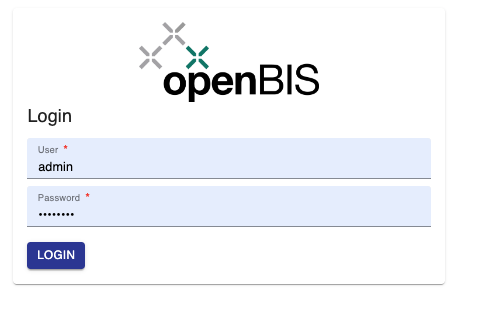
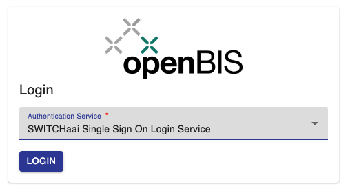
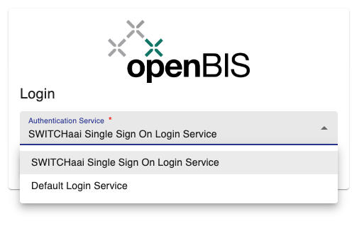
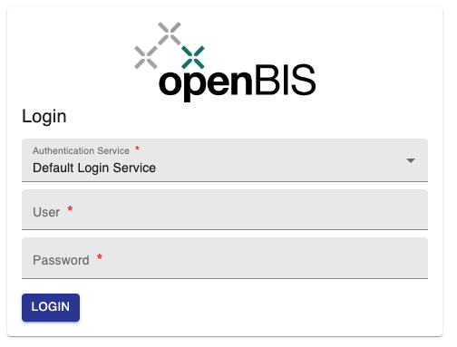

The admin interface of openBIS can can be accessed via a URL of this type: https://openbis-xxx/openbis/webapp/openbis-ng-ui/

where openbis-xxx is the name of the server specified in the openBIS configuration file, during the installation by a system admin.

# Login

## File based and/or LDAP authentication

When file based and/or LDAP authentication are used in openBIS, the login interface is as shown below. Users need to provide their username and password to login.
Only registered users with assigned rights can login to openBIS.

## SWITCHaai authentication

When SWITCHaai (SSO) authentication is used in addition to file based and/or LDAP authentication, the login interface is as shown below. 

SWITCHaai is selected by default. In this case, users need to click on **Login** and they will be redirected to the SWITCHaai login page.

If a user would like to authenticate with a file-based account or LDAP (depending on system configuration), they need to select **Default Login Service** from the dropdown and provide username and password.

