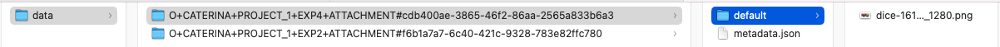

# Imports of openBIS exports

It is possible to export metadata and data from one openBIS instance to another.
The export process is described [here](../../general-users/data-export.md).

## Metadata import

The exported metadata (and related masterdata) can be imported in another openBIS instance by an instance admin via the admin UI, as described in [mastedata import and export](./masterdata-exports-and-imports.md). 

Exported metadata (and masterdata) is contained in a **xlsx** folder, as shown below.

If a data folder and/or a scripts folder are present in the exported **xlsx** folder, this needs to be zipped before import via admin UI (**xlsx.zip**).
If only the metadata.xlsx file is contained in the **xlsx** folder, this can be directly uploaded via admin UI.

## Datasets import

Exported datasets are contained in a data folder in a format ready to be imported via [eln-lims default dropbox](../../general-users/data-upload.md#data-upload-via-dropbox).

The folders contained in the data folder need to be placed in the eln-lims incoming directory and from here will be uploaded to the corresponsing openBIS entities.

When importing both metadata and data in a different openBIS instance, first the metadata need to be imported and afterwards the data. 

