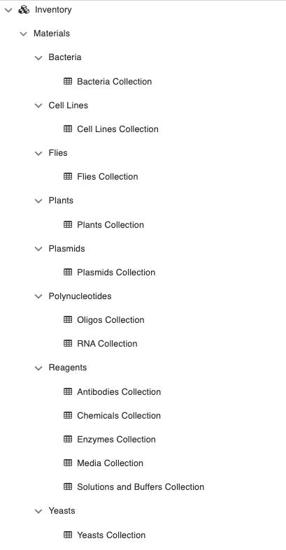
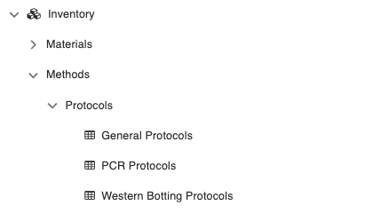

# Inventory overview

The default Inventory contains two
folders: **Materials** and **Methods**.

These are used to organise respectively samples and materials of any
type and lab protocols.

Samples, materials and protocols are modelled in openBIS as *Objects*.
In the openBIS ELN-LIMS for life sciences, the following Object types
are preconfigured in the database:

 

    Antibodies, Chemicals, Enzymes, Media, Solutions and Buffers, Plasmids, Plants, Oligos, 
    RNAs, Bacteria, Cell lines, Flies, Yeasts, General protocols, PCR protocols, Western blotting protocols.

 

These *Objects* are organised in *Collections* in the **Materials** and
**Methods** sections of the Inventory .

 

 

 

The generic openBIS ELN-LIMS only has one predefined *Object* type for
the Inventory:

 

    General Protocol 

 

Additional *Object* types and the corresponding *Collections* must be
created by the *Instance admin*, based on the needs of the lab.

 

It is possible to add additional folders in the Inventory, for example
for **Equipment** (see **[Create new Inventory
Spaces](https://openbis.ch/index.php/docs/admin-documentation-20-10-3/space-management/create-new-inventory-spaces/))**.

 

Updated on April 26, 2023
