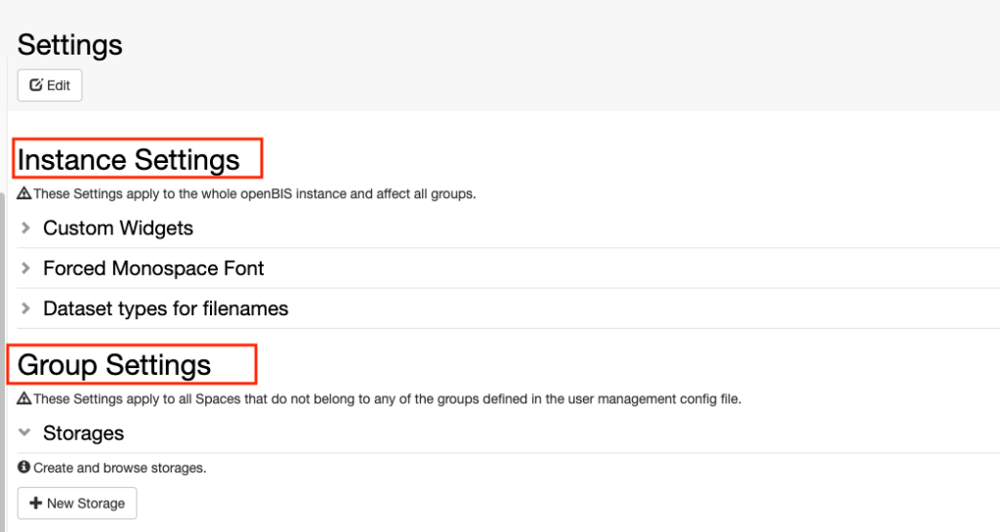
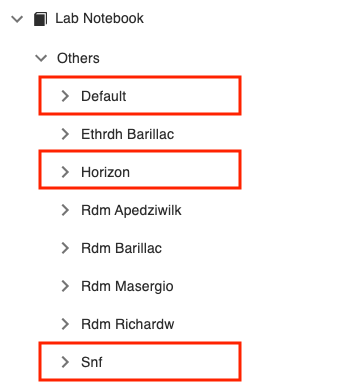
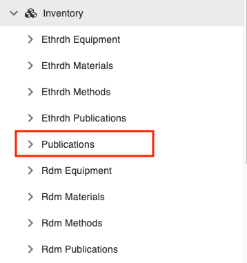

Multi Group Set Up
====

openBIS can be configured to be used by multiple groups, where every group only sees their own group Spaces.
This configuration needs to be done by a system admin, as described [here](https://openbis.readthedocs.io/en/latest/system-admin-documentation/advanced-features/share-ids.html).

In the example below we see two groups: RDM and ETHRDH. For each group, in the Inventory, there area n Equipment, a Materials, a Methods and a Publications Spaces with the group prefix. In the lab notebook, each group member has a personal Space where the name is the group prefix and the username of the user.

It is possible to configure the user management configuration file (sys admin) not to create user Spaces for a given group, in case one group prefers to organise their notebook by project, rather than by group members, as described [here](https://openbis.readthedocs.io/en/latest/system-admin-documentation/advanced-features/share-ids.html).
 

In a multi group instance users are automatically registered and the roles defined in the user management configuration file on the server are automatically assigned to them. There is a maintenance task that runs in the background at a frequency determined by the system admin. This can be once per day or several times per day. If there are new users, they will be added to openBIS when the maintenance task runs.
 

An instance admin can assign additional roles to users from the admin interface ([User Registration](https://openbis.readthedocs.io/en/latest/user-documentation/general-admin-users/admins-documentation/user-registration.html)). Default roles defined in the user management configuration file and automatically assigned cannot be removed, because they will be assigned again automatically by openBIS when the maintenance task runs.
 

We would recommend to assign SPACE_USER rights for the Inventory Spaces to every group user and SPACE_ADMIN rights for their own lab notebook. This can be specified in the user management configuration file by the system admin.
 

In the user management configuration file, one or more admins for each group can be designated. The group admin has by default SPACE_ADMIN rights to all the Spaces of their group. A group admin can customise the [Group ELN Settings](https://openbis.readthedocs.io/en/latest/user-documentation/general-admin-users/admins-documentation/multi-group-set-up.html#group-eln-settings) for the group.

 
## General ELN Settings

In a multi-group instance an *Instance admin* can customise the General
ELN Settings.

The Settings can be access from the main menu, under **Utilities**.

The General ELN Settings are Settings that are not specific to any of
the defined groups group , as shown below.

The General ELN Settings consist of two parts:

1.  **Instance Settings**. These settings affect the whole instance, it
    is not possible to customise them on a group level.
2.  **Group Settings**. These settings affect all general *Spaces* that
    do not belong to any group defined in the configuration file
    (see [openBIS set up for multi group
    instances](https://unlimited.ethz.ch/display/openBISDoc2010/User+Group+Management+for+Multi-groups+openBIS+Instances)).
    This is the case, for example, if *Spaces* are manually created and
    they do not belong to any group (see [Create new ELN
    Spaces](https://openbis.readthedocs.io/en/latest/user-documentation/general-admin-users/admins-documentation/space-management.html#create-new-eln-spaces)).

 

Spaces that do not belong to any group do not have a group prefix. In
the example below **Publications** do not belong to any group in the
Inventory.

and **Horizon**, **Snf** do not belong to any group in the Lab notebook.

### Instance Settings

 

1.  **Custom widget**s. This section allows to enable the Rich Text
    Editor or Spreadsheet component for a given field, as described
    in [Enable Rich Text Editor or Spreadsheet
    Widgets;](https://openbis.readthedocs.io/en/latest/user-documentation/general-admin-users/admins-documentation/new-entity-type-registration.html#enable-rich-text-editor-or-spreadsheet-widgets)
2.  **Forced Monospace Font**. This section allows to force the use of
    monospace font (i.e. fixed width) for selected MULTILINE\_VARCHAR
    properties. This is useful for example for plasmid sequences.
3.  **Dataset types for filenames**. This section allows to associate
    files with a given extension to a specific dataset type, as
    described in [Associate File Types to Dataset
    Types](https://openbis.readthedocs.io/en/latest/user-documentation/general-admin-users/admins-documentation/associate-file-types-to-dataset-types.html).

### Group Settings

1.  **Storages**. In this section the storages for samples to be used in
    *Spaces* not belonging to any predefined group (see above), can be
    created, as described in [Configure Lab
    Storage;](https://openbis.readthedocs.io/en/latest/user-documentation/general-admin-users/admins-documentation/customise-inventory-of-materials-and-samples.html#configure-lab-storage)
2.  **Templates**. In this section, the templates for a given *Object
    type* to be used in *Spaces* not belonging to any predefined group
    (see above) can be created, as described in [Create Templates for
    Objects](https://openbis.readthedocs.io/en/latest/user-documentation/general-admin-users/admins-documentation/create-templates-for-objects.html);
3.  **Object types definition extension**. In this section, it is
    possible to:
    1.  Define if one *Object type* is a protocol. If an *Object type*
        is defined as a protocol, it is possible to create a local copy
        of it under an Experiment, when linking to it as a parent, as
        described in [Enable Protocols in
        Settings;](https://openbis.readthedocs.io/en/latest/user-documentation/general-admin-users/admins-documentation/customise-inventory-of-protocols.html#enable-protocols-in-settings)
    2.  Enable the storage widget for an *Object type,* as described
        in [Enable Storage Widget on Sample
        Forms](https://openbis.readthedocs.io/en/latest/user-documentation/general-admin-users/admins-documentation/customise-inventory-of-materials-and-samples.html#enable-storage-widget-on-sample-forms)
    3.  Define if the *Object type* should be shown in drop downs, as
        described in [Enable Objects in
        dropdowns](https://openbis.readthedocs.io/en/latest/user-documentation/general-admin-users/admins-documentation/new-entity-type-registration.html#enable-objects-in-dropdowns);
    4.  Define if the *Object type* should be shown in the main menu
        under the Lab notebook section. By default objects are not shown
        in the main menu in the Inventory section.
    5.  Customise the *Parents* and *Children* sections for an *Object
        type* as described in [Customise Parents and Children Sections
        in Object
        Forms](https://openbis.readthedocs.io/en/latest/user-documentation/general-admin-users/admins-documentation/customise-parents-and-children-sections-in-object-forms.html);
4.  **Inventory Spaces**. It is possible to move *Spaces* from the
    Inventory section to the Lab notebook section and vice-versa as
    described in [Move Spaces between Lab Notebook and
    Inventory](https://openbis.readthedocs.io/en/latest/user-documentation/general-admin-users/admins-documentation/space-management.html#move-space-between-lab-notebook-and-inventory)
5.  **Main menu**. The main menu for the *Spaces* that do not belong to
    any predefined group (see above) can be customised here, as
    described in [Customise the Main
    Menu;](https://openbis.readthedocs.io/en/latest/user-documentation/general-admin-users/admins-documentation/customise-the-main-menu.html)
6.  **Miscellaneous**. In this section it is possible to:
    1.  Show the dataset archiving buttons in *Spaces* that do not
        belong to any predefined group. Please note that this is not
        available by default, but the infrastructure for [archiving to
        tapes](https://openbis.readthedocs.io/en/latest/user-documentation/general-users/data-archiving.html)
        (StrongBox/StrongLink) needs to be put in place by a *system
        admin ([Multi data set
        archiving](https://unlimited.ethz.ch/display/openBISDoc2010/Multi+data+set+archiving))*.
    2.  Hide sections by default in *Spaces* that not belong to any
        predefined group. By default some sections in some forms are
        hidden:
        1.  Description in *Spaces* and *Projects*.
        2.  Identification info in *Spaces*, *Projects*, *Experiments*,
            *Objects*, *Datasets*.

By unchecking this option, these sections will be shown by default.

 

Updated on April 26, 2023
 
## Group ELN Settings

 

In a multi group instance a *group admin* or *Instance admin* can
customise the ELN Settings for the group.

 

The group Settings can be selected from the **Settings** in the main
menu.

 

 

The Settings for the relevant group can be selected from the available
dropdown, as shown below.

 

 

 

In the group settings the following is configurable:

 

1.  **Storages**. In this section the group storages for samples can be
    created, as described in [Configure Lab
    Storage;](https://openbis.readthedocs.io/en/latest/user-documentation/general-admin-users/admins-documentation/customise-inventory-of-materials-and-samples.html#configure-lab-storage)
2.  **Templates**. In this section, the templates for a given *Object
    type* can be created, as described in [Create Templates for
    Objects](https://openbis.readthedocs.io/en/latest/user-documentation/general-admin-users/admins-documentation/create-templates-for-objects.html);
3.  **Object types definition extension**. In this section, it is
    possible to:
    1.  Define if one *Object type* is a protocol. If an *Object type*
        is defined as a protocol, it is possible to create a local copy
        of it under an Experiment, when linking to it as a parent, as
        described in [Enable Protocols in
        Settings;](https://openbis.readthedocs.io/en/latest/user-documentation/general-admin-users/admins-documentation/customise-inventory-of-protocols.html#enable-protocols-in-settings)
    2.  Enable the storage widget for an *Object type,* as described
        in [Enable Storage Widget on Sample
        Forms](https://openbis.readthedocs.io/en/latest/user-documentation/general-admin-users/admins-documentation/customise-inventory-of-materials-and-samples.html#enable-storage-widget-on-sample-forms)
    3.  Define if the *Object type* should be shown in drop downs, as
        described in [Enable Objects in
        dropdowns](https://openbis.readthedocs.io/en/latest/user-documentation/general-admin-users/admins-documentation/new-entity-type-registration.html#enable-objects-in-dropdowns);
    4.  Define if the *Object type* should be shown in the main menu
        under the Lab notebook section. By default objects are not shown
        in the main menu in the Inventory section.
    5.  Customise the Parents and Children sections for an *Object type*
        as described in [Customise Parents and Children Sections in
        Object
        Forms](https://openbis.readthedocs.io/en/latest/user-documentation/general-admin-users/admins-documentation/customise-parents-and-children-sections-in-object-forms.html);
4.  **Inventory Spaces**. It is possible to move Spaces from the
    Inventory section to the Lab notebook section and vice-versa as
    described in [Move Spaces between Lab Notebook and
    Inventory](https://openbis.readthedocs.io/en/latest/user-documentation/general-admin-users/admins-documentation/space-management.html#move-space-between-lab-notebook-and-inventory)
5.  **Main menu**. The main menu for the group can be customised here,
    as described in [Customise the Main
    Menu;](https://openbis.readthedocs.io/en/latest/user-documentation/general-admin-users/admins-documentation/customise-the-main-menu.html)
6.  **Miscellaneous**. In this section it is possible to:
    1.  Show the dataset archiving buttons for the group. Please note
        that this is not available by default, but the infrastructure
        for [archiving to
        tapes](https://openbis.readthedocs.io/en/latest/user-documentation/general-users/data-archiving.html)
        (StrongBox/StrongLink) needs to be put in place by a *system
        admin ([Multi data set
        archiving](https://unlimited.ethz.ch/display/openBISDoc2010/Multi+data+set+archiving))*.
    2.  Hide sections by default. By default some sections in some forms
        are hidden:
        1.  Description in *Spaces* and *Projects*.
        2.  Identification info in *Spaces*, *Projects*, *Experiments*,
            *Objects*, *Datasets*.

By unchecking this option, these sections will be shown by default.

 

Updated on April 26, 2023
