New Entity Type Registration
====

Entity types, i.e. *Experiment/Collection*, *Object* and *Dataset*
types, as well as *Property types* and *Controlled Vocabularies*
constitute the openBIS **masterdata**. They can be created by someone
with *Instance admin* role in the **new Admin openBIS UI**. 

Note: *Material* types are also part of the openBIS masterdata. However,
they are no longer supported and will be decommissioned soon. They
should NOT be used. 

The new Admin openBIS UI can be accessed via a URL of this type:
**https://openbis-xxx/openbis/webapp/openbis-ng-ui/**

where openbis-xxx is the name of the server specified in the openBIS
configuration file, during the installation by a system admin.

## Register a new Object Type

1.  Select **Types -&gt; Object Types** from the menu.
2.  Click **Add** at the bottom of the page.
 

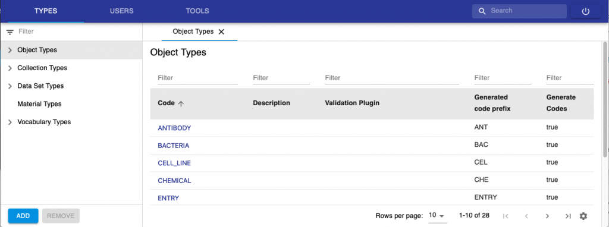
 

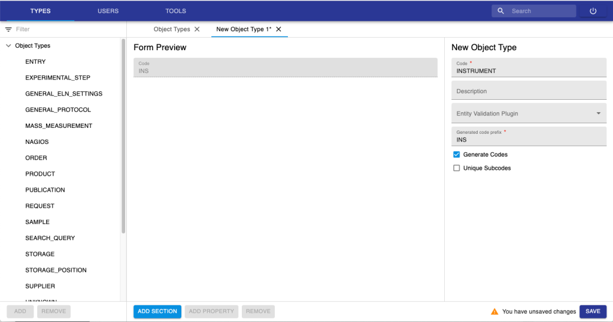
 

3. Enter a ***Code***. E.g. **INSTRUMENT**. This is the name of the
Object to create and is unique. Please note that Codes should be in
capital letters, and they can only contain A-Z, a-z, 0-9 and \_, -, .

4. Provide a description (not mandatory).

5. Entity validation plugin is used when we want to have validation on
some data entries. This is done via a custom script (see [Entity Validation Scripts](../properties-handled-by-scripts.md#entity-validation-scripts))

6. Enter the **Generated Code Prefix**. As a convention, we recommended
to use the first 3 letters of the *Object* *type* code (e.g. **INS**, in
this case). This field is used by openBIS to automatically generate
Object codes: the codes will be for example INS1, INS2, INS3, etc.

7. Leave **Generate Codes** selected if you want to have codes
automatically generated by openBIS.

8. **Unique Subcodes** is used for contained objects, which are not
used in the ELN. Ignore this option. 

9. Click **Add Section** at the bottom of the page. Sections are ways
of grouping together similar properties. Examples of sections used in
the ELN are *General info*, *Storage info*, *Experimental Details*, etc.
 

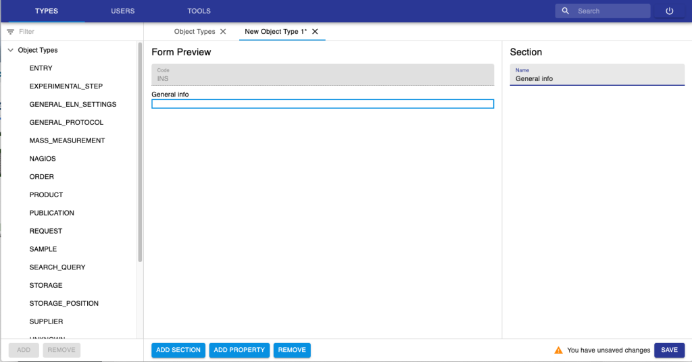
 

10. Add properties inside the Section, by clicking the **Add Property**
button at the bottom of the page. To remove a property, use the
**Remove** button at the bottom of the page. 

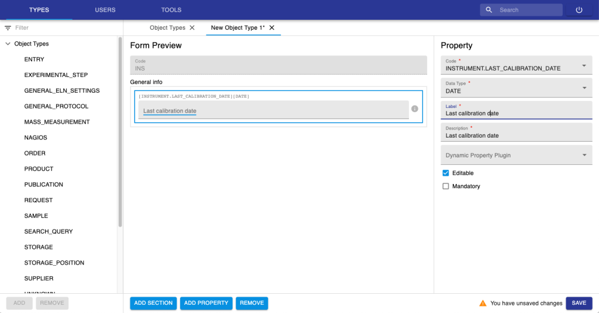

11. Click **Save** at the bottom of the page.
 

Please note that new *Object types* created in the admin UI, do not
automatically appear in ELN drop downs, but they have to be manually
enabled, as described here: [Enable Objects in dropdowns](./new-entity-type-registration.md#enable-objects-in-dropdowns) 

## Registration of Properties

When registering new properties, the fields below need to be filled in.

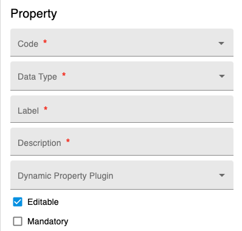

1.  **Code.** Unique identifier of the property. Codes can only contain
    A-Z, a-z, 0-9 and \_, -, .
2.  **Data Type.** See below for data types definitions.
3.  **Label.** This is the property/column header that the user can see
    in the ELN.
4.  **Description**: The description is shown inside a field, to give
    hints about the field itself. In most cases, label and description
    can be the same.
5.  **Dynamic Property Plugin**: Script for calculated properties.
    See [Dynamic properties](../properties-handled-by-scripts.md#dynamic-properties)
6.  **Editable**: Editable in the ELN interface. In some cases, metadata
    is automatically imported by scripts and this should not be changed
    by users in the interface.
7.  **Mandatory**: Field can be set as mandatory.
 

### Property Data Types
 

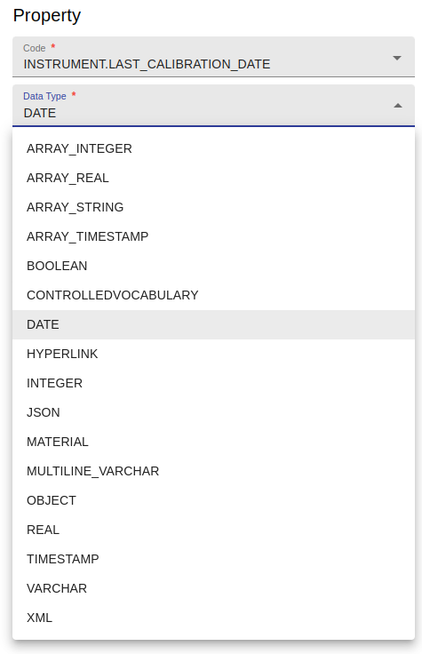

1.  **BOOLEAN**: yes or no
2.  **CONTROLLEDVOCABULARY**: list of predefined values
3.  **DATE**. Date field
4.  **HYPERLINK**: URL
5.  **INTEGER**: integer number
6.  **MATERIAL**. Not used in ELN. It will be dismissed.
7.  **MULTILINE\_VARCHAR**: long text. It is possible to enable a Rich
    Text Editor for this type of property. This is described
    here: [Enable Rich Text Editor or Spreadsheet Widgets](./new-entity-type-registration.md#enable-rich-text-editor-or-spreadsheet-widgets)
8.  **REAL**: decimal number
9.  **OBJECT**. 1-1 connection to a specific object type.
10. **TIMESTAMP**: date with timestamp
11. **VARCHAR**: one-line text
12. **XML**: to be used by *Managed Properties* (see [openBIS Managed Properties](../properties-handled-by-scripts.md#managed-properties) and for *Spreadsheet component*s, as described here:[Enable Rich Text Editor or Spreadsheet Widgets](./new-entity-type-registration.md#enable-rich-text-editor-or-spreadsheet-widgets)
 

### Considerations on properties registration

1.  If you create a property with code “PROJECT”, you should not use the
    label “Project”. This will give an error if you use XLS Batch
    registration/update, because openBIS considers this to be an openBIS
    *Project*.
2.  You should not assign more than 1 property with same label to the
    same *Object* type. If two or more properties with the same label
    are present in the same *Object* type, this will result in an error
    in the XLS Batch registration/update.
 

### Controlled Vocabularies

Controlled vocabularies are pre-defined lists of values for a given
field.
 

Existing Vocabularies can be visualised from the Types -&gt;
Vocabularies Tab. Vocabularies starting with the “**$**” symbol are
internal: they cannot be deleted and their terms cannot be deleted.
However, it is possible to add new terms to these vocabularies and these
can also be deleted.

New Vocabularies can be added, by clicking the **Add** button at the
bottom of the page.

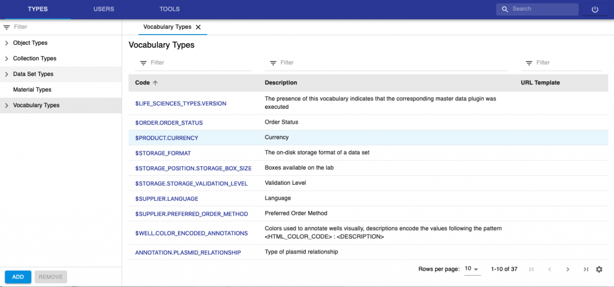

When registering a new vocabulary, a Code for the vocabulary needs to be
entered. This corresponds to the name of the vocabulary, and it is a
unique identifier. Codes can only contain A-Z, a-z, 0-9 and \_, -, .

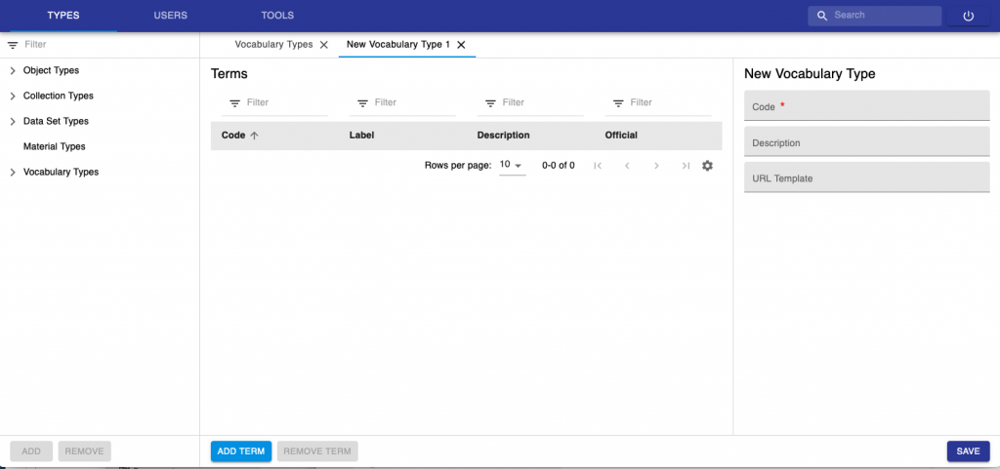

To add terms to the list click **Add Term** at the bottom of the page.
Vocabulary terms always have a code and a label: the code is unique and
contain only alpha-numeric characters; labels are not necessarily unique
and allow also special characters. If the label is not defined, codes
are shown.

After creating the vocabulary and registering the terms, remember to **Save**.

## Register a new Experiment/Collection type

The registration of a new **Collection** type is very similar to the
registration of **Object** types. For Collection Types, you only need to
provide a Code (which is a unique identifier), Description and add a
validation plugin if you want to have metadata validation (see [Entity
Validation Scripts](../properties-handled-by-scripts.md#entity-validation-scripts)).

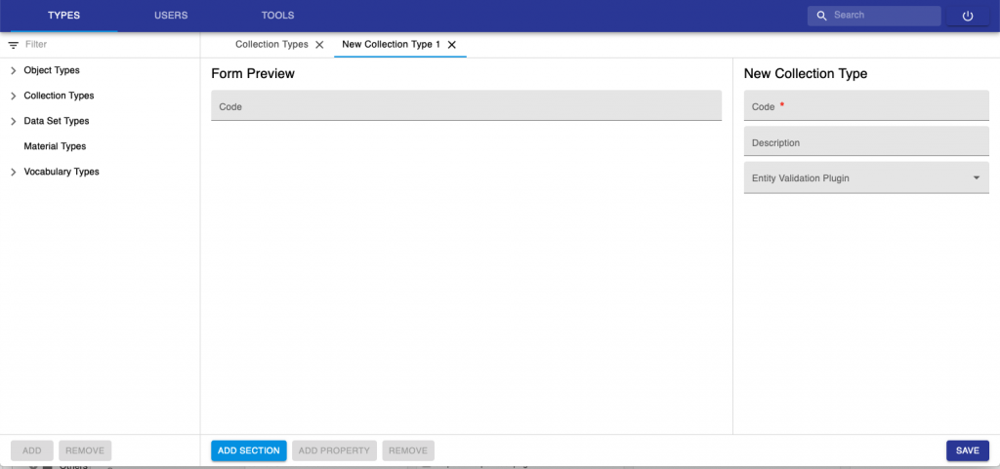

## Register a new Dataset type

The registration of a new Dataset types is similar to the registration
of object types. 

It is possible to disallow deletion for a given dataset type.

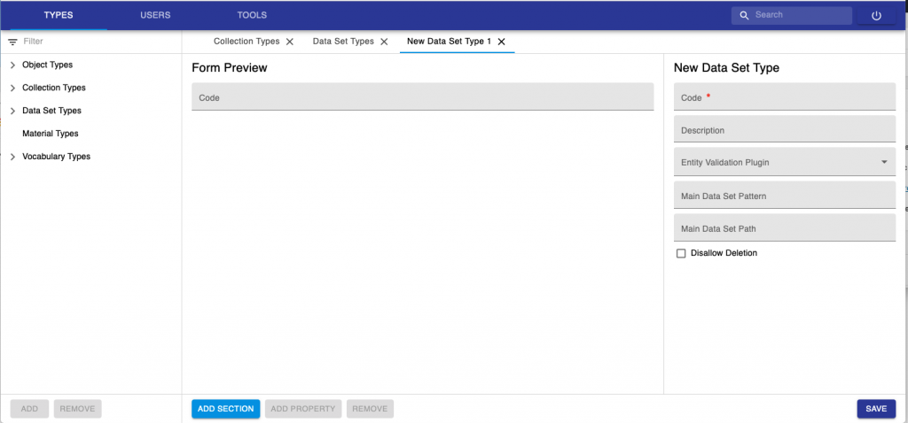

 
## Enable Rich Text Editor or Spreadsheet Widgets

  
For certain fields, it is possible to enable the use of a Rich Text
Editor (RTE) or a spreadsheet component. *Instance admin* rights are
necessary for this.

  
The **RTE** can be enabled for properties of type
**MULTILINE\_VARCHAR**. The **spreadsheet component** can be enabled for
properties of type **XML**.

  
Procedure:  
  

1.  Properties are defined when creating new entity types (*Datasets*,
    *Objects*, *Experiments/Collections*)
2.  To set a property as RTE or spreadsheet go to the **Settings**,
    under **Utilities**
3.  Select /ELN\_SETTINGS/GENERAL\_ELN\_SETTINGS
4.  Enable editing and scroll down to the **Custom Widgets** section
5.  Click the + button on the same line as **Property Type** and
    **Widget**, as shown below
6.  A new field will appear where you can select the property type and
    the widget. Choices are: **Word Processor** (=RTE) or
    **Spreadsheet.**

Updated on October 19, 2022
 
## Enable Objects in dropdowns

 

 

By default, no Object shows in dropdown menus. Which object types should
show in dropdown menus can be customised from the Settings.

1.  Navigate to the Object Type definitions Extension
2.  Open one Object Type (e.g. Antibody)
3.  Select show in drop downs
4.  Save the Settings

 

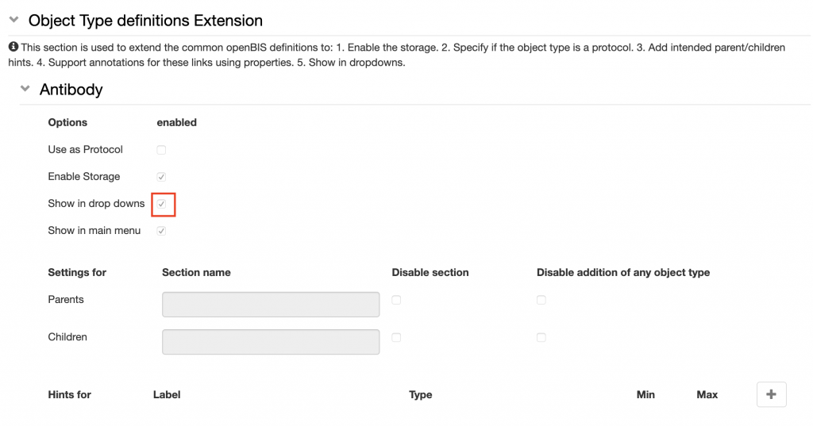

Updated on October 19, 2022
 
## Register masterdata via Excel

 

It is possible to register openBIS masterdata using an Excel template
from the admin UI.

 

This can be done from the Import menu under the Tools sections, as shown
below. Three options can be chosen for the import:

 

1.  **fail if exists**: if a type or a property already exists in the
    database, the upload will fail.
2.  **ignore if exists**: if a type or a property already exists in the
    database, the upload will ignore this.
3.  **update is exists**: if a type or a property already exists in the
    database, the upload will update existing values.

 

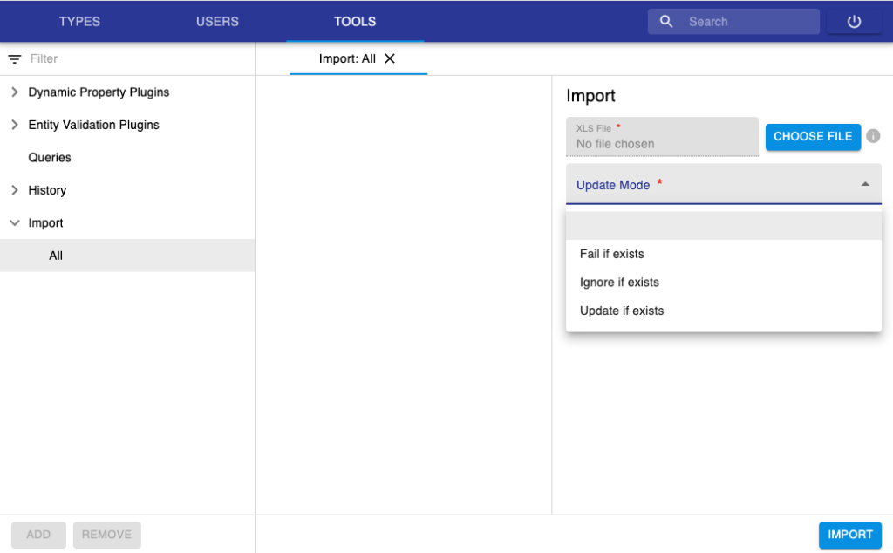

 

 

An example template of an Excel masterdata file can be found here:
[masterdata-template](att/masterdata-template-no-version.xls)

Please note that in the template we used separate spreadsheets for each
type (Sample, Experiment, Dataset), but it is also possible to have
everything in one single spreadsheet.

 

### Modifying existing types

If you wish to add a new property to an existing
*Collection/Object/Dataset* type, you need to:

1\. add the property in the file

2\. use **Ignore if exists** as upload method. In this case, only the
new property is added to the type.

 

### Masterdata and metadata import

The import on the admin UI allows also to register entities in addition to
masterdata. An example template file for this can be found here:
[masterdata-metadata](att/masterdata-metadata-no-version.xls)

 

More extensive documentation on the XLS format for masterdata and
metadata registration can be found
[here](../../advance-features/excel-import-service.md).

 
## Properties overview

 

The overview of all properties registered in openBIS and their
assignments to types is available under the **Types** section in the
admin UI, as shown below.

 

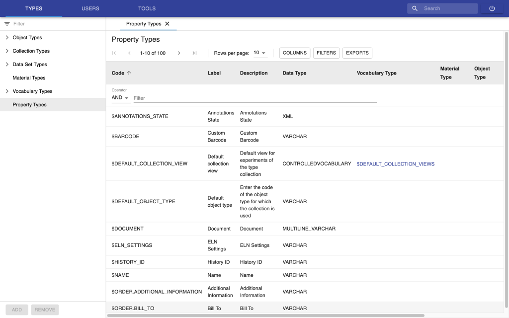

 
## Internal properties and vocabularies

 

Some properties and vocabularies are internally defined in openBIS.

These can be identified by the **$** sign.

 

Internal properties (e.g. $NAME, $BARCODE, etc) cannot be deleted nor
modified, not even by an instance admin.

 

Internal vocabularies (e.g. $DEFAULT\_COLLECTION\_VIEWS, etc), cannot be
deleted and their existing terms cannot be deleted nor modified, however
an instance admin can add new terms to an internal vocabulary. The terma added by an admin can be modified and/or deleted.

## Default openBIS Types

Certain Collection, Object and Dataset types are provided with the default openBIS installation.
These types often use $properties, which cannot be deleted nor modified.

It is however possible to add new properties to these types. The newly added properties must NOT be made mandatory, as this might cause the system not to function correctly and will create problems during an upgrade.

Default types should also not be deleted and re-created with the same code and different properties, as this might cause the system not to function correctly and will create problems during an upgrade.

In openBIS 7.0 these actions will be prevented by introducing internal types and internal property assignments.

