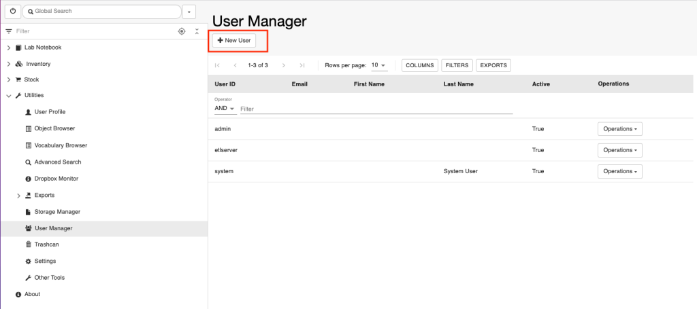
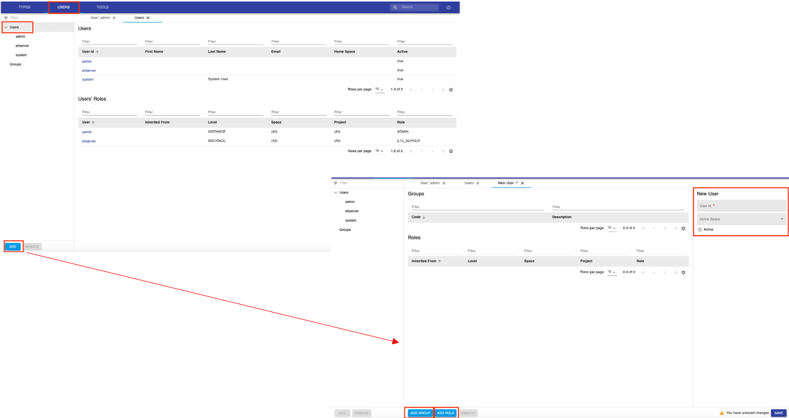
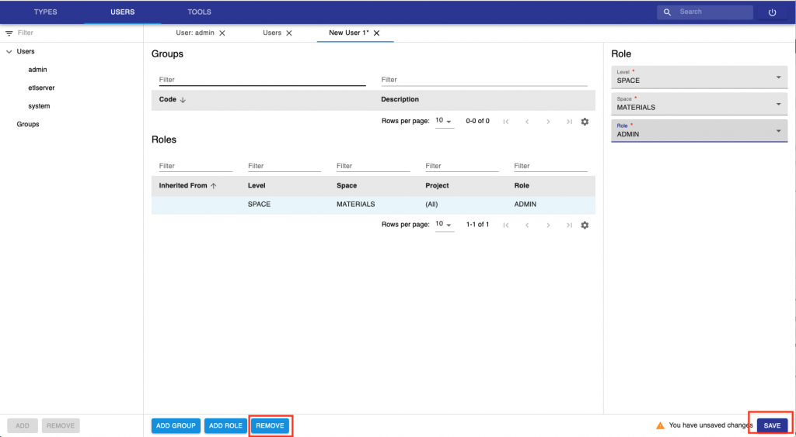
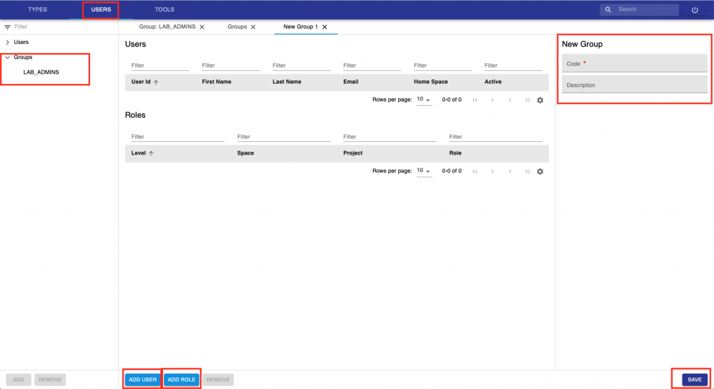
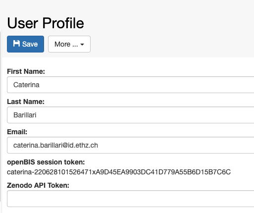
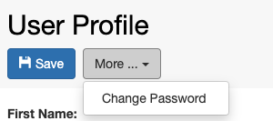
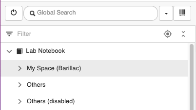
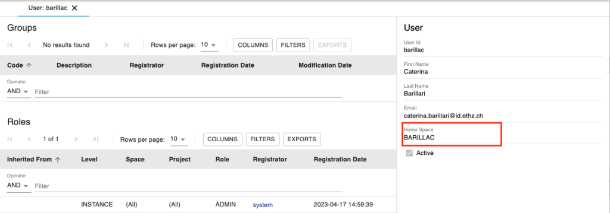

User Registration
====

## Register users in ELN Interface

Users can only be registered by someone with *Instance admin* role:

1.  Go to the **User Manager**, under **Utilities**.
2.  Click the  +**New** **User** button. 

3. Select the **Authentication Service**:

a. **Default Authentication Service**. This can be LDAP or SSO.

b. **File Authentication Service**. In this case a username and password need to be created.

4. **User ID**. for LDAP authentication, this is the LDAP username; for SSO authentication this is the email address of the user.

For file-based authentication provide username and password. The password can later be changed by the user.

## Default roles assigned in ELN

When a user is registered via the ELN interface, a *Space* (folder) with
the name of the user is automatically created under the Lab Notebook
main menu. The user is also assigned some default roles:

1.  *Space admin* of the *Space* created for him/her under the notebook.
2.  *Space user of* the Inventory *Spaces* (MATERIALS, METHODS by
    default), the STOCK\_CATALOG and the STORAGE *Spaces*.
3.  *Space Observer* of the STOCK\_ORDERS, ELN\_SETTINGS and
    PUBLICATIONS S*paces*.

Modification to default rights can be granted by an *Instance admin*
from the *admin UI*, as explained below.

Overview of roles:
[openBIS Roles](https://openbis.readthedocs.io/en/latest/user-documentation/general-admin-users/admins-documentation/user-registration.html#openbis-roles)

## Register users from the admin UI

When users are registered via the admin UI no default roles are
assigned.
 

To register new users from the admin UI:

1.  go to the **Users** tab. The **Users** and **Groups** will show in
    the main menu on left had side.
2.  Click on **Users** in the menu: the **Add** button at the bottom of
    the menu will become active (blue)
3.  Click the **Add** button
4.   Enter the U**ser Id**. This is the LDAP username, when LDAP
    authentication is used, or the email address if SSO is used. Please
    note that file-based authentication (where username and password can
    be created) is not supported by the admin UI.
5.  **Home space**: this sets the default folder a user sees marked as
    **My Space** in the Lab Notebook.
6.  Click the **Add Role** button at the bottom of the page to assign a
    role to the user.
7.  Click the **Add Group** button at the bottom of the page to assign a
    user to a group of users.

8. To assign a role to a user, first the **Level** needs to be selected
(Instance, Space, Project) .

9.If level is Instance, you can directly select a role (Admin, Observer). If the level is Space or Project, you first need to select the Space or Project and then assign a [Role](https://openbis.readthedocs.io/en/latest/user-documentation/general-admin-users/admins-documentation/user-registration.html#openbis-roles).

10. Multiple roles can be assigned to a user. 

11. Roles can be removed from the **Remove** button at the bottom of
the page. 

12. After making the necessary changes, press the **Save** button.

Note: for using the ELN interface, it is necessary to assign every user
or user group the OBSERVER role to the space ELN\_SETTINGS.

## Create users groups in admin UI
 

It is possible to create groups of users and assign rights to a group:

1.  go to the **Users** tab. The **Users** and **Groups** will show in
    the main menu on left had side.
2.  Click on **Groups** in the menu: the **Add** button at the bottom of
    the menu will become active (blue)
3.  Click the **Add** button
4.  Enter a **Code** for the group. This is the equivalent of a name,
    but Codes can only contain numbers, letters and the following
    symbols: . – \_
5.  You can now assign registered users to the group and assign Roles as
    explained above.

## openBIS roles
 

### Observer

This role can be assigned to the whole openBIS instance (*Instance
Observer*) or to specific *Spaces* or *Projects* (*Space* or *Project
Observer*). Users with this role have read-only access to the whole
openBIS (*Instance Observer*), or to a specified *Space* or *Project*
(*Space* or *Project Observer*).

An Observer can see and search everything in an openBIS instance or the
*Space/Project* which they have access to. They can also download
datasets. They cannot modify nor delete anything.

 

### Space/Project User

Extends Observer permissions with some creating and editing
functionality. Permissions are limited to specified *Space(s)* or
*Project(s)*.

Can do everything that Observer and additionally:

-   create
    -   objects
    -   collections
-   edit
    -   objects
    -   collections
    -   projects

 

### Space/Project Power User

Extends *Space/Projec*t User permissions with some deleting, editing and
processing functionality. Permissions are limited to specified
*Space(s)* or *Project(s)*.

Can do everything that *Space/Project* User and additionally:

-   create projects
-   delete
    -   projects
    -   data sets
    -   objects
    -   collections

Please note that this role cannot be assigned via the ELN UI, only via
admin UI.

### Space/Project Admin

Extends Space/Project Power User permissions allowing to manage roles
and projects inside given *Space(s)* or *Project(s)*.

Can do everything that Space/Project Power User and additionally:

-   assign and remove Space/Project roles

 

### Instance Admin

Has the full access to given openBIS instance.

Can do everything that Space/Project Admin and additionally:

-   create
    -   space
    -   material
    -   person
    -   property type
    -   vocabulary
    -   material type
    -   object type
    -   collection type
    -   data set type
-   create/delete instance admin role
-   edit
    -   material
    -   property type
    -   property type assignment
    -   vocabulary
    -   material type
    -   object type
    -   collection type
    -   data set type
-   assign/unassign property type
-   delete
    -   space
    -   vocabulary terms
    -   material type
    -   sample type
    -   experiment type
    -   data set type

 

Please note that this role cannot be assigned via the ELN UI, only via
admin UI.

 

Updated on April 26, 2023
 
## User Profile

In the User Profile, a user who is logged in into openBIS can find the
following information:

 

1.  **First Name**
2.  **Last Name**
3.  **Email**
4.  **openBIS session token**
5.  **Zenodo API Token** ([Export to
    Zenodo](https://openbis.readthedocs.io/en/latest/user-documentation/general-users/data-export.html#export-to-zenodo))

 

First name, last name and email are automatically filled in when LDAP or
SSO are used for authentication.

In case of file-based authentication, this information can be entered
here directly from the user.

 

 

For file-based authentication, users can also change their password
here, from the **Change Password** option under the **More..** dropdown.

 

Updated on June 28, 2022
 
## Assign home space to a user

 

When a home space is assigned to a user, this becomes marked as **My
Space** for that user in the lab notebook, as shown below.

 

 

When users are registered via the ELN UI, a *Space* with their username
is created (see [User
Registration)](https://openbis.readthedocs.io/en/latest/user-documentation/general-admin-users/admins-documentation/user-registration.html)
and this is automatically set as home space for the user.

The same happens in multi-group instances where spaces are created for
each user in the lab notebook section.

An *instance admin* can change the home space of a user or assign one to
a user that does not have a home space assigned from the admin UI, as
shown below.

 

 

Please note that when a user is inactivated, the home space assigned to
that user is moved in the ELN UI to the folder **Others (disabled).** If
this is not desired, the space should be removed as home space from the
inactivated user. This can be done by an *instance admin*.

 

 

 

Updated on April 26, 2023
