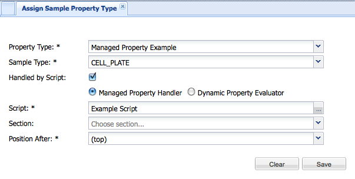
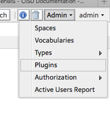
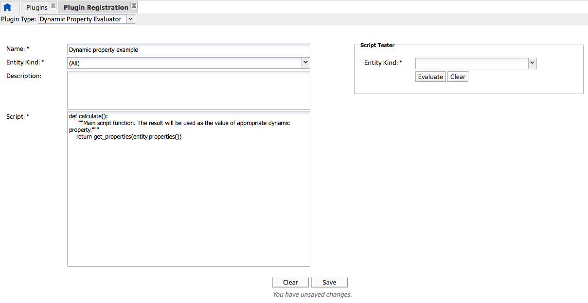
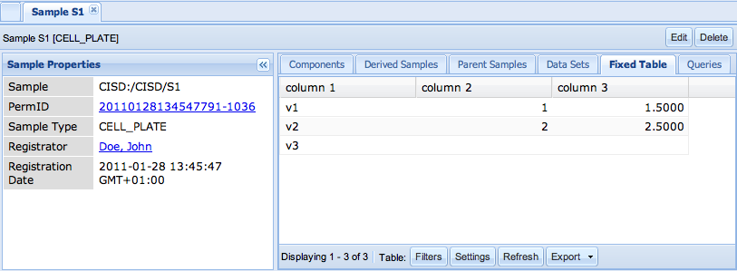
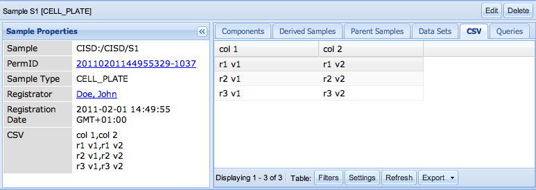
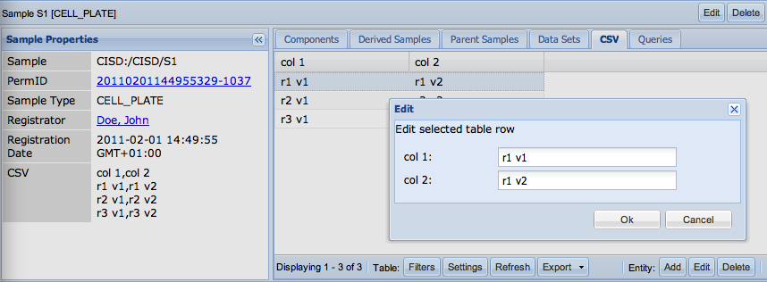
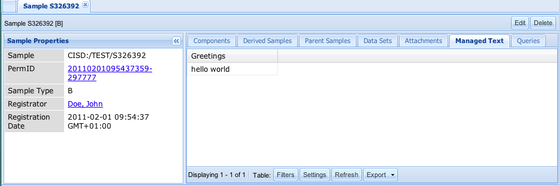

Properties Handled By Scripts
====
 

##### Introduction

One of the reasons why openBIS is easily extensible and adjustible is
the concept of generic entities like samples, experiments, materials and
data sets. By adding domain specific properties to the mentioned
objects, instance administrator creates a data model specific to given
field of study. Values of configured properties will be defined by the
user upon creation or update of the entities (samples etc.).

In most cases values of properties must be provided directly by the
user. The default way of handling a property in openBIS can be changed
by instance admin defining a property that should be handled by a script
written in [Jython](http://www.jython.org) or Predeployed Plugin written
in Java. Jython plugins use Jython version configured by the
service.properties property `jython-version` which can be either 2.5 or
2.7.

##### Types of Scripts

There are two types of plugins that can be used for handling properties,
and one script type to perform validations on entities:

1.  **Dynamic Property Evaluator** (for properties referred to as
    *Dynamic Properties*)  
    -   for properties that **can't be modified by users**,
    -   values of such properties will be **evaluated automatically**
        using metadata already stored in openBIS (e.g. values of other
        properties of the same entity or connected entities),
    -   the script defines an expression or a function that returns a
        value for a *Dynamic Property* specified in the script
2.  **Managed Property Handler** (for properties referred to as *Managed
    Properties*)

&nbsp;

1.  -   for properties that will be **indirectly modified by users**,
    -   the script alters default handling of a property by openBIS by
        defining functions that specify e.g.:  
        -   how the property should be **displayed** in entity detail
            view (e.g. as a table),
        -   **input fields** for modifying the property,

    &nbsp;

    -   -   **translation** and/or **validation** of user input.

2.  **Entity Validation**
    1.  performed after each update or creation of a given entity type.
    2.  the user provided script performs a validation, which can cancel
        the operation if the validation fails

##### Defining properties

To create a property that should be handled by a script perform the
following steps.

1.  Define a property type with appropriate name and data type
    (Administration-&gt;Property Types-&gt;New).
2.  Define a script that will handle the property
    (Administration-&gt;Scripts) or deploy a Java plugin. For details
    and examples of usage go to pages:  
    -   [Dynamic Properties](/display/openBISDoc2010/Dynamic+Properties)
    -   [Managed Properties](/display/openBISDoc2010/Managed+Properties)
    -   [Entity validation
        scripts](/display/openBISDoc2010/Entity+validation+scripts)
3.  Assign the created property type to chosen entity type using the
    created script (e.g. for samples: Administration-&gt;Property
    Types-&gt;Assign to Sample Type):  
    -   select Handled By Script checkbox,
    -   select the appropriate Script Type
    -   choose the Script
4.  The validation scripts are assigned to the type in the "Edit Type"
    section. (e.g Admin-&gt;Types-&gt;Samples. Select sample and click
    edit.)

 

 

 

 

 

-   No labels
 
Dynamic Properties
------------------

### Introduction

*Dynamic Properties* are one of two types of properties that use Jython
scripts for providing special functionality to OpenBIS. To understand
the basic concept read about [Properties Handled By
Scripts](/display/openBISDoc2010/Properties+Handled+By+Scripts).

### Defining dynamic properties

To create a dynamic property:

-   Define a property type with appropriate name and data type
    (`Admin->Plugins→Add Plugin`)  

-   Choose `Dynamic Property Evaluator` from Plugin type dropdown list
    in the upper left corner.  

-   You may evaluate script on chosen entity in Script Tester section.

### Creating scripts

To edit existing dynamic property script, edit dynamic
property (`Admin→Plugins→(click on dynamic property)→Edit plugin`)

The scripts should be written using standard Jython syntax. Unlike
custom columns and filters (which also require Jython syntax), dynamic
properties can have more than one line of code. If the Script contains
only one line, it will be evaluated and used as the value of appropriate
dynamic property. If on the other hand a multi line script is needed,
the function named `"calculate"` will be expected and the the result
will be used as property value.

To access the entity object from the script, use the following syntax:

    entity.<requested method>

Currently available methods that can be called on all kinds of entities
include:

-   `code()`
-   `property(propertyTypeCode)`
-   `propertyValue(propertyTypeCode)`
-   `propertyRendered(propertyTypeCode)`
-   `properties()`

For more details see
[IEntityAdaptor](https://openbis.ch/javadoc/20.10.x/javadoc-dynamic-api/ch/systemsx/cisd/openbis/generic/shared/hotdeploy_plugins/api/IEntityAdaptor.html)
(interface implemented by `entity`) and
[IEntityPropertyAdaptor](https://openbis.ch/javadoc/20.10.x/javadoc-dynamic-api/ch/systemsx/cisd/openbis/generic/shared/hotdeploy_plugins/api/IEntityPropertyAdaptor.html)
(interface implemented by each property).

It is also possible to acces the complete Java Object by calling
`"entityPE()"` method, but this is appropach is not recomended, as the
returned value is not a part of a well defined API and may change at any
point. You may use it as a workaround, in case some data are not
accessible via well defined API, but you should contact OpenBIS helpdesk
and comunicate your needs, so the appropriate methods can be added to
the official API.

You can test your script on selected entities
(samples/experiments/materials/data sets) using the testing environment
- part of `Script Editor`.

 

#### Simple Examples

1.  Show a value of a Sample property which is named 'Multiplicity'

  

    entity.propertyValue('Multiplicity')

  

2\. Takes an existing property and multiplies the value by 1.5

    float(entity.propertyValue('CONCENTRATION_ORIGINAL_ILLUMINA'))*1.5

  

  

#### Advanced Examples

1.  Show all entity properties as one dynamic property:

  

    def get_properties(e):  
        """Automatically creates entity description"""
        properties = e.properties()
        if properties is None:
            return "No properties defined"
        else:
            result = ""
            for p in properties:
                result = result + "\n" + p.propertyTypeCode() + ": " + p.renderedValue()
            return result
        
    def calculate(): 
        """Main script function. The result will be used as the value of appropriate dynamic property."""
        return get_properties(entity) 

  

2\. Calculate a new float value based some other values

  

    import java.lang.String as String

    def calculateValue():  
      nM = 0
      uLDNA = 0
      if entity.propertyValue('CONCENTRATION_PREPARED_ILLUMINA') != '' and \
         entity.propertyValue('FRAGMENT_SIZE_PREPARED_ILLUMINA') != '' :
        nM =  float(entity.propertyValue('CONCENTRATION_PREPARED_ILLUMINA')) /  \
               float(entity.propertyValue('FRAGMENT_SIZE_PREPARED_ILLUMINA')) *  \
               1000000 / 650
        if float(entity.propertyValue('UL_STOCK')) !='' :
          uLDNA =  float(entity.propertyValue('UL_STOCK')) * 2 / nM    
          uLEB = float(entity.propertyValue('UL_STOCK')) - uLDNA
          return String.format("%16.1f", uLEB)
      return 0
     
    def calculate(): 
        """Main script function. The result will be used as the value of appropriate dynamic property."""
        return calculateValue()

  

3\. Calculate a time difference between two time stamps:

  

    from datetime import datetime
    def dateTimeSplitter(openbisDate):
      dateAndTime, tz = openbisDate.rsplit(" ", 1)
      pythonDateTime = datetime.strptime(dateAndTime, "%Y-%m-%d %H:%M:%S")  
      return pythonDateTime
    def calculate():
      
      try:
        start = entity.propertyValue('FLOW_CELL_SEQUENCED_ON')
        end = entity.propertyValue('SEQUENCER_FINISHED')
        s = dateTimeSplitter(start)
        e = dateTimeSplitter(end)
        diffTime = e-s
        return str(diffTime)
      except:
        return "N/A"

  

4\. Illumina NGS Low Plexity Pooling Checker: checks if the complexity
of a pooled sample is good enough for a successful run:

    def checkBarcodes():
      '''
      'parents' are a HashSet of SamplePropertyPE
      ''' 
      VOCABULARY_INDEX1 = 'BARCODE'
      VOCABULARY_INDEX2 = 'INDEX2'
      RED = set(['A','C'])
      GREEN = set(['T', 'G'])
      SUCCESS_MESSAGE="OK"
      NO_INDEX = "No Index"
      
      listofIndices = []
      boolList = []
      positionList = []
      returnString = " "
      for e in entity.entityPE().parents:
        for s in e.properties:
          if s.entityTypePropertyType.propertyType.simpleCode == VOCABULARY_INDEX1:
            index = s.getVocabularyTerm().code
            if len(listofIndices) > 0:
              for n in range(0,len(index)-1):
                listofIndices[n].append(index[n])
            else:
              for n in range(0,len(index)-1):
                listofIndices.append([index[n]])
           
          # remove any duplicates   
          setofIndices=[set(list) for list in listofIndices]    
     
          # Test whether every element in the set 's' is in the RED set
          boolList=[setofNuc.issubset(RED) for setofNuc in setofIndices]
      if boolList:
        for b in boolList:
          if b:
            positionList.append(boolList.index(b)+1)
            # set the value to False, because 'index' returns only the first occurrence
            boolList[boolList.index(b)]=False
      else:
       return NO_INDEX
        #  if s.entityTypePropertyType.propertyType.simpleCode == VOCABULARY_INDEX2:
        #   pass 
      if positionList:
        for pos in positionList:
          returnString += "WARNING! Base position " + str(pos) + " of " + \
                             VOCABULARY_INDEX1 + \
                             " does not contain both color channels" + \
                             "\n" 
      else:
        returnString = SUCCESS_MESSAGE
      return returnString
    def calculate(): 
        """Main script function. The result will be used as the value of appropriate dynamic property."""
        return checkBarcodes() 

  

  

#### Data Types

Any data type that can be used by openBIS properties is supported by
dynamic properties. The script always returns just a string
representation of a property value. The value is then validated and in
special cases converted before being saved. The string formats and
validation rules are the same as in batch import/update of
samples/experiments/data sets/materials.

The non-trivial cases are properties with data type:

-   CONTROLLED VOCABULARY - use code of vocabulary term as string
    representation,
-   MATERIAL - use function `material(code, typeCode)` to create the
    string representation.

### Creating and Deploying Java Plugins

To create valid Java plugin for Dynamic Properties, one should create a
class that is
implementing `ch.systemsx.cisd.openbis.generic.server.dataaccess.dynamic_property.calculator.api.IDynamicPropertyCalculatorHotDeployPlugin`
interface. The class should be annotated with 
`ch.ethz.cisd.hotdeploy.PluginInfo` annotation specifying the name of
the plugin,
and `ch.systemsx.cisd.openbis.generic.server.dataaccess.dynamic_property.calculator.api.IDynamicPropertyCalculatorHotDeployPlugin`
class as a plugin type.

Such a plugin should be exported to a jar file and put
into `<<openBIS installation directory>>/servers/entity-related-plugins/dynamic-properties`
directory. The plugin will be detected automatically and will be
automatically available to openBIS. No restart is needed.

### Dynamic properties evaluator

Evaluation of dynamic properties may be very time consuming, therefore
it is not done automatically after each metadata update. To make sure
that the potential inconsistencies are repaired, the maintenance task
can be defined (`service.properties`), that runs in specified intervals:

    maintenance-plugins = dynamic-property-evaluator

    dynamic-property-evaluator.class = ch.systemsx.cisd.openbis.generic.server.task.DynamicPropertyEvaluationMaintenanceTask
    # run daily at midnight  
    dynamic-property-evaluator.interval = 86400
    dynamic-property-evaluator.start = 00:00

If the value of a dynamic property has not yet been calculated, it will
be shown as `(pending evaluation)`.

-   No labels
 
### Introduction

Entity validation scripts are a mechanism to ensure metadata
consistency. For each entity type a user can define a validation
procedure, which will be performed at each creation or update of the
entity of that type. There are two ways to define an entity validation
procedure: Jython scripts and Java plugins.

### Defining a Jython validation script

1.  Go to Admin -&gt; Plugins -&gt; Add Plugin.
2.  Select "Entity Validator" as the plugin type 
3.  Choose name, entity kind, and description.
4.  Prepare a script (see paragraph "Script specification" below)

### Script specification

The script should at least include the validate function, that takes two
parameters. The first one is the entity being validated, and the second
is the boolean stating whether it is a new entity (creation) or an
existing one(update).

1.  the function name should be 'validate'. It will be called with two
    parameters.  
    1.  the first argument is the entity. It will be the object
        implementing
        the [IEntityAdaptor](http://svnsis.ethz.ch/doc/openbis/current/index.html?ch/systemsx/cisd/openbis/generic/server/dataaccess/dynamic_property/calculator/api/IEntityAdaptor.html) interface
    2.  the second argument is the boolean "isNewEntity". It will be
        true if the entity is new.
2.  The script should return None (or nothing) if the validation is
    successful and a string with an error message, if the validation
    fails.

#### Triggering Validation of other Entities

A plugin can specify that another entity needs to be validated as well.
For example, a change to a sample could require validation of its
children. The infrastructure can be informed of this dependency by
calling `requestValidation` with the entity that needs to be validated
as an argument.

### Script example

Here is the example script that validates, that the newly created entity
does not have any properties defined:

**Basic Example**

    def validate(entity, isNew):
      if isNew:
        if not entity.properties() is None:
          return "It is not allowed to attach properties to new sample."

**Triggering Example**

    def validate(entity, isNew):
      for s in entity.children():
        requestValidation(s)

### Activating the validation

To make the validation active per entity type you have to select the
validation script for each type:

-   Admin -&gt; Types -&gt; &lt;Entity Kind&gt; you selected also in the
    script definition -&gt;
-   Select a Sample Type and edit it
-   You find a property which is called 'Validation Script' (see screen
    shot below). Just select your defined Script and hit save.

### Creating and Deploying Java Validation Plugins

To create a valid Java plugin for Entity Validation, one should create a
class that is implementing
`the ch.systemsx.cisd.openbis.generic.server.dataaccess.entity_validation.IEntityValidatorHotDeployPlugin` interface.
The class should be annotated with
`ch.ethz.cisd.hotdeploy.PluginInfo` annotation specifying the name of
the plugin,
and `ch.systemsx.cisd.openbis.generic.server.dataaccess.entity_validation.IEntityValidatorHotDeployPlugin` class
as a plugin type.

All classes needed to run the plugin have to be exported to a jar file
and put into
`the directory <<openBIS installation directory>>/servers/entity-related-plugins/entity-validation`.
The plugin will be detected and made available automatically to openBIS.
No restart is required for that.

### When are validations performed

Validations are performed at the end of the transaction, not at the
moment of the change. So if during some longer operation there are
several updates to different entities, all of them are evaluated at the
end, when all changes are available to the validation script.

Therefor it is possible to write for instance a dropbox that makes some
updates that break validation temporarily, and still succeeds as long as
the validations succeed after all the updates have been done.

### Good practices

1.  Validation scripts should be read-only.  
    -   In theory it is possible to edit the entity during the
        validation. This is a bad practice. Consider using [Dynamic
        Properties](/display/openBISDoc2010/Dynamic+Properties) if you
        want calculations being performed after the entity updates.
2.  Think about performance  
    -   The plugins will be executed for every creation or update of
        entities of that type. This can affect the performance
        drastically if the plugin will be too heavy.

-   No labels
 
Managed Properties
------------------

### Introduction

*Managed Properties* are one of two types of properties that use Jython
scripts for providing special functionality to openBIS. To understand
the basic concept read about [Properties Handled By
Scripts](/display/openBISDoc2010/Properties+Handled+By+Scripts).

The feature is especially useful when a complex data structure should be
stored in a single property. Properties holding XML documents are a good
example. The problem with XML documents is that users may find them
difficult to work with (read, create or even modify without mistakes).
This is where managed properties come in handy. Users don't have to be
aware of the complex format of data stored in a property. It can be a
task for instance administrator to specify how the values should be
presented to a user and how is he going to modify them using a custom
UI.

### Defining Managed Properties

To create a Managed Property:

-   Define a property type with appropriate name and data type
    (`Administration->Property Types->New`)
-   Define the formula which should be used to manage your property
    (`Administration->Scripts`).
-   Assign created property type to chosen entity (sample etc.) type
    (`Administration->Property Types->Assign to Sample Type`). In the
    assignment form perform the following steps specific to managed
    properties:
    1.  select `Handled By Script` checkbox,
    2.  select `Managed Property Handler` radio option
    3.  choose the appropriate `Script` that will be responsible
    4.  optionally set the *Shown in Edit Views *checkbox to true. This
        has the following effects:
        1.  In registration/editing form the raw values backing the
            managed properties is show.
        2.  In registration form additional input fields are provided if
            the script has defined the function `batchColumnNames` or
            `inputWidgets`.

### Creating scripts

To browse and edit existing scripts or add new ones, select
Administration-&gt;Scripts from the top menu.

The scripts should be written in standard Jython syntax. The following
functions are invoked by openBIS, some of them are mandatory:

[TABLE]

All functions (except `batchColumnNames and` ` inputWidgets` )  have
access to a variable named `property` which holds an object of type
` IManagedProperty `. Methods of this class are explained below. To
access the property object from the script, use the following syntax:

    property.<requested method>

#### Predefined Functions

The following functions are predefined and can be used everywhere in the
script:

-   ` ISimpleTableModelBuilderAdaptor createTableBuilder()`: Creates a
    table model builder. It will be used in `configureUI` to create
    tabular data to be shown in openBIS GUI.

&nbsp;

-   `ValidationException ValidationException(String message)`: Creates a
    Validation Exception with specified message which should be raised
    in functions `updateFromUI` and `updateFromBatchInput` in case of
    invalid input.

&nbsp;

-   ` IManagedInputWidgetDescriptionFactory inputWidgetFactory()`:
    returns a factory that can be used to create descriptions of input
    fields used for modification of managed property value (see
    [IManagedInputWidgetDescription](http://svnsis.ethz.ch/doc/openbis/current/ch/systemsx/cisd/openbis/generic/shared/basic/dto/api/IManagedInputWidgetDescription.html)
    and [example](#ManagedProperties-Example3)).

&nbsp;

-   ` IElementFactory elementFactory()`: returns a factory that can be
    used to create
    [IElement](http://svnsis.ethz.ch/doc/openbis/current/ch/systemsx/cisd/openbis/generic/shared/managed_property/api/IElement.html)-s.
    See [\#Storing structured content in managed
    properties](#ManagedProperties-Storingstructuredcontentinmanagedproperties).

&nbsp;

-   ` IStructuredPropertyConverter xmlPropertyConverter()`: returns a
    converter that can translate
    [IElement](http://svnsis.ethz.ch/doc/openbis/current/ch/systemsx/cisd/openbis/generic/shared/managed_property/api/IElement.html)-s
    to XML Strings and from XML or JSON Strings. See [\#Storing
    structured content in managed
    properties](#ManagedProperties-Storingstructuredcontentinmanagedproperties).
-   ` IStructuredPropertyConverter jsonPropertyConverter()`: returns a
    converter that can translate
    [IElement](http://svnsis.ethz.ch/doc/openbis/current/ch/systemsx/cisd/openbis/generic/shared/managed_property/api/IElement.html)-s
    to JSON Strings and from XML or JSON Strings. See [\#Storing
    structured content in managed
    properties](#ManagedProperties-Storingstructuredcontentinmanagedproperties).

#### Java API

Java objects used and created in the scripts are implementing Java
interfaces from two packages:

-   ` ch.systemsx.cisd.openbis.generic.shared.basic.dto.api `  
    DTOs (Data Transfer Objects) that will be transferred between server
    and client (web browser)
-   ` ch.systemsx.cisd.openbis.generic.shared.managed_property.api `  
    utilities (e.g. for managing DTOs)

#### Examples of user defined functions

The following examples show how to implement particular script functions
that will be invoked by openBIS.

##### configureUI

###### Example 1

This example shows how to configure a fixed table (without using value
stored in the property at all) that will be shown in detail view of an
entity.

    def configureUI():
        """create table builder and add 3 columns"""
        tableBuilder = createTableBuilder()
        tableBuilder.addHeader("column 1")
        tableBuilder.addHeader("column 2")
        tableBuilder.addHeader("column 3")

        """add two rows with values of types: string, integer, real"""
        row1 = tableBuilder.addRow()
        row1.setCell("column 1","v1")
        row1.setCell("column 2", 1)
        row1.setCell("column 3", 1.5)
        row2 = tableBuilder.addRow()
        row2.setCell("column 1","v2")
        row2.setCell("column 2", 2)
        row2.setCell("column 3", 2.5)

        """add a row with only value for the first column specified (two other columns will be empty)"""
        row3 = tableBuilder.addRow()
        row3.setCell("column 1","v3")

        """specify that the property should be shown in a tab and set the table output"""
        property.setOwnTab(True)
        uiDesc = property.getUiDescription()
        uiDesc.useTableOutput(tableBuilder.getTableModel())

Let's assume, that a property type with label *Fixed Table* was assigned
to sample type CELL\_PLATE as a managed property using the example
script.

The picture below shows that in detail view of CELL\_PLATE sample S1
there will be a tab titled *Fixed Table* containing a table defined by
the script. The table has the same functionality as all other openBIS
tables like sorting, filtering, exporting etc.  

###### Example 2

This is another example of showing how to configure a fixed table, but
this time values in the table will be displayed as clickable links to
openBIS entities (see [Linking to openBIS
entities](#ManagedProperties-LinkingtoopenBISentities) for more
details):

    def configureUI():
        """create table builder with 4 columns (any column names can be used)"""
        tableBuilder = createTableBuilder()
        tableBuilder.addHeader("sample")
        tableBuilder.addHeader("experiment")
        tableBuilder.addHeader("data set")
        tableBuilder.addHeader("material")

        """
           Add rows with values of type entity link.
           Use element link factory to create link cells and.
        """
        factory = elementFactory()
        row = tableBuilder.addRow()
        """ for links to samples, experiments and datasets provide the permId """
        row.setCell("sample", factory.createSampleLink("samplePermId"))
        row.setCell("experiment", factory.createExperimentLink("experimentPermId"))
        row.setCell("data set", factory.createDataSetLink("dataSetPermId"))
        """ for material links material code and material type code are needed """
        row.setCell("material", factory.createMaterialLink("materialCode", "materialTypeCode"))

        """specify that the property should be shown in a tab and set the table output"""
        property.setOwnTab(True)
        uiDesc = property.getUiDescription()
        uiDesc.useTableOutput(tableBuilder.getTableModel())

If linked entity doesn't exist in the database the perm id
((`code (type)` for materials) will be shown as plain text (not
clickable).  
Otherwise clickable links will be displayed with link text equal to:

-   identifier of samples or experiments,
-   code of a data set (the same as perm id),
-   `code (type)` of a material

###### Example 3

This example shows how to configure a table representation of a property
value holding a CSV document (many lines with comma separated values):

    def configureUI():
        """get the property value as String and split it using newline character""" 
        value = property.getValue()
        lines = []
        if value != None:
            lines = value.split("\n")

        tableBuilder = createTableBuilder()
        if len(lines) > 0:
            """treat first line as header - split using comma character to get column titles"""
            header = lines[0].split(",")
            tableBuilder.addFullHeader(header)
            """iterate over rest of lines and add them to the table as rows"""
            for i in range(1, len(lines)):
                row = lines[i].split(",")
                tableBuilder.addFullRow(row)

        """specify that the property should be shown in a tab and set the table output"""
        property.setOwnTab(True)
        uiDesc = property.getUiDescription()
        uiDesc.useTableOutput(tableBuilder.getTableModel())

Let's assume, that:

-   a multiline property type with label CSV was assigned to sample type
    CELL\_PLATE as managed property using the example script,

-   value of CSV property for CELL\_PLATE sample S1 is:

        col 1,col 2
        r1 v1,r1 v2
        r2 v1,r2 v2
        r3 v1,r3 v2

The picture below shows that in detail view of sample S1 there will be a
tab titled CSV containing a table defined by the script.  

Managed property value will be visible as text in the left panel
(*Sample Properties*) only if user had enabled debugging mode in openBIS
(`User Menu->Settings->Enable Debugging Mode`).

###### Example 4

This is an extension of the previous example showing how to specify user
input for actions like add, edit and delete:

    def configureUI():
        """code from previous example is not repeated here"""

        factory = inputWidgetFactory()
     
        if len(lines) > 0:
            header = lines[0].split(",")
     
            """define an action labelled 'Add' for adding a new row to the table"""
            addAction = uiDesc.addTableAction('Add').setDescription('Add new row to the table')
            """for every header column add a text input field with the same label as column title"""
            widgets = []
            for i in range(0, len(header)):
                widgets.append(factory.createTextInputField(header[i]))
            addAction.addInputWidgets(widgets)
     
            """define an action labelled 'Edit' for editing a selected row of the table"""
            editAction = uiDesc.addTableAction('Edit').setDescription('Edit selected table row')
            editAction.setRowSelectionRequiredSingle()
            """for every header column add a text input field that is bounded with a column"""
            widgets = []
            for i in range(0, len(header)):
                columnName = header[i]
                widgets.append(factory.createTextInputField(columnName))
                editAction.addBinding(columnName, columnName)
            editAction.addInputWidgets(widgets)
     
            """define an action labelled "Delete" for deleting selected rows from the table - no input fields are needed"""
            deleteAction = uiDesc.addTableAction('Delete')\
                                 .setDescription('Are you sure you want to delete selected rows from the table?')
            deleteAction.setRowSelectionRequired()    

The picture below shows updated detail view of sample S1. For every
action defined in the script there is a button in bottom toolbar of the
table.  

The screenshot was taken after a user clicked on the first table row and
then clicked on `Edit` button. This resulted in showing a dialog with
input fields defined in the script. Every field has default value set
automatically to a value from the selected row.

Whenever an action is defined in `configureUI` there should be
`updateFromUI()` function defined that handles the actions (see [next
example](#ManagedProperties-Example5)). Otherwise clicking on action
buttons will cause an error.

##### updateFromUI()

This function should update the value of the managed property in
response to user's action.

###### Example 5

This is an extension of the previous example showing how to specify
behaviour of actions defined in `configureUI()` function:

    def configureUI():
        """code from previous example is not repeated here"""

    def updateFromUI(action):
     
        """get the property value as String and split it using newline character"""
        value = property.getValue()
        lines = []
        if value != None:
            lines = value.split("\n")
         
        """for 'Add' action add a new line with values from input fields"""
        if action.getName() == 'Add':
            newLine = extractNewLineFromActionInput(action)
            lines.append(newLine)
        elif action.getName() == 'Edit':
            """
            For 'Edit' action find the line corresponding to selected row
            and replace it with a line with values from input fields.
            NOTE: line index is one bigger than selected row index because of header.
            """
            lineIndex = action.getSelectedRows()[0] + 1
            lines.pop(lineIndex)
            newLine = extractNewLineFromActionInput(action)
            lines.insert(lineIndex, newLine)
        elif action.getName() == 'Delete':
            """
            For 'Delete' action delete the lines corresponding to selected rows.
            NOTE: deletion of rows is implemented here in reversed order
            """
            rowIds = list(action.getSelectedRows())
            rowIds.reverse()
            for rowId in rowIds:
                lines.pop(rowId + 1)
     
        """in the end update the property value concatenating all the lines"""
        value = "\n".join(lines)
        property.setValue(value)
     
    def extractNewLineFromActionInput(action):
        inputValues = []
        for input in action.getInputWidgetDescriptions():
            inputValue = ""
            if input.getValue():
                inputValue = input.getValue()
            inputValues.append(inputValue)
        return ",".join(inputValues)

##### updateFromBatchInput(), batchColumNames() and inputWidgets()

All examples assume batch upload of a CSV/TSV file in openBIS for an
entity type which has managed properties.

###### Example 6

This example assumes one column in the file for the managed property.

    def updateFromBatchInput(bindings):
        property.setValue('hello ' + bindings.get(''))

    def configureUI():
        builder = createTableBuilder()
        builder.addHeader('Greetings')
        row = builder.addRow()
        row.setCell('Greetings', property.getValue())
        property.getUiDescription().useTableOutput(builder.getTableModel())

The following input file for a batch upload for samples of a type where
property `MANGED-TEXT`

    MANGED-TEXT
    world
    universe

would create in sample detailed view

###### Example 7

This example takes two columns from the batch input file for creation of
one managed property.

    def batchColumnNames():
        return ['Unit', 'Value']

    def updateFromBatchInput(bindings):
        property.setValue(bindings.get('VALUE') + ' [' + bindings.get('UNIT') + ']')

    def configureUI():
        builder = createTableBuilder()
        builder.addHeader('Value')
        builder.addRow().setCell('Value', property.getValue())
        property.getUiDescription().useTableOutput(builder.getTableModel())

Assuming a sample type is assigned to the property `MANAGED-TEXT` with
this script. On the batch upload form a click on *Download file
template* would return a template file like the following one:

    # The "container" and "parents" columns are optional, only one should be specified.
    # "container" should contain a sample identifier, e.g. /SPACE/SAMPLE_1, while "parents" should contain comma separated list of sample identifiers. 
    # If "container" sample is provided, the registered sample will become a "component" of it.
    # If "parents" are provided, the registered sample will become a "child" of all specified samples.
    # The "experiment" column is optional, cannot be specified for shared samples and should contain experiment identifier, e.g. /SPACE/PROJECT/EXP_1
    identifier  container   parents experiment  MANAGED-TEXT:UNIT   MANAGED-TEXT:VALUE

Instead of one property column `MANAGED-TEXT` there are two columns for
each value of the list returned by the script function
`batchColumnNames`.

Uploading the following file for such a sample type

    identifier container   parents experiment  MANAGED-TEXT:UNIT   MANAGED-TEXT:VALUE
    /test/sample-with-managed-property-1                mm  1.56
    /test/sample-with-managed-property-2                sec 47.11

would lead to a detailed view as in the following screenshot:  

If the flag *Shown in Edit Views* is set and flag *Show Raw Value in
Forms* is not set, the registration form would have a field called
'Managed Text' with initially one section with input field 'Unit' and
'Value':

With '+' and 'Add More' button additional sections can be created.
Existing sections can be deleted by the '-' button. The section fields
are all non-mandatory single-line fields with labels specified by the
batch column names. More is possible if the function `batchColumnsNames`
is replaced by function `inputWidgets` as in the following example:

    def inputWidgets():
        factory = inputWidgetFactory()
        unit = factory.createComboBoxInputField('Unit', ['cm', 'mm']).setMandatory(True)
        value = factory.createTextInputField('Value').setMandatory(True)
        return [unit, value]

 

The field 'Managed Text' in the registration form will be as shown in
the following screen shot:

Both fields are mandatory and the first field is a combo box with the
two elements 'cm' and 'mm'.

##### HTML Output

In addition to table output, a managed property may produce HTML output.
Here is a (overly) simple example:

###### Example 8

    def configureUI():
      property.getUiDescription().useHtmlOutput("
hello foo
")

##### Accessing information about a person that performs an update operation

###### Example 9

This example shows how information about a person that performs an
update operation can be access in a managed property script. The
information is stored in the 'person' variable that is available in both
'updateFromUI' and 'updateFromBatchInput' functions.

    def updateFromBatchInput(bindings):
        property.setValue('userId: ' + person.getUserId() + ', userName: ' + person.getUserName())

#### Storing structured content in managed properties

By "structured" properties we understand properties holding complex data
structures in their values. Typically, the Jython scripts handling such
properties need to implement a conversion strategy transforming the data
structure held into a property value and vice versa. To facilitate this
task, openBIS offers an API allowing the users to easily create an
abstract data structure and persist it as a single property.

##### Supported structure elements

The abstract data structure supported by the API is basically a list of
[IElement](http://svnsis.ethz.ch/doc/openbis/current/ch/systemsx/cisd/openbis/generic/shared/managed_property/api/IElement.html)-s.
IElements are named objects optionally having associated key-value
attributes and optionally containing other IElements. Additionally,
IElements can also be used as containers for larger chunks of raw data.

To construct concrete instances of IElement one has to use
[IElementFactory](http://svnsis.ethz.ch/doc/openbis/current/ch/systemsx/cisd/openbis/generic/shared/managed_property/api/IElementFactory.html)
available via the predefined function
[elementFactory()](#ManagedProperties-PredefinedFunctions).

##### Linking to openBIS entities

Astute readers may have already noticed that the
[IElementFactory](http://svnsis.ethz.ch/doc/openbis/current/ch/systemsx/cisd/openbis/generic/shared/managed_property/api/IElementFactory.html)
also offers methods that create
[IEntityLinkElement](http://svnsis.ethz.ch/doc/openbis/current/ch/systemsx/cisd/openbis/generic/shared/managed_property/api/IEntityLinkElement.html)
instances. An IEntityLinkElement denotes a link to another object in
openBIS.

Currently the entity links can lead to entities that don't exist in the
database. Such links are displayed as text instead of html links in
grids defined for managed properties.

##### Converting to property value

Once you a have created the desired data structure in form of
[IElement](http://svnsis.ethz.ch/doc/openbis/current/ch/systemsx/cisd/openbis/generic/shared/managed_property/api/IElement.html)-s,
you can use an
[IStructuredPropertyConverter](http://svnsis.ethz.ch/doc/openbis/current/ch/systemsx/cisd/openbis/generic/shared/managed_property/api/IStructuredPropertyConverter.html)
to convert it to a property value. An instance of
[IStructuredPropertyConverter](http://svnsis.ethz.ch/doc/openbis/current/ch/systemsx/cisd/openbis/generic/shared/managed_property/api/IStructuredPropertyConverter.html)
can be created from the [\#Predefined
Functions](#ManagedProperties-PredefinedFunctions).

Managed properties can be stored either as XML Strings or as JSON
Strings. The script writer makes the decision for a serialization type
by either calling `xmlPropertyConverter()` or `jsonPropertyConverter()`.
Note that both converters can convert from XML or JSON Strings
to `IElement` lists, detecting automatically which type of String they
get. The two converters only differ in what type of serialization they
use when converting from `List<IElement>` to a String. By this mechanism
it is even possible to change the serialization type after values of the
managed property have been created and stored in the database without
breaking the functionality of managed properties. To maintain this
transparency it is recommended that API users avoid parsing the XML or
JSON Strings themselves and let the converter do the job.

##### Jython example script

Sometimes a few lines of code are worth a thousand words. Have a look at
the example code below. It is extracted from a Jython script and
demonstrates the basics of constructing and serializing structured
content within a managed property.

    factory = elementFactory()
    converter = xmlPropertyConverter()
      
      
    def initialCreationOfPropertyValue():
      
      """
       Create an element data structure containing
       1) A link to Sample with specified perm id
       2) A link to Material with specified type and typCode 
       3) An application specific element "testElement"
      """
      elements = [
          factory.createSampleLink("samplePermId"),
          factory.createMaterialLink("type", "typeCode"),
          factory.createElement("testElement").addAttribute("key1", "value1").addAttribute("key2", "value2")
      ]
      
      # save the created data structure into the property value
      property.value = converter.convertToString(elements)

    def updateDataStructure():
      """ 
        This function imitates an update procedure. The content of the property
        is parsed to a list of elements, several modifications are made on the elements
        and these are then saved back in the property.
      """

      # read the stored data structure
      elements = list(converter.convertToElements(property))
      
      # we assume, the contents from the "create..." method above
      elements[0] = factory.createSampleLink("modifiedLink")
      elements[1].children = [
          factory.createElement("nested1").addAttribute("na1", "na2")
      ]
      # replaces the old value of the "key2" attribute
      elements[2].addAttribute("key2", "modifiedvalue")

      # update the property value to reflect the modified data structure
      property.value = converter.convertToString(elements)

At the end of the function `initialCreationOfPropertyValue()`, the
variable `property.value` will contain an XML representation of the
created data structure, which will look like

    <root>
      <Sample permId="samplePermId"/>
      <Material permId="type (typeCode)"/>
      <testElement key1="value1" key2="value2"/>
    </root>

The function `updateDataStructure()` assumes that the
`initialCreationOfPropertyValue()` has already been called and modifies
the data structure to what would translate to the following XML snippet
:

    <root>
      <Sample permId="modifiedLink"/>
      <Material permId="type (typeCode)">
        <nested1 na1="na2"/>
      </Material>
      <testElement key1="value1" key2="modifiedvalue"/>
    </root>

#### Unofficial API

In addition to the variable `property`, the variable `propertyPE` is
also available to managed property scripts. Its use is not officially
supported and code that uses it is not guaranteed to work after an
upgrade of openBIS, but it can be used to get access to useful
information that is not available through the official API.

#### 'Real World' example

The following example shows a complete implementation of a managed
property script for handling list of log entries. The property value is
stored as an XML document.

    from java.util import Date
     
    """
    Example XML property value handled by this script:
    <root>
      <logEntry date="2011-02-20 14:15:28 GMT+01:00" person="buczekp" logType="INFO">Here is the 1st log entry text.<logEntry>
      <logEntry date="2011-02-20 14:16:28 GMT+01:00" person="kohleman" logType="WARN">Here is the 2nd log entry text - a warning!<logEntry>
      <logEntry date="2011-02-20 14:17:28 GMT+01:00" person="tpylak" logType="ERROR">Here is the 3rd log entry text - an error!!!<logEntry>
      <logEntry date="2011-02-20 14:18:28 GMT+01:00" person="brinn" logType="ERROR">Here is the 4th log entry text - an error!!!<logEntry>
      <logEntry date="2011-02-20 14:19:28 GMT+01:00" person="felmer" logType="WARN">Here is the 5th log entry text - a warning!<logEntry>
    </root>
    """
     
    LOG_ENTRY_ELEMENT_LABEL = 'logEntry'
    LOG_TYPES = ['INFO', 'WARN', 'ERROR']
     
    """ labels of table columns and corresponding input fields """
    DATE_LABEL = 'Date'
    PERSON_LABEL = 'Person'
    LOG_TYPE_LABEL = 'Log Type'
    LOG_TEXT_LABEL = 'Log Text'
     
    """ names of attributes of XML elements for log entries """
    DATE_ATTRIBUTE = 'date'
    PERSON_ATTRIBUTE = 'person'
    LOG_TYPE_ATTRIBUTE = 'logType'
     
    """ action labels (shown as button labels in UI) """
    ADD_ACTION_LABEL = 'Add Log Entry'
    EDIT_ACTION_LABEL = 'Edit'
    DELETE_ACTION_LABEL = 'Delete'
     
     
    def configureUI():
        """Create table builder and add headers of columns."""
        builder = createTableBuilder()
        builder.addHeader(DATE_LABEL, 250) # date and log text values are long, override default width (150)
        builder.addHeader(PERSON_LABEL)
        builder.addHeader(LOG_TYPE_LABEL)
        builder.addHeader(LOG_TEXT_LABEL, 300) 
         
        """
           Extract XML elements from property value to a Python list.
           For each element (log entry) add add a row to the table.   
        """
        elements = list(xmlPropertyConverter().convertToElements(property))
        for logEntry in elements:
            row = builder.addRow()
            row.setCell(DATE_LABEL, Date(long(logEntry.getAttribute(DATE_ATTRIBUTE))))
            row.setCell(PERSON_LABEL, logEntry.getAttribute(PERSON_ATTRIBUTE))
            row.setCell(LOG_TYPE_LABEL, logEntry.getAttribute(LOG_TYPE_ATTRIBUTE))
            row.setCell(LOG_TEXT_LABEL, logEntry.getData())
     
        """Specify that the property should be shown in a tab and set the table output."""
        property.setOwnTab(True)
        uiDescription = property.getUiDescription()
        uiDescription.useTableOutput(builder.getTableModel())
     
        """
           Define and add actions with input fields used to:
           1. specify attributes of new log entry,
        """
        addAction = uiDescription.addTableAction(ADD_ACTION_LABEL)\
                                 .setDescription('Add a new log entry:')
        widgets = [
            inputWidgetFactory().createComboBoxInputField(LOG_TYPE_LABEL, LOG_TYPES)\
                                .setMandatory(True)\
                                .setValue('INFO'),
            inputWidgetFactory().createMultilineTextInputField(LOG_TEXT_LABEL)\
                                .setMandatory(True)
        ]
        addAction.addInputWidgets(widgets)
         
        """
           2. modify attributes of a selected log entry,
        """
        editAction = uiDescription.addTableAction(EDIT_ACTION_LABEL)\
                                  .setDescription('Edit selected log entry:')
        # Exactly 1 row needs to be selected to enable action.
        editAction.setRowSelectionRequiredSingle()             
        widgets = [
            inputWidgetFactory().createMultilineTextInputField(LOG_TEXT_LABEL).setMandatory(True)
        ]
        editAction.addInputWidgets(widgets)
        # Bind field name with column name.
        editAction.addBinding(LOG_TEXT_LABEL, LOG_TEXT_LABEL)
     
        """
           3. delete selected log entries.
        """
        deleteAction = uiDescription.addTableAction(DELETE_ACTION_LABEL)\
                                    .setDescription('Are you sure you want to delete selected log entries?')
        # Delete is enabled when at least 1 row is selected.
        deleteAction.setRowSelectionRequired()
       
     
    def updateFromUI(action):
        """Extract list of elements from old value of the property."""
        converter = xmlPropertyConverter()
        elements = list(converter.convertToElements(property))
     
        """Implement behaviour of user actions."""
        if action.name == ADD_ACTION_LABEL:
            """
               For 'add' action create new log entry element with values from input fields
               and add it to existing elements.
            """
            element = elementFactory().createElement(LOG_ENTRY_ELEMENT_LABEL)
            """Fill element attributes with appropriate values."""
            element.addAttribute(DATE_ATTRIBUTE, str(Date().getTime()))            # current date
            element.addAttribute(PERSON_ATTRIBUTE, action.getPerson().getUserId()) # invoker the action
            """Retrieve values from input fields filled by user on the client side."""
            element.addAttribute(LOG_TYPE_ATTRIBUTE, action.getInputValue(LOG_TYPE_LABEL))
            """Set log text as a text element, not an attribute."""
            element.setData(action.getInputValue(LOG_TEXT_LABEL))
            """Add the new entry to the end of the element list."""
            elements.append(element)
        elif action.name == EDIT_ACTION_LABEL:
            """
               For 'edit' action find the log entry element corresponding to selected row
               and replace it with an element with values from input fields.
            """
            selectedRowId = action.getSelectedRows()[0]
            elements[selectedRowId].setData(action.getInputValue(LOG_TEXT_LABEL))
        elif action.name == DELETE_ACTION_LABEL:
            """
               For 'delete' action delete the entries that correspond to selected rows.
               NOTE: As many rows can be deleted at once it is easier to delete them in reversed order.
            """
            rowIds = list(action.getSelectedRows())
            rowIds.reverse()        
            for rowId in rowIds:
                elements.pop(rowId)       
        else:
            raise ValidationException('action not supported')
         
        """Update value of the managed property to XML string created from modified list of elements."""
        property.value = converter.convertToString(elements)

### Creating and Deploying Java Plugins

To create valid Java plugin for Managed Properties, one should create a
class that is
implementing `ch.systemsx.cisd.openbis.generic.shared.managed_property.api.IManagedPropertyHotDeployEvaluator` interface.
The class should be annotated
with  `ch.ethz.cisd.hotdeploy.PluginInfo` annotation specifying the name
of the plugin,
and `ch.systemsx.cisd.openbis.generic.shared.managed_property.api.IManagedPropertyHotDeployEvaluator` class
as a plugin type.

Such a plugin should be exported to a jar file and put
into `<<openBIS installation directory>>/servers/entity-related-plugins/managed-properties` directory.
The plugin will be detected automatically and will be automatically
available to openBIS. No restart is needed.

-   No labels
