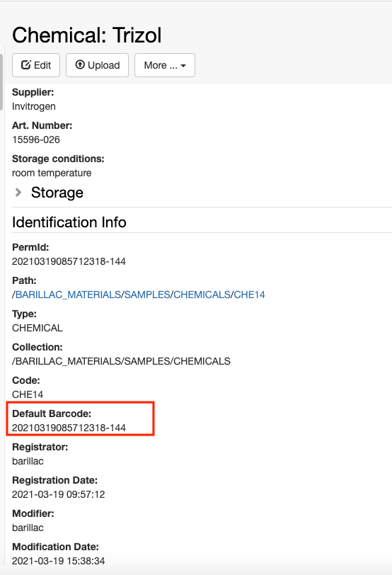
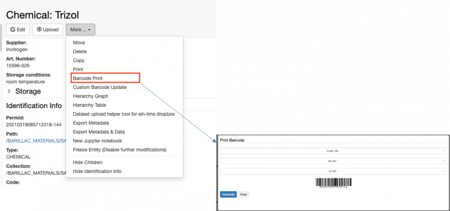
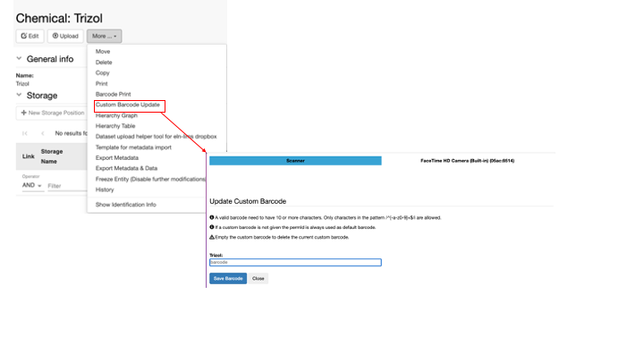
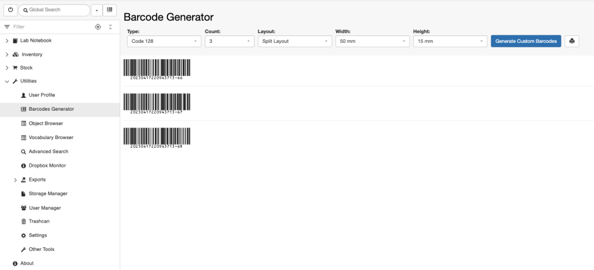

# Barcodes

## Barcodes

The barcode functionality must be enabled in openBIS by a *lab manager*
or *group admin*: [Enable
Barcodes](../../../../../docs-test/docs/user-documentation/general-admin-users/admins-documentation/enable-barcodes.md).

### Barcodes for individual samples

When a sample is registered, a barcode is automatically generated by
openBIS. This is found in the **Identification info** section, as shown
below.

This barcode can be printed and the label can be added to the vial
containing the sample. The option to print the barcode is under the 
**More..** menu

If a sample already has it own barcode, it is possible to scan this with
a scanner or the camera of a mobile device and assign it to the sample.
This can be done after registration of a sample, with the **Custom
Barcode Update** option under the **More..** drop down.

The custom barcode will appear in the *Identification Info*. If a custom
barcode is registered, the print function shown above will print the
custom barcode, instead of the default one.

### Generate batches of barcodes

In some cases there is the need to generate several barcodes that can be
later on assigned to samples registered in openBIS.

To generate new barcodes, go to the **Barcodes Generator** in the main
menu under **Utilities**.

Users can select:

1.  The type of barcode to generate:
    1.  *Code 128*
    2.  *QR Code*
    3.  *Micro QR code*
2.  The number of barcodes to generate
3.  The layout:
    1.  *Split*: one barcode per page
    2.  *Continuous*: several barcodes in one page
4.  The width of the barcode
5.  The length of the barcode

After selecting the desired parameters, click the **Generate Custom
Barcodes** button.

To print the barcodes use the **print icon** on the form, next to
**Generate Custom Barcodes**. These barcodes can be printed on labels to
be attached to vials. When the samples are registered in openBIS, these
barcodes can be scanned and assigned to the samples as explained above.

### Scan barcodes from mobile devices

It is also possible to scan barcodes and QR codes using the scan button
on top of the main menu, as shown below. In this way, you can scan a
barcode or QR code already associated with an entry and this will open
the entry page in openBIS. You can use a scanner or the camera of a
mobile device. The selection you make is saved.

Updated on July 5, 2023

## Printer and Barcode Scanner Requirements

### Printers

There are several manufacturers of printers and different kinds of
barcodes and paper to adapt to different use cases. Most manufacturers
have their own proprietary printer driver and language for labels.

To allow freedom of choice for the barcode printer, the openBIS ELN-LIMS
allows to configure both the type of barcodes and the layout and size of
the labels. openBIS uses this information to produce a PDF document,
thus having as single requirement that the printer driver used allows to
print PDF documents using applications such as Adobe Acrobat Reader or
Preview (Mac).

#### Printer Configuration

There are different types of printer drivers. The two types we can
define as generic are **PS** (PostScript) (recommended) and **PCL**
(Printer Command Language). Printers with these drivers are likely to
print PDF documents and other types of documents with embedded fonts,
images, etc…

The printer paper type needs to be configured for each printer. Two
layouts are supported:

-   **Split**: The PDF will contain separate pages with each barcode.
-   **Continuous**: The PDF will contain a continuous layout with the
    barcodes. More uncommon for this applications.

The printer paper size needs to be configured for each printer. It is
possible to indicate the size of the barcode, so it can fit.

#### Printer testing

We provide two example documents that can be used to test the printer.

-   Split barcodes example PDF:
    [printer-test-code128-split-50-15](att/printer-test-code128-split-50-15.pdf)
-   Continuous barcodes example PDF:
    [printer-test-code128-continuous-50-15](att/printer-test-code128-continuous-50-15.pdf)

Please consider that these examples likely do not correspond to the
particular paper size of the printer being evaluated and as such the
barcodes may look squashed. In order to obtain optimal results, the
paper size would need to be configured. However, for the test it is
enough to verify that the printer can print those files.

#### Printer Advice before purchasing

Before purchasing a printer, we recommend to check with the manufacturer
that the barcode printer provides a general driver and that it can print
one of the documents provided as example above.

#### Tested Printers

-   Zebra ZD420

### Scanners

There are several manufacturers of barcode scanners. In most cases
scanners act as a keyboard for the computer, so when the barcode scanner
scans a barcode it will type whatever has been scanned.

#### Scanner Configuration

The scanner keyboard layout should be the same as the computer used. If
not this could cause problems if there are any special characters.

#### Scanner testing

Open a notepad and scan the barcodes provided in the examples below. The
scanner should read them and type the correct output.

-   Barcode Code 128.
    [scanner-test-code128-50-15](att/scanner-test-code128-50-15.pdf).
    This should give as output “20210720122856003-454071” without
    quotes.
-   Barcode QR Code.
    [scanner-test-qrcode-50-50](att/scanner-test-qrcode-50-50.pdf).
    This should give as output “20210720122856003-454071” without
    quotes.
-   Barcode Micro QR Code.
    [scanner-test-microqrcode-30-30](att/scanner-test-microqrcode-30-30.pdf).
    This should give as output “20210720122856003-454071” without
    quotes.

#### Scanner Advice before purchasing

Before purchasing a scanner, ensure that the barcode scanner provides a
keyboard driver and ask the manufacturer’s support to scan the examples
above.

#### Tested Scanners

-   Honeywell 1902G-BF

Updated on July 27, 2022
