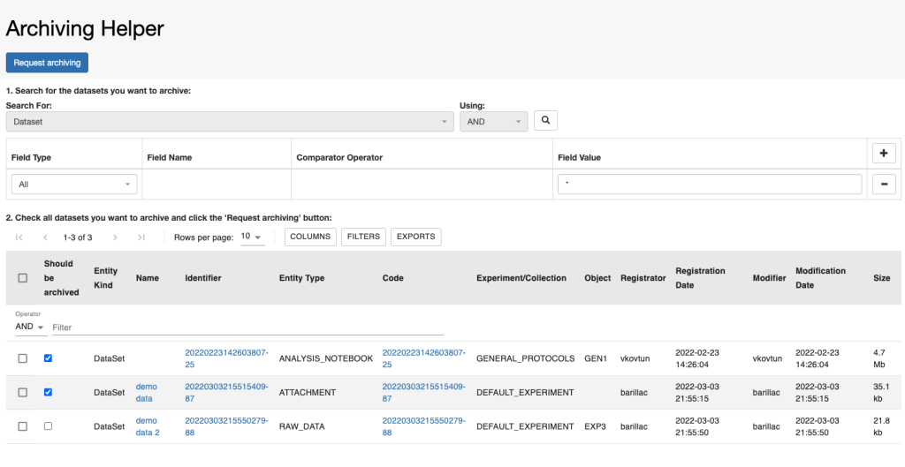
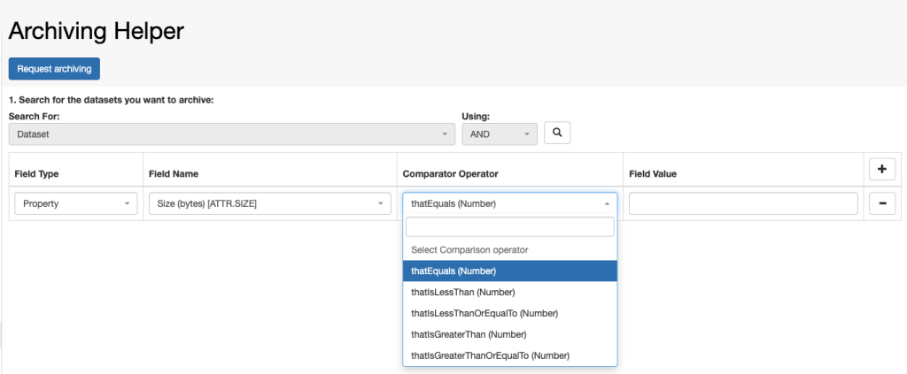
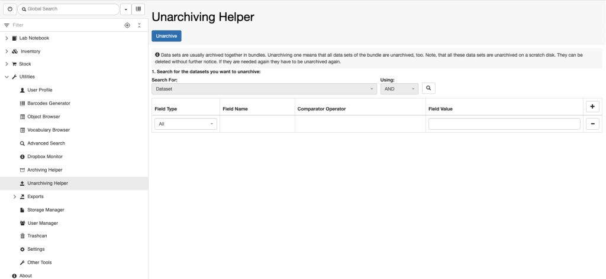

# Data archiving

 

## Dataset archiving

 

openBIS supports archiving of datasets to Strongbox
([https://www.strongboxdata.com/](https://www.strongboxdata.com/)) as
described in [Datasets
Archiving](../../../system-admin-documentation/advanced-features/archive-datasets.md)

 

This needs to be set up and configured by a *system admin*.

 

To trigger archiving manually from the ELN, navigate to a dataset and
use the *Request or disallow archiving* button, as shown below.

 

 

 

 

Please note that the strongbox has a minimum size requirement of
**10GB**. If a single dataset is below this threshold it will be queued
for archiving and it will be archived only when additional datasets in
the same *Space/Project/Experiment* are selected for archiving and the
minimum size is reached. All datasets are bundled together and archived
together. This implies that if unarchiving is requested for one dataset
in a bundle, all other datasets will also be unarchived.

 

### Dataset archiving helper tool

 

If you wish to archive multiple datasets, you can use the **Archiving
Helper** tool under **Utilities** in the main menu. You can search for
datasets and select multiple ones to be archived, by clicking the
**Request Archiving** button on the top of the page.

 

It is possible to search datasets by size, by selecting *Property* in
the **Field Type**, *Size (bytes)\[ATTR.SIZE\]*  in the **Field Name**
and the desired **Comparator Operator**, as shown below.

 

## Dataset unarchiving

 

Once the dataset is archived on tapes, the button on the dataset page
changes to **Unarchive**, as shown below. Datasets can be unarchived by
using this button.

 

 

 

### Dataset unarchiving helper tool

 

To unarchive several datasets it is possible to use the **Unarchiving
Helper** tool, under **Utilities** in the main menu, as shown below. You
can search for datasets and select multiple ones to be unarchived, using
the **Unarchive** button on tope of the page.

 

Updated on April 25, 2023
