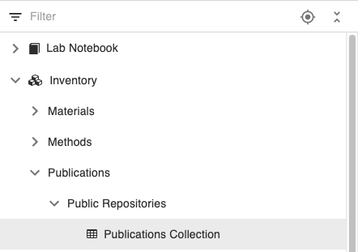

Data Export
====
 
## Export to File

### Export Lab Notebooks & Inventory Spaces 

  
All levels of the *Lab Notebook* and *Inventory* can be exported, using
the **Export** option in the **More..** drop down, as shown below.  

**Space**

**Project**

**Experiment/Collection**

**Object**

**Dataset**

In each case, the following export options are available: 

 
- **Make import compatible**. If selected, the exported data are in a format ready to be uploaded in openBIS using the default eln-lims dropbox, and the metadata XLSX file is in a format ready to be uploaded via the admin UI.
- **Export metadata as pdf**. Metadata is exported in pdf files. One pdf for each exported entity is created.
- **Export metadata as XLSX**. Metadata is exported in one xlsx file. One file containing the metadata of all exported entities and the corresponding masterdata. If **Make import compatible** is selected, this format is suitable for re-import in openBIS.
- **Export data**. Default size limit is 10GB. This can be changed in .. If **Make import compatible** is selected, exported data is in a format ready to be uploaded in openBIS using the default eln-lims dropbox. If not, the datasets will be in a folder structure that matches the ELN hierarchy.
- **Include levels below from same space**. If selected, all hirerachy levels below the selected entity and belonging to the same Space are exported.
- **Include Object and Dataset parents from same space**. If selected, Object parents and Dataset parents from the same Space are exported. Example: I export Object A, in Experiment A, in Space 1. Object A has Object B as parent, in Experiment B in Space 1. When this option is selected, Object B is also exported, otherwise it is not.
- **Include Objects and Datasets parents and children from different spaces**. This exports Object and Dataset parents and children that belong to a different Space than the Space from where Objects and Datasets are being exported. Example: I export Object A in Space 1, which has parents in Space 2. If this option is selected, the parents in Space 2 are also exported.
- **Wait for download to complete in browser**. This is suitable when exporting only metadata or small datasets. When the dowload is ready, the zip file will be available to download from the browser.

_Note: ensure that pop-ups are not disabled in your browser_.
- **Receive results by email**. If this option is selected, when the export is ready, you will receive an email notification with a download link.  Email
notification needs to be configured on *system level* during or after
installation, as explained in [Configure Data Store
Server](../../system-documentation/standalone/optional-datastore-server-configuration.md)

 

 
## Export to Zenodo

  
openBIS provides an integration with the **Zenodo** data
repository ([https://zenodo.org/).](https://zenodo.org/)

  
This enables data direct data transfer from openBIS to Zenodo. First of
all the connection to Zenodo needs to be configured on *system level*
in the DSS service.properties (see [How to configure the openBIS
DSS)](../../system-documentation/standalone/optional-datastore-server-configuration.md)
If this is configured, a lab manager, who has admin rights for the
**Settings,** needs to enable it in the ELN, as explained in [Enable
Transfer to Data
Repositories](../general-admin-users/admins-documentation/enable-transfer-to-data-repositories.md)**.**

###  Create Zenodo Personal Access Token

  
In order to be able to export data to Zenodo, you need a valid Zenodo
account. You also need to create a **personal access token.** This can
be done from the **Applications** under **Settings** in Zenodo, as shown
below:

### Save Zenodo Personal Access Token in openBIS

  
After creating the personal access token in Zenodo, this needs to be
stored in openBIS, with the following procedure:

1.  Go to **User Profile** under **Utilities** in the main menu.
2.  Enable editing.
3.  Add the personal access token from Zenodo.
4.  **Save.**

 

### Export data to Zenodo

  
To export data to Zenodo:

1.  Go to **Exports** -> **Export to Zenodo** under **Utilities** in
    the main menu.
2.  Select the data you want to export from the menu.
3.  Enter a **Submission** **Title.**
4.  Click **Export Selected** on top of the export form.
5.  The selected data are transferred as a zip file to Zenodo. You are
    now redirected to Zenodo, where you should fill in additional
    metadata information.
6.  Publish the entry in Zenodo.

 

 
The data exported to Zenodo is a .zip file that contains the metadata of the exported entries in 4 formats (.txt, .html, .doc, .json) and the data. The hiearchy (i.e.folder structure) used in the ELN is preserved in the exported .zip file.
 

After you hit the **Publish** button in Zenodo, a new entry with the
details of this submission will be created in the **Publications**
folder in the **Inventory**. Please note that this may take a few
minutes.

 

## Export data to Zenodo in a multi-group instance

If you export data from a multi-group instance where you have access to more than one group, you need to select the group under which the new publication entry should be created. 

In the example below we see 3 group names: GENERAL, DEMO, TEST.

If you select GENERAL, the publication entry will be created under the PUBLICATION Space (if present).

If you select DEMO, the publication entry will be created under the DEMO_PUBLICATION Space. 

If you select TEST, the publication entry will be created under the TEST_PUBLICATION Space. 

 
## Export to ETH Research Collection

 

The [ETH Research Collection](https://www.research-collection.ethz.ch/)
is a FAIR repository for publications and research data provided by ETH
Zurich to its scientists.

 

Data can be uploaded to the ETH Research Collection **only by members of
ETH Zurich**. This export feature is only available to ETHZ members.

 

To export data to the ETH Research Collection:

1.  Go to **Utilities** -> **Exports** -> **Export to Research
    Collection**.
2.  Select what to export from the tree.
3.  Select the **Submission Type** from the available list: *Data
    collection, Dataset, Image, Model, Sound, Video, Other Research
    Data*.
4.  Select the **Retention Period** that will be used in the ETH
    Research Collection: *10 years, 15 years, indefinite.* This is time
    for which the data will be preserved in the Research Collection.
5.  Click the **Export Selected** button on top of the page.
6.  The selected data are transferred as zip file to the ETH Research
    Collection. You will be redirected to the ETH Research Collection
    and will need to complete the submission process there.

 

The data exported to the Research Collection is a .zip file that contains the metadata of the exported entries in 4 formats (.txt, .html, .doc, .json) and the data. The hiearchy (i.e.folder structure) used in the ELN is preserved in the exported .zip file.

A new entry with the details of this submission will be created in the
**Publications** folder in the **Inventory** after the submission
process in complete. This may take a few minutes.

 

The size limit for one single export to the ETH Research Collection is
10GB.

## Export data to the ETH Research Collection in a multi-group instance
 
If you export data from a multi-group instance where you have access to more than one group, you need to select the group under which the new publication entry should be created. See explanation in section **Export data to Zenodo in a multi-group instance** above.
 

