# Managing Lab Stocks and Orders

  
It is possible to use openBIS to manage stocks of products and create
orders of products to buy for the lab. 

Every lab member can register products and place requests of products to
buy. The requests can be converted into orders by the lab manager or the
person responsible for purchases in the lab. The orders created with
openBIS contain the information that can be sent to the suppliers.

  
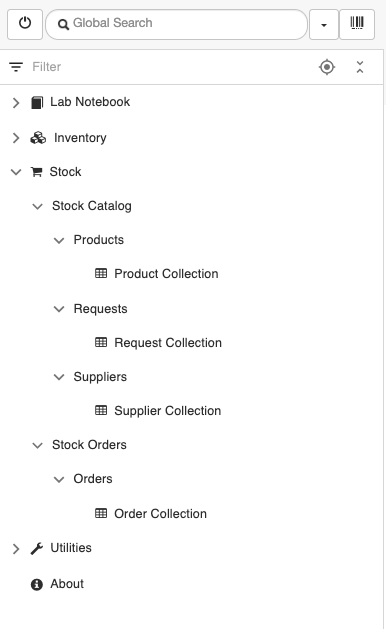

 

In the **Stock Catalog** folder, a lab can create one collection of all
products purchased in the lab and one collection of all suppliers used
for purchasing. Each product must be linked to 1 supplier. 

Every lab member by default has *Space User* access rights to the
**Stock Catalog** folder and is able to register products, suppliers and
place requests for products to buy.

The **Stock Orders** folder is visible to all lab members, who have by
default *Space Observer* rights to it.  The lab manager, or person
responsible for purchases, has *Space Admin* rights to this Space.
Orders can be created based on the requests placed in the **Stock
Catalog**. 

## STOCK CATALOG

 

### Building the catalog of products and suppliers

#### Catalog of suppliers

 

To build the catalog of all suppliers used for purchasing products by
the lab:

> 1.  Go to the **Supplier Collection** folder under **Stock** *->*
>     **Stock Catalog***->* **Suppliers** in the main menu.
> 2.  Click on the **+ New Supplier** button in the *Collection* page.
> 3.  Follow the steps explained in the [Register
>     Entries](https://openbis.ch/index.php/docs/user-documentation-20-10-3/inventory-of-materials-and-methods/register-single-entries-in-a-collection/)
>     documentation page.
>
>  

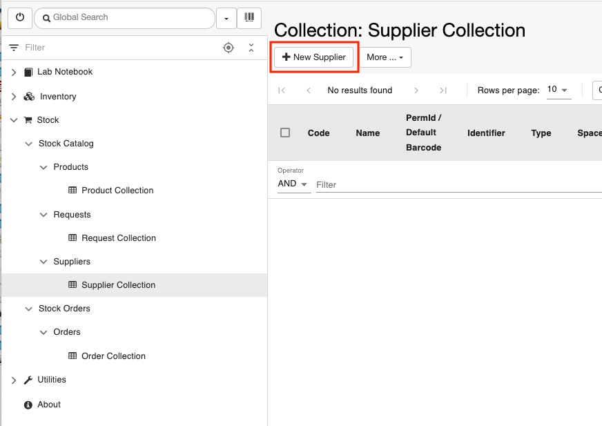

To register several suppliers at once, follow the steps described in
[Batch register entries in a
Collection.](https://openbis.ch/index.php/docs/user-documentation-20-10-3/inventory-of-materials-and-methods/batch-register-entries-in-a-collection/)

####  Catalog of products

 

To build the catalog of all products purchased in the lab:

> 1.  Go to the **Product Collection** folder under **Stock** *->*
>     **Stock Catalog***->* **Products** in the main menu.
> 2.  Click the **+ New Product** button in the *Collection* page.

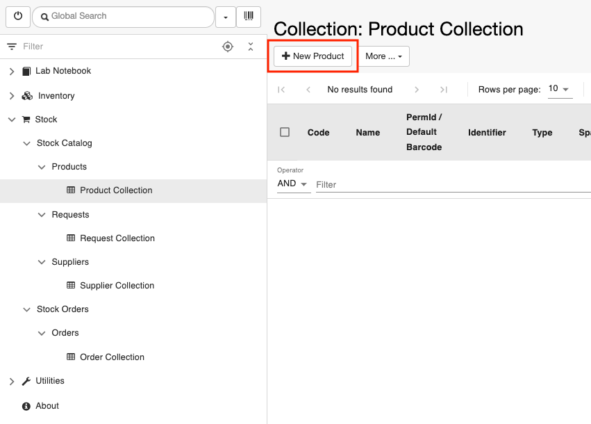

>  
>
> 3. For each product it is necessary to register one supplier as
> parent. Select the correct supplier from the list of suppliers
> registered in the **Supplier Collection.** The process for adding
> parents is the same as described for Experimental Steps: [Add
> parents](https://openbis.ch/index.php/docs/user-documentation-20-10-3/lab-notebook/add-parents-and-children-to-experimental-steps/).
>
>  

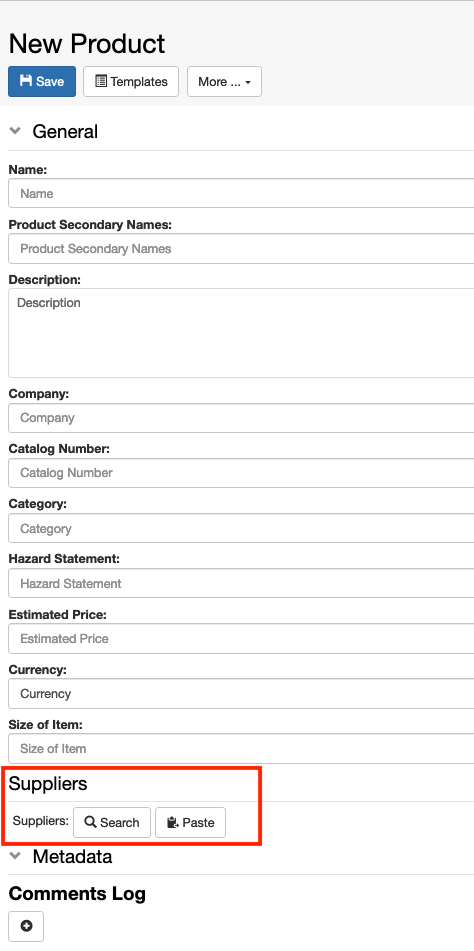

 

To register several suppliers at once, follow the steps described in
[Batch register entries in a
Collection.](https://openbis.ch/index.php/docs/user-documentation-20-10-3/inventory-of-materials-and-methods/batch-register-entries-in-a-collection/)

### Creating requests for products to order

 

Every lab member can create requests for products that need to be
ordered:

> 1.  Go to the **Request Collection** folder under **Stock** *->*
>     **Stock Catalog***->* **Requests** in the main menu.
> 2.  Click the **+ New Request** button in the *Collection* page.

 

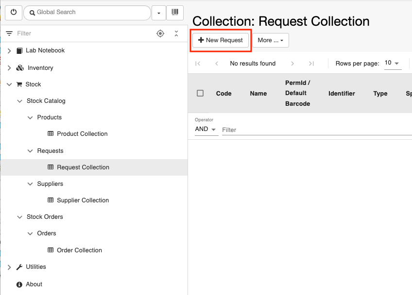

>        3. When you fill in the form the following information needs to
> be provided:
>
>  
>
> 1.  -    **Order Status**. Options  are **Delivered**, **Paid**,
>         **Ordered**, **Not yet ordered**. When you create a request
>         set this field to **Not yet ordered.** Only requests with this
>         **Order Status** can be processed to orders.
>
> 2.   
>     -   Add the product you for which you want to place a request for
>         order. This can be done in two ways**:**
>
> 1\. add a product that is already present in the catalog. This process
> is the same as described for adding parents in Experimental Steps:
> [Add
> parents](https://openbis.ch/index.php/docs/user-documentation-20-10-3/lab-notebook/add-parents-and-children-to-experimental-steps/).
> The quantity, i.e. how many units of the product are requested, needs
> to be specified.
>
> 2\. add a product that is not yet registered in the Catalog. In this
> case the information shown in the picture below needs to be provided.
> After creating the request, the product entered here is automatically
> registered in the Product Catalog.
>
>  

Please note that only 1 product can be added to 1 request.

 

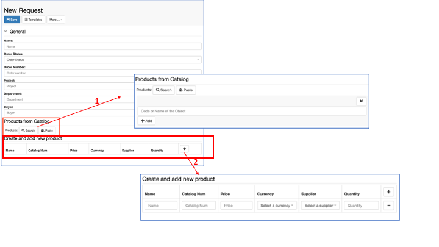

> 4. Click **Save** on top of the form.

## STOCK ORDERS

 

This section is accessible by default by every lab member. However, by
default, only the person in charge of lab purchases can process orders
based on the requests created in the Stock Catalog by every lab member.

###  Processing product orders from requests

 

To create orders of products from requests created in the Stock Catalog:

> 1.  Go to the **Order Collection** folder under **Stock** *->*
>     **Stock Orders***->* **Orders** in the main menu.
> 2.  Click the **+ New Order** button in the *Collection* page.

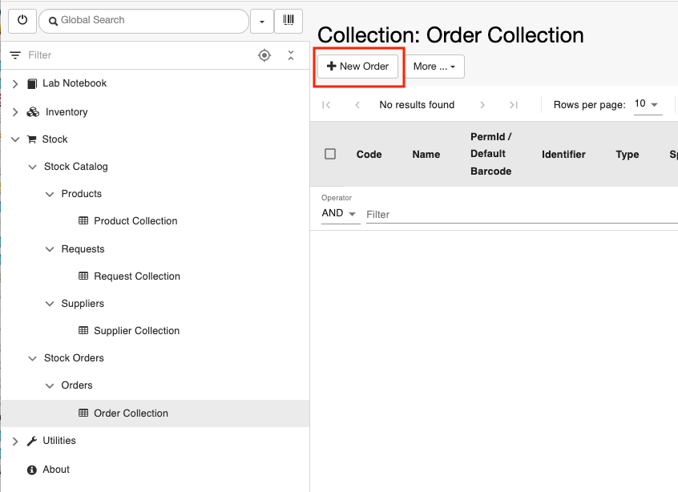

>  
>
>  
>
> 3\. If you do not see the **Code** in the form, select **Show
> Identification Info** from the **More..** dropdown

 

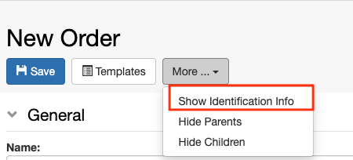

 

4\. Enter a **Code** for the order

 

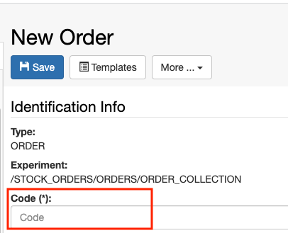

 

>  
>
>   3. If an **order** **template** form is available (see [Create
> Templates for
> Objects](https://openbis.ch/index.php/docs/admin-documentation-20-10-3/create-templates-for-objects/)),
> this template can be used and most fields will be automatically filled
> (see [Use templates for Experimental
> Steps](https://openbis.ch/index.php/docs/user-documentation-20-10-3/lab-notebook/use-templates-for-experimental-steps/)).
> If no template is available, the relevant fields in the form need to
> be filled in with the relevant information.

 

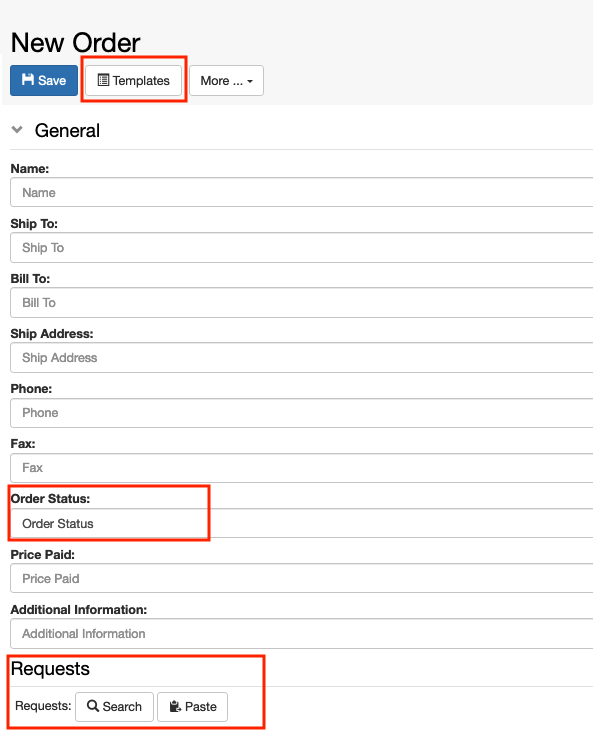

> 4\. Enter the **Order Status.** This field is mandatory. Available
> options are **Delivered**, **Paid**, **Ordered**, **Not yet ordered**.
> When you first create the order, you should set the status to **Not
> yet ordered**.
>
> 5. Add one or more requests to the Order. Only requests with Order
> Status set to **Not yet ordered** will be displayed and can be
> selected.
>
> 6. Click **Save** on top of the form.

 

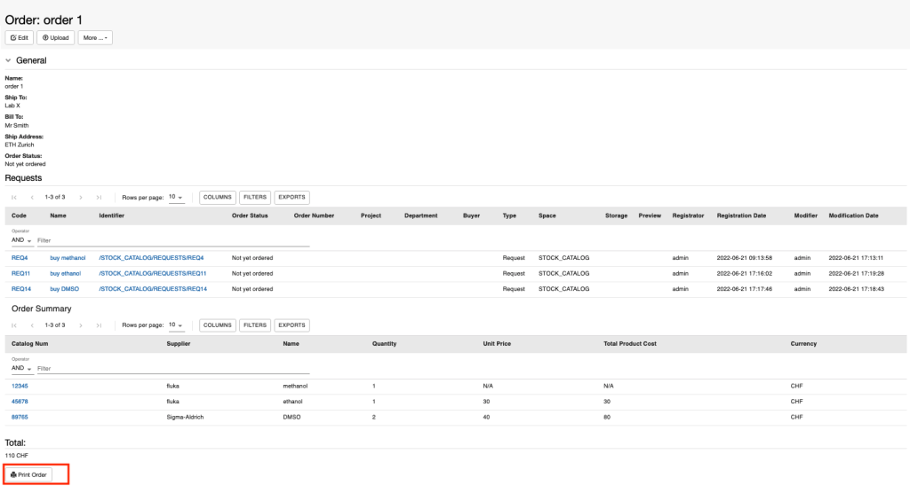

If the price information is available in the products, the total cost of
the order is calculated by openBIS and displayed in the order form, as
shown above.

By using the **Print Order** button in the order form, the order can be
printed as text file that can be sent to the suppliers for purchasing
the products.

To simplify the process of ordering multiple products from the same
supplier, all information related to the same supplier is grouped in one
single text file. 

In the example presented in the picture above, there are 2 products to
buy from fluka and 1 product to buy from Sigma-Aldrich. In this case the
two attached files have been printed from the Order form in openBIS,
using the **Print Order** button:
[order\_ORD1\_p0; ](https://openbis.ch/wp-content/uploads/2022/02/order_ORD1_p0.txt)
[order\_ORD1\_p1](https://openbis.ch/wp-content/uploads/2022/02/order_ORD1_p1.txt)

 

Once the order is processed, you should change the **Order Status** to
**Ordered**. This will automatically change the **Order Status** in all
connected requests. Requests with this oder status cannot be added to
additional orders.

Updated on April 25, 2023
