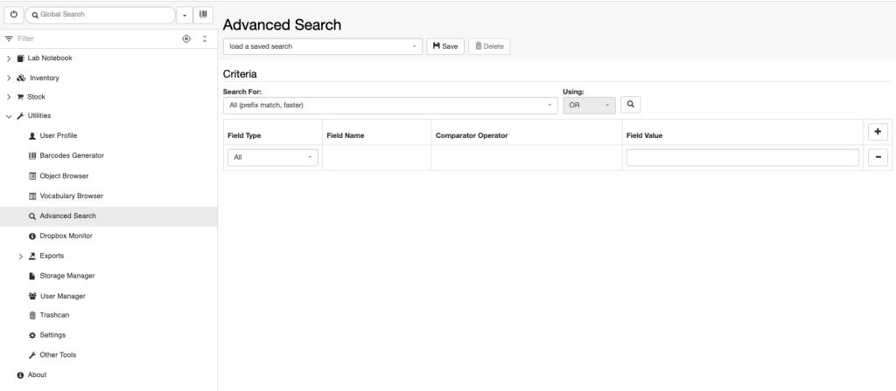
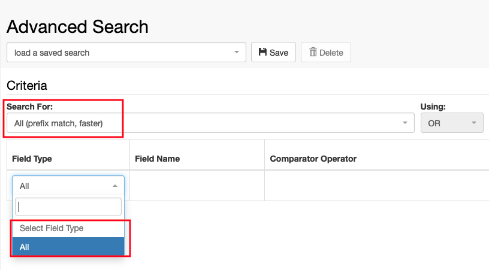
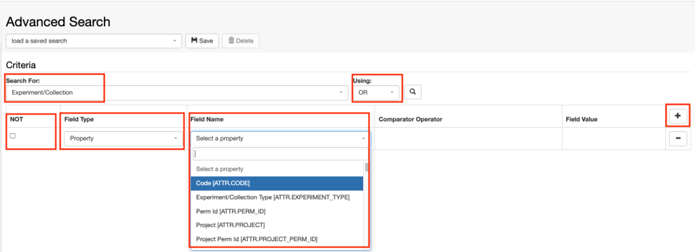
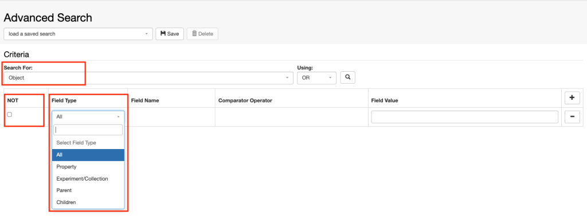
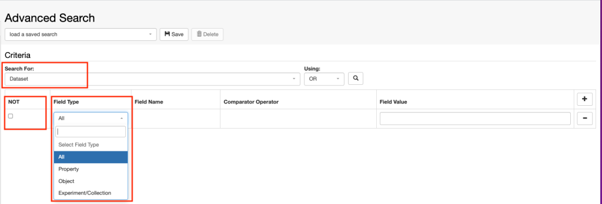
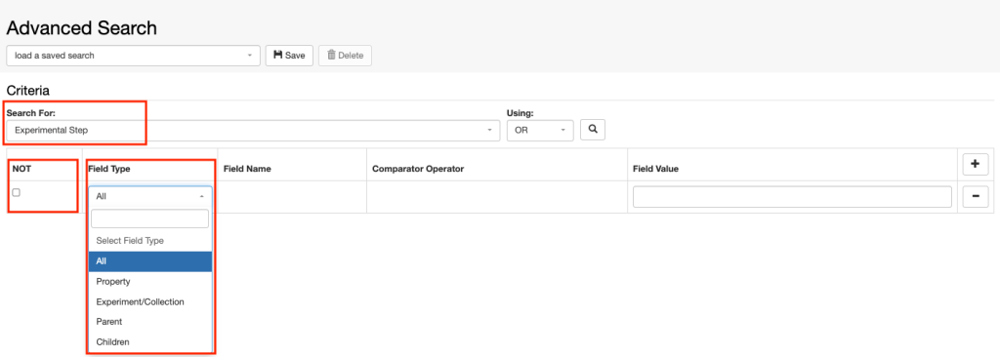
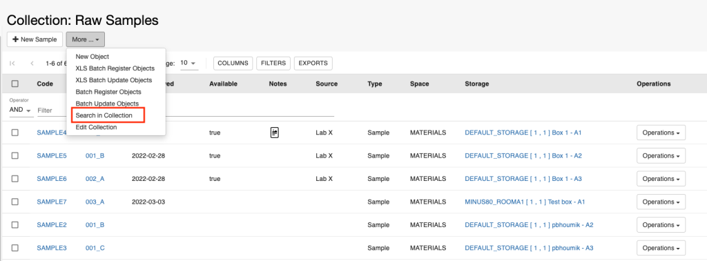
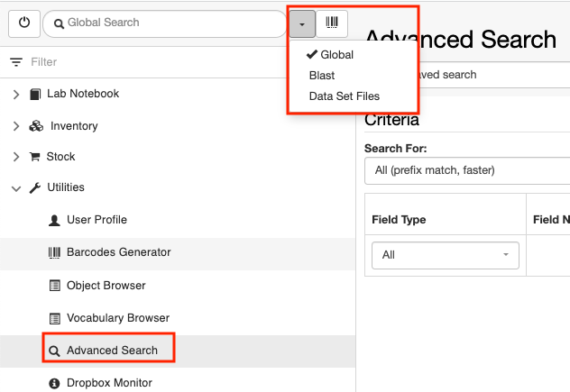
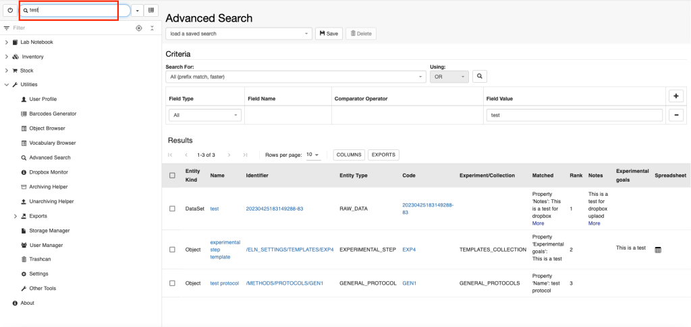

# Search

## Advanced search

The **Advanced Search** can be accessed from the main menu, under
**Utilities**. Alternatively, the advanced search can also be used after
performing a global search (see
[Search](./search.md)),
to refine the obtained results.

In the advanced search users can combine several search criteria using
either the **AND** or **OR** operators. Users can choose to search for:

1.  **All (prefix match, faster)**: search for the first 3 letters of a
    word. The search is performed across all fields of all entities
    (Experiments/Collections, Objects, Datasets).
2.  **All (full word match, faster)**: search for a complete word. The
    search is performed across all fields of all entities
    (Experiments/Collections, Objects, Datasets).
3.  **All (partial match, slower)**: search for a partial word. The
    search is performed across all fields of all entities
    (Experiments/Collections, Objects, Datasets).
4.  **Experiment/Collection**: search is performed across all fields of
    all Experiments/Collections.
5.  **Object**: search is performed across all fields of all Objects.
6.  **Dataset**: search is performed across all fields of all Datasets.
7.  **A specific Object type** (e.g. Antibody, Bacteria, Cell Line, in
    the picture below): search is performed across all fields of the
    selected Object type only.

After selecting what to search for, the search can be further restricted
to specific fields, in the **Field Type** drop down menu. The available
fields for a search vary depending on what the search is performed.

### Search for: All

This includes all 3 “All” options described above.

Available **Field Types**:

1.  **All**: search across all fields of all entities.

In this case, this is the only available option and it is not possible
to restrict the search.

### Search for: Experiment/Collection

Available **Field Types**:

1.  **All**: search across all fields of all Experiments/Collections
2.  **Property**: Can select a specific property to search on. This can
    be selected in the **Field Name**.

It is possible to exclude terms from the search by selecting the NOT in
the first column of the table.

If **Property** is selected in the **Field Type**, a list of all
available properties becomes available in the **Field Name** drop down.
According to the type of property selected, the comparator operator will
be different (e.g for a date field it is possible to select an exact
date, or everything before a given date or everything after). It is
possible to search on more than one field by clicking on the **+**
button in the table and build complex queries in this way. By selecting
the NOT checkbox in the table certain fields can be excluded from the
search.

### Search for: Object

Available **Field Types**:

1.  **All**: search across all fields of all Objects
2.  **Property**: can select one or more specific properties to search
    on. These can be selected in the **Field Name** (see above)
3.  **Experiment/Collection**: search for Objects in a given
    Experiment/Collection 
4.  **Parent**: search for Objects that have the specified parents
5.  **Children**: search for Objects that have the specified children

Also in this case, fields can be excluded from the search by selecting
the NOT checkbox in the table.

### Search for: Dataset

Available **Field Types**:

1.  **All**: search across all fields of all Datasets
2.  **Property**: can select one or more specific properties to search
    on. These can be selected in the **Field Name** (see above)
3.  **Object**: search for Datasets in a given Object 
4.  **Experiment/Collection**: search for Datasets in a given
    Experiment/Collection

Also in this case, fields can be excluded from the search by selecting
the NOT checkbox in the table.

### Search for: specific Object Type (e.g Experimental Step)

In this case, the available Field Types are the same as when searching
for an Object.

Available **Field Types**:

1.  **All**: search across all fields of the specific Object type (e.g.
    Experimental Step)
2.  **Property**: can select one or more specific properties to search
    on. These can be selected in the **Field Name** (see above)
3.  **Experiment/Collection**: search for Objects of the selected type
    in a given Experiment/Collection 
4.  **Parent**: search for Objects of the selected type that have the
    specified parents
5.  **Children**: search for Objects of the selected type that have the
    specified children

### Search Collection

It is possible to launch an advanced search limited to Objects of one
Collection from a Collection page, by selecting **Search in Collection**
from the **More** drop down. This redirects to the Advanced Search page
where the Collection is already pre-defined.

Updated on July 5, 2023

## Search
  
Different types of searches are available from the main menu in openBIS:

1.  Global search
2.  BLAST search
3.  Data Set Files Search
4.  Advanced Search

### Global search

This functionality, available from the main menu, performs a search
across all database fields. Results are presented in a table in the
**Advanced Search** page. The search can be also be further refined (see
[Advanced
search](./search.md#advanced-search)).

### BLAST search

This performs a BLAST search over nucleotide sequences contained either
in the **Sequence** property of an Object type (e.g Plasmid or Oligo) or
in Datasets of type **SEQ\_FILES**. Results are shown in a table, sorted
by E-value.

### Data Set File search

This search allows users to search across names of files stored in
openBIS Datasets.

Please note that it is not possible to search the content of the files.

In the example below, we search for files that contain “mass-loss” in
the name, and we find 1 dataset that contains a file called
mass-loss-data.csv.

By clicking on the table row that shows the Dataset containing the
searched file, you will be redirected to the Dataset page.

Updated on April 25, 2023

## Save and reuse searches

It is possible to save and re-use searches created in the [Advanced
search](./search.md#advanced-search).
*Space* *admin* rights are required to save searches in a given Space.
Searches can be used by anyone with *User* or *Observer* rights to a
given Space.

In the Advanced Search page, build your search criteria (see example
below). To save the search, click the **Save** button and enter:

1.  The **Name** of the search
2.  The **Experiment/Collection** where the search should be stored

Searches are stored in *Experiments/Collections*.

Saved searches are available from the **load a saved search** drop down
menu, at the top of the **Advanced Search** page.  

Updated on July 28, 2022
