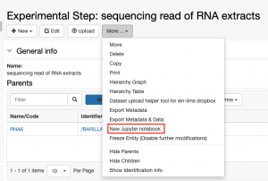
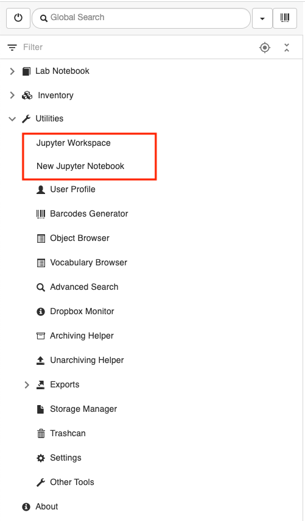
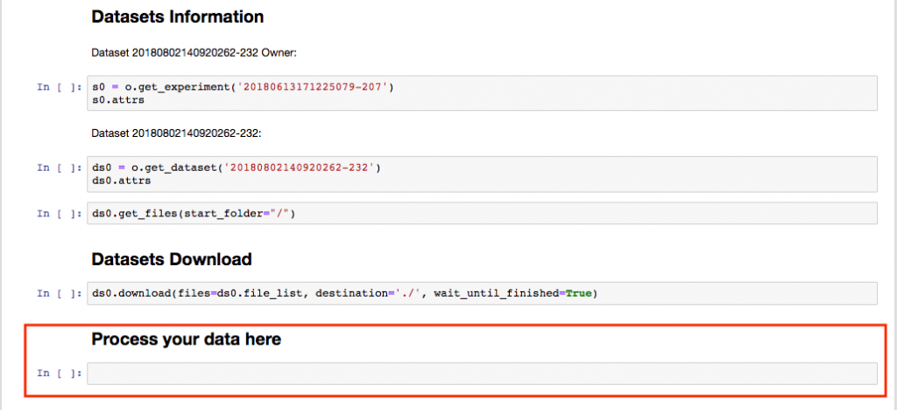

Tools For Analysis Of Data Stored In Openbis
====
 
## Jupyter Notebooks

  
Jupyter notebooks are web applications that combine text, code and
output ([https://jupyter.org/](https://jupyter.org/)). Jupyter supports
over 40 programming languages.

Jupyter notebooks can be used to analyze data stored in openBIS.  
  

It is possible to connect to a JupyterHub server and launch Jupyter
notebooks directly from the openBIS interface. This feature is not
available by default, but needs to be enabled and configured by a
*system admin*. JupyterHub docker containers are available from our
download page: [openBIS
download.](https://wiki-bsse.ethz.ch/display/bis/openBIS+Download+Page)
Further documentation can be found here: [JupyterHub for
openBIS](https://unlimited.ethz.ch/display/openBISDoc2010/JupyterHub+for+openBIS)  
  

### How to use Jupyter notebooks from openBIS

 

Jupyter notebooks can be opened at every level of the openBIS hierarchy
(*Space, Project, Experiment/Collection, Object, Dataset*) from the
**More…** dropdown menu, as shown below.

 

 

If you get a similar error as the one shown below when you try to launch
a notebook from an entity, you need to start the JupyterHub server by
going to the main menu **Utilities** -&gt; **Jupyter Workspace**. This
error appears when the JupyterHub server is restarted (e.g. after an
upgrade), because the user profile needs to be recreated.

 

If you go to the Jupyter workspace, the user profile is re-created on
the server. After this, you can open a notebook from any entity of the
openBIS hierarchy as explained above (*Space, Project,
Experiment/Collection, Object, Dataset*).

 

 Jupyter notebooks can also be launched from the main menu, under
**Utilities**, as shown below.

 

**Note**: if you use SSO for authentication (eg. Switch aai), the first
time you want to work with a Jupyter notebook, you first need to open
the **Jupyter Workspace** and then launch a notebook from wherever you
want to open it.

 

When you launch a notebook from the **New Jupyter Notebook** in the main
menu under **Utilities**, it is necessary to enter:  
  

1.  The **dataset(s)** needed for the analysis. 
2.  The **owner** of the Jupyter notebook. Jupyter notebooks are saved
    back to openBIS as datasets, and these belong either to an
    *Experiment/Collection* or to an *Object*. The owner is the
    *Experiment/Collection* or *Object* where the notebook should be
    stored.
3.  The **directory name**. This is the name of the folder that will be
    created on the JupyterHub server.
4.  **Notebook name**. This is the name of the Jupyter notebook.

Jupyter notebooks can also be opened from a *Project*, *Experiment*,
*Experimental Step* choosing the corresponding option in the **More**
drop down menu. When opening notebooks from an *Experiment* or
*Experimental Step*, all connected datasets are automatically selected.
If some are not needed, they can be deselected. 

### Overview of Jupyter notebook opened from openBIS.

The Jupyter notebooks running on the JupyterHub server for openBIS
support the following kernels: *Bash, Octave, Python 2, Python 3, R,
SoS* ([Script of Scripts).](https://vatlab.github.io/sos-docs/)

When you open a Jupyter notebook from openBIS, the default kernel used
is Python 3, but you can change to another language as shown below.

 

 

  
The Jupyter notebook opened from the openBIS interface contains some
pre-filled cells. All cells need to be run. The information of two cells
should be modified: **Name of the dataset** where the notebook will be
stored and **Notes** (in red below).

 

If you are running a JupyterHub version released after July 2021
(available at
[https://hub.docker.com/u/openbis](https://hub.docker.com/u/openbis))
you do not need to enter username and password, as authentication uses
the openBIS session token.

 

#### What to do in case of invalid session token

 

If your session token is not automatically renewed you will see a long
error message when you try to retrieve information of a dataset. At the
bottom of the  error message you can see:

 

 

In such case, the session token can be manually entered in the cell as
shown below:

 

           

 

The session token can be copied from the **User Profile** under the
**Utilities** Main Menu in the ELN. 

Enter the session token, run the cell above and then move to the next
cell to get the dataset(s) information.

 

Alternatively you can go to the Jupyter Workspace under **Utilities**
and restart the server.

 

Your script should be written in the section named *Process your data
here*, that contains one empty cell (see below). You can, of course, add
additional cells.

 

After the analysis is done, the notebook can be saved back to openBIS,
by running the last few cells which contain the information about where
the notebook will be stored (as shown below).

 

 

The last pre-filled cell in the notebook, contains the information on
where to upload the Jupyter notebook in openBIS. After you run this
cell, you can go back to the ELN interface, refresh the webpage and you
will see your Jupyter notebook uploaded to the Object or Experiment you
specified. By default the Jupyter notebook are save to datasets of type
ANALYSIS\_NOTEBOOK. If you prefer to use a different type, you can edit
the pre-filled cell shown above.

 

### Using a local Jupyter installation with openBIS

It is also possible to use a local Jupyter installation with openBIS. In
this case, it is possible to download an extension for JupyterLab that
adds 3 buttons to a default notebook: 

1.  connect to an openBIS instance;
2.  download datasets from the openBIS instance;
3.  upload the notebook to openBIS.

 

The JupyterLab openBIS extension is available from: [JupyterLab openBIS
extension](https://www.npmjs.com/package/jupyterlab-openbis)

 

Updated on April 25, 2023
 
## MATLAB toolbox

  
The MATLAB toolbox for openBIS allows to access data stored in openBIS
directly from MATALB. Full documentation can be found here: [MATLAB
API](https://openbis.readthedocs.io/en/latest/software-developer-documentation/apis/matlab-v3-api.html)

Updated on April 17, 2023
