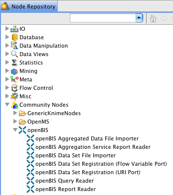
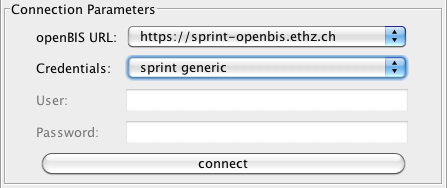
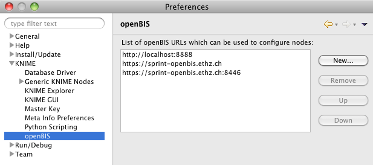
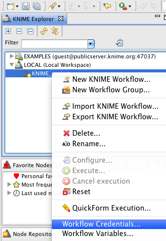
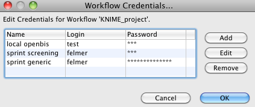
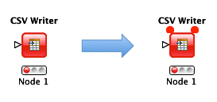
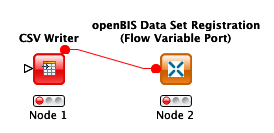
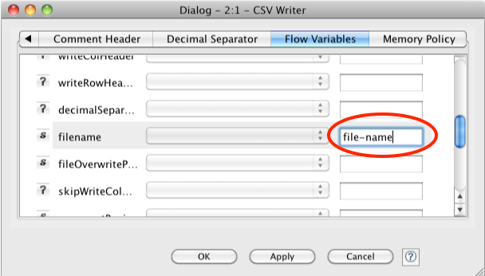
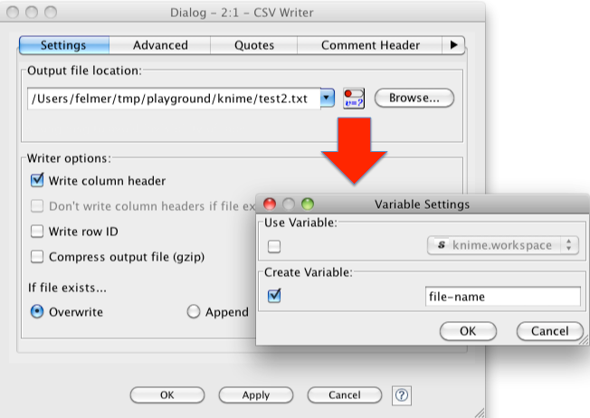
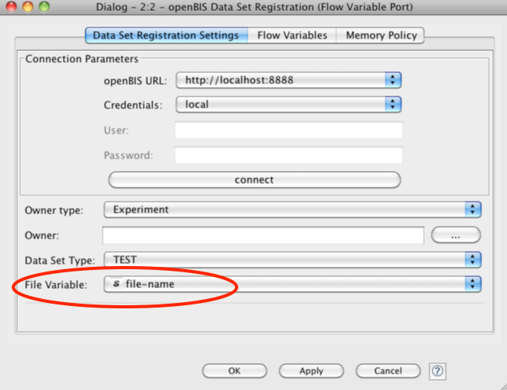

openBIS KNIME Nodes
===================

Introduction
------------

[KNIME](http://www.knime.org) is a powerful workflow system. It allows
to import data from some sources and process them in a workflow
graphically designed by the user.

There are special openBIS KNIME nodes for importing/exporting data
from/to openBIS. KNIME version 2.7.2 or higher is required.

Installation
------------

1.  Start KNIME application.
2.  Click on menu item 'Install New Software...' of menu 'Help'. An
    installation dialog pops up.
3.  Click on the add button. A dialog titled 'Add Repository' pops up.
4.  Enter a name like 'KNIME Community Nodes' and the URL
    <http://update.knime.org/community-contributions/3.1>
5.  Check the check box of 'openBIS Knime Nodes' in section 'Community
    Contributions - Bioinformatics & NGS' and click twice the next
    button.
6.  Accept the license agreements.
7.  Click the finish button.
8.  Ignore the security warning and restart KNIME application.

Usage
-----

All openBIS KNIME nodes can be found in Node Repository under Community
Nodes -> openBIS:



Drag and drop a node into the project and double-click on the node. A
node setting dialog opens for entering parameters.

Nodes
-----

All nodes need

-   URL of openBIS server, like
    ` https://sprint-openbis.ethz.ch/openbis `.
-   User credentials

When configuring a node in the node setting dialog the user is asked for
these parameters in the section 'Connection Parameters':



After pressing the button *connect* a connecting to the openBIS server
will be established. This is needed for editing additional node
parameters. For example, the combo boxes of the reader nodes have to be
populated.

```{warning}
For a data set registration node the credentials combo box is only filled if all nodes of the upstream part of the workflow are successfully configured.
```

The OK button closes the node setting dialog. The connection parameters
and all other parameters will be stored and used when executing a
workflow.

### Definining openBIS URLs

Contrary to the previous version of openBIS KNIME nodes (Version 13.04.0
and earlier) the URL field in the node setting dialog is no longer a
text field but a combo box with URLs. This list of predefined URLs is
initially empty. It has to be created by the following preference page:



### Defining User Credentials for Authentication

For security reasons it is not recommended to specify user ID and
password directly for each openBIS node. Instead named credentials
should be used. This has the advantage to enter user ID and password
only once for a workflow with several openBIS nodes.

Named credentials are defined for a particular workflow. They are called
workflow credentials and can be specified via the context menu of the
workflow:



Each set of credentials has a name (which is used in the combo box), a
user ID (called 'Login') and a password:



The credentials are saved with the workflow except of the passwords. The
user will be asked for the passwords after loading a workflow.

```{warning} 
If user ID and password are entered directly in the node setting dialog the KNIME master key on the preferences page **KNIME -> Master Key** should be activated. Otherwise passwords will be stored unencrypted!
```

### openBIS Query Reader

This node allows to run parametrized SQL queries on openBIS. The combo
box shows a list of available queries. After choosing one additional
parameters have to be entered.

### openBIS Report Reader

This node allows to get a report for a specified data set. The combo box
shows a list of available report. After choosing a report a data set
should be entered. The button with three dots lets pop up a dialog for
convenient way to choose a data set.

### openBIS Data Set File Importer

This nodes allows to download a particular file from a specified data
set. Data set code, file path and a local folder for downloads have to
be specified. The output of the node is not a table put an object of
type `org.knime.core.data.uri.URIPortObject`. Other nodes with input
ports of this type can access the downloaded file. Such nodes exist in
GenericKnimeNodes of the Community Nodes (which are a part of openMS
KNIME Nodes). Also 'openBIS Data Set Registration (URI Port)' is such a
node.

The absolute path of the downloaded file is also available as a flow
variable `absolute-file-path`. This allows to connect a openBIS Data Set
File Importer with a file reader which supports absolute file paths in
flow variables like the CSV Reader node. The mechanism of connecting
both nodes via flow variable ports is explained in the next section
where a CSV Writer node is connected with an openBIS Data Set
Registration node.

This importer node also creates the following KNIME flow variables:
`openbis.DATA_SET`, `openbis.EXPERIMENT`, and
optionally `openbis.SAMPLE`. These variables contain data set code,
experiment identifier, and sample identifier, respectively. The flow
variable `openbis.SAMPLE` identifier only appears if the data set is
directly link to a sample. KNIME flow variables are available to other
nodes downstream.

 

### openBIS Data Set Registration (Flow Variable Port)

This node allows to register a file as a data set. The path of the file
to be registered is the value a flow variable specified in the node
settings dialog. In addition the user has to specify owner type and data
set type.

The owner identifier (which is either a data set code, an experiment
identifier, or a sample identifier depending on the chosen owner type)
can be chosen by a chooser dialog. If the owner field is empty one of
the flow variables s `openbis.DATA_SET`, `openbis.EXPERIMENT`, or
`openbis.SAMPLE` will be used.

#### Usage

This node is usually used in combination with a writer node which stores
data (e.g. data table) in a file. Writer nodes are end nodes of a
workflow. But it is possible to append another node downstream by using
the flow variable port. Normally the flow variable ports are not
visible. To make them visible choose item '**Show Flow Variable Ports**'
of the context menu of the node. Two red circle will appear at the upper
corners of the node symbol:


add a node of type 'openBIS Data Set Registration (Flow Variable Port)'
and connect the upper right circle of the writer node with the input
node of the registration node. A click on 'Hide Flow Variable Ports' of
the context menu of the writer node hides the upper left circle:


you need to tell the registration node which flow variable has the path
to the file to be registered. This needs two steps:

1.  The configuration parameter of the writer has to be made available
    as a flow variable. This can be done in tab 'Flow Variables' of the
    node settings dialog. It lists all configuration parameters. If a
    name is specified in the text field of a certain parameter its value
    will be available as a flow variable of specified name for the
    downstream nodes. Here is the example for CSV Writer:  
      

    This works for all writers. There is an easier way for CSV Writer:
    On the Settings tab there is small button named '*v=?*'. Clicking on
    this button opens a dialog where the flow variable for the file name
    can directly be specified by using 'Create Variable':



      
      

2.  In the registration node the flow variable specified in the first
    step has to be chosen as the file variable:  
      


 

### openBIS Data Set Registration (URI Port)

This nodes allows to register a file as a data set. The file to be
registered is the first one in the list of URIs of the port object of
type `org.knime.core.data.uri.URIPortObject`. The user has to specify
owner type and data set type in the node settings dialog.

The owner identifier (which is either a data set code, an experiment
identifier, or a sample identifier depending on the chosen owner type)
can be chosen by a chooser dialog. If the owner field is empty one of
the flow variables `openbis.DATA_SET`, `openbis.EXPERIMENT`, or
`openbis.SAMPLE` will be used.

### openBIS Aggregation Service Report Reader

This nodes allows to get an [aggregation
service](https://openbis.readthedocs.io/en/latest/user-documentation/legacy-advance-features/openbis-kinme-nodes.html#openbis-aggregation-service-report-reader) report. Only
aggregation services where the service key starts with `knime-` can be
chosen by the user in the node settings dialog.  After the service has
been chosen the aggregation service will be invoked with the parameter
`_REQUEST_ `set to` getParameterDescriptions`. The service has to return
a table where each row defines the name of the parameter and optionally
its type. This is used to created an appropriated form in the node
settings dialog. The values specified by the user will be used to invoke
the aggregation service when the node is executed. The result will be
available as a KNIME table. See also section [KNIME Aggregation Service
Specifications](https://openbis.readthedocs.io/en/latest/user-documentation/legacy-advance-features/openbis-kinme-nodes.html#knime-aggregation-service-specifications).

### openBIS Aggregated Data File Importer

This nodes allows to invoke an [aggregation
service](https://openbis.readthedocs.io/en/latest/user-documentation/legacy-advance-features/openbis-kinme-nodes.html#knime-aggregation-service-specifications) which returns a name
of a file in the session workspace which will be downloaded and made
available for nodes with input ports of type
`org.knime.core.data.uri.URIPortObject`. Such nodes exist in
GenericKnimeNodes of the Community Nodes. Also 'openBIS Data Set
Registration (URI Port)' is such a node.

Only aggregation services where the service key starts
with `knime-file-` can be chosen by the user in the node settings
dialog.  The communication protocol between this node and openBIS is as
for nodes of type 'openBIS Aggregation Service Report Reader'. The only
difference is that the returned table has only one row with one cell
which contains the file name.

KNIME Aggregation Service Specifications
----------------------------------------

Nodes of type 'openBIS Aggregation Service Report Reader' and 'openBIS
Aggregated Data File Importer' rely on [aggregation
services](https://openbis.readthedocs.io/en/latest/user-documentation/legacy-advance-features/openbis-kinme-nodes.html#knime-aggregation-service-specifications) which follow a
certain protocol. In order to distinguish these services from other
aggregation services the service key (i.e. [core
plugins](https://openbis.readthedocs.io/en/latest/software-developer-documentation/server-side-extensions/core-plugins.html) ID) has to start
with `knime-`. The specifications of such services are the following:

1.  If there is a parameter `_REQUEST_ `with
    value` getParameterDescriptions` descriptions of all parameters will
    be returned in the form specified as follows:  
    -   The table has the columns `name` and `type`.
    -   Each row has a non-empty unique value of column `name`. It
        specifies the name of the parameter. It is also shown in node
        settings dialog.
    -   The type columns contains either an empty string or `VARCHAR`,
        `VOCABULARY`, `EXPERIMENT`, `SAMPLE`, or `DATA_SET.` The default
        type is `VARCHAR` which is represented in the node settings
        dialog by a single-line text field. The types `EXPERIMENT`,
        `SAMPLE`, and `DATA_SET` are also single line text field with an
        additional button to open an appropriate chooser.
    -   The type `VOCABULARY` isn't useful without a list of terms in
        the following form: `VOCABULRY:<term 1>, <term 2>, ...`.  
        Example: `VOCABULARY:Strong, Medium, Weak`
2.  If there is no parameter `_REQUEST_ `or its value
    isn't` getParameterDescriptions` the aggregation service can assume
    that all parameters as defined by the parameters description are
    present. Some of them might have empty strings as values.
3.  An exception should be returned as a table with five columns where
    the first column is `_EXCEPTION_`. If such a table is returned an
    exception with stack trace will be created and thrown in KNIME. It
    will appear in KNIME log. For each row either the first cell isn't
    empty or the five other cells are not empty. In the first case the
    value of the first column is of the form <exception
    class>:<exception message>. If the first column is empty
    the row represents a stack trace entry where the other columns are
    interpreted as class name, method name, file name, and line number.

In order to simplify KNIME aggregation services a Helper API in Java is
available
[openbis-knime-server.jar](/att/openbis-knime-server.jar).
It should be added to openBIS installation in
folder `<installation folder>/servers/datastore_server/ext-lib`.

### KNIME Aggregation Service Helper API

The helper API contains the two
classes `ch.systemsx.cisd.openbis.knime.server.AggregationCommand`
and `ch.systemsx.cisd.openbis.knime.server.AggregationFileCommand` which
should be extend when writing an aggregation service for nodes of type
'openBIS Aggregation Service Report Reader' and 'openBIS Aggregated Data
File Importer', respectively.

The subclasses should override the method `defineParameters()`. Its
argument is a `ParameterDescriptionsBuilder` which simplifies creation
of parameter descriptions.

If `AggregationCommand`/`AggregationFileCommand` is subclassed the
method `aggregate()/createFile()` should be overridden. The
`aggregate()` methods gets the original arguments which are the
parameters binding map and the ISimpleTableModelBuilderAdaptor. The
`createFile()` methods gets only the parameters binding map. It returns
the name of the file in the session workspace.

The aggregation service should instanciate the subclass and
invoke `handleRequest()` with the parameters binding map and the table
model builder adaptor.

The `ParameterDescriptionsBuilder` has the method `parameter()`. It
creates a `ParameterDescriptionBuilder` based on the specified parameter
name. The `ParameterDescriptionBuilder` has the
methods `text()`, `vocabulary()`, `experiment()`, `sample()`,
`dataSet()` which specify the parameter type. Only `vocabulary()` has an
argument: The string array of vocabulary terms.

#### Example for an Aggregation Service Report Reader

```py
from ch.systemsx.cisd.openbis.knime.server import AggregationCommand
from ch.systemsx.cisd.openbis.generic.shared.api.v1.dto import SearchCriteria
from ch.systemsx.cisd.openbis.generic.shared.api.v1.dto import SearchSubCriteria
from ch.systemsx.cisd.openbis.generic.shared.api.v1.dto.SearchCriteria import MatchClause
from ch.systemsx.cisd.openbis.generic.shared.api.v1.dto.SearchCriteria import MatchClauseAttribute
EXPERIMENT = 'Experiment'
DATA_SET_COLUMN = 'Data Set'
PATH_COLUMN = 'Path'
SIZE_COLUMN = 'Size'
def scan(tableBuilder, dataSetCode, node):
    if node.isDirectory():
        for child in node.childNodes:
            scan(tableBuilder, dataSetCode, child)
    else:
        row = tableBuilder.addRow()
        row.setCell(DATA_SET_COLUMN, dataSetCode)
        row.setCell(PATH_COLUMN, node.relativePath)
        row.setCell(SIZE_COLUMN, node.fileLength)
class MyAggregationCommand(AggregationCommand):
    def defineParameters(self, builder):
        builder.parameter(EXPERIMENT).experiment()
        
    def aggregate(self, parameters, tableBuilder):
        experiment = searchService.getExperiment(parameters.get(EXPERIMENT))
        searchCriteria = SearchCriteria()
        subCriteria = SearchCriteria()
        subCriteria.addMatchClause(MatchClause.createAttributeMatch(MatchClauseAttribute.PERM_ID, experiment.permId))
        searchCriteria.addSubCriteria(SearchSubCriteria.createExperimentCriteria(subCriteria))
        dataSets = searchService.searchForDataSets(searchCriteria)
        tableBuilder.addHeader(DATA_SET_COLUMN)
        tableBuilder.addHeader(PATH_COLUMN)
        tableBuilder.addHeader(SIZE_COLUMN)
        for dataSet in dataSets:
            dataSetCode = dataSet.dataSetCode
            try:
                content = contentProvider.getContent(dataSetCode)
                scan(tableBuilder, dataSetCode, content.rootNode)
            finally:
                if content != None:
                    content.close()
        
def aggregate(parameters, tableBuilder):
    MyAggregationCommand().handleRequest(parameters, tableBuilder)
```


#### Example for an Aggregated Data File Importer

```py
import os.path
from java.util import Date
from ch.systemsx.cisd.openbis.knime.server import AggregationFileCommand

class MyAggregationFileCommand(AggregationFileCommand):
    def defineParameters(self, builder):
        builder.parameter('Greeting Type').vocabulary(['Hi', 'Hello'])
        builder.parameter('Name')
        builder.parameter('Sample').sample()
        
    def createFile(self, parameters):
        sessionWorkspace = sessionWorkspaceProvider.getSessionWorkspace()
        filename = "report.txt"
        output = open(os.path.join(sessionWorkspace.getAbsolutePath(), filename), "w")
        name = parameters.get('Name')
        sample = searchService.getSample(parameters.get('Sample'))
        output.write(str(parameters.get('Greeting Type')) + " " + str(name) + "!\n\n" + Date().toString() + "\n")
        output.write(sample.getSampleType())
        output.close()
        return filename

def aggregate(parameters, tableBuilder):
    MyAggregationFileCommand().handleRequest(parameters, tableBuilder)
```
